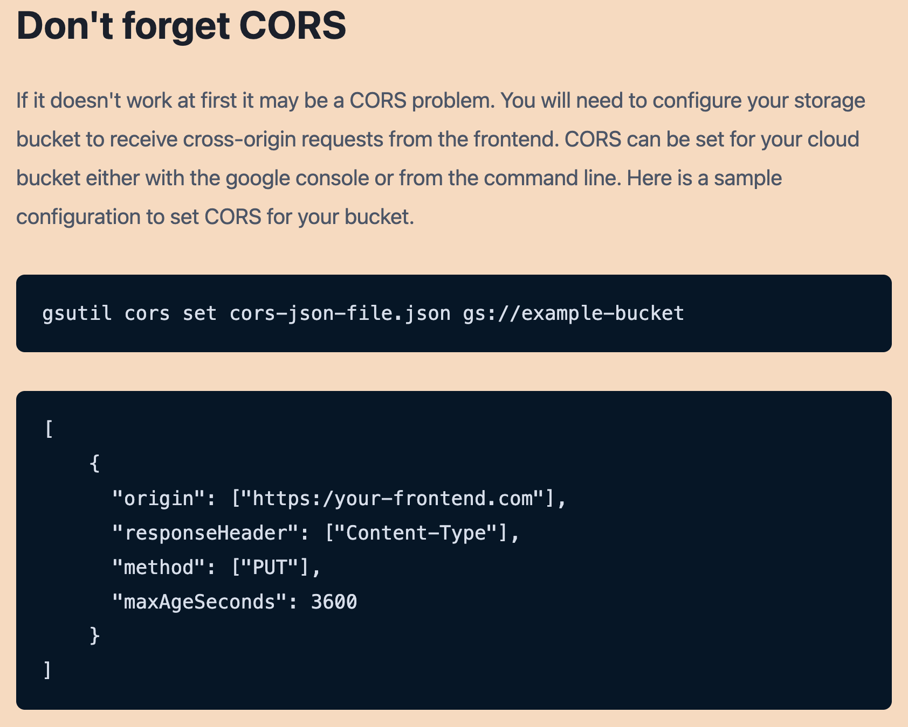
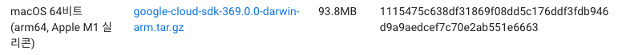
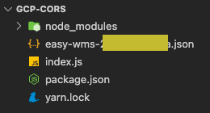

### Yesterday I Learned

이미지 업로드 기능을 구현.  
서버로부터 전달받은 Signed URL을 기반으로 이미지를 업로드하려고 할 때, 클라이언트의 Origin과 Signed URL(GCS 버킷의 URL)의 Origin이 달라서 CORS 에러가 발생했다.

&nbsp;

장장 4주동안.. 이미지 업로드 이슈를 진행하면서 기능 설계에도 어려움을 겪었지만, 이 gcp 에 업로드하기 위한 cors 에러를 처리하는 방법도 꽤나 낯설었다. 이 참에 gcp 초기 세팅하는 방법과 cors 에러를 해결하는 방법에 대한 글을 써본다. (gcp 에 대해 더 자세히 공부해야겠다.)

1. Cloud SDK 설치([https://cloud.google.com/sdk/docs/install?hl=ko](https://cloud.google.com/sdk/docs/install?hl=ko))

   1. Cloud SDK는 Google Cloud에서 호스팅되는 리소스와 애플리케이션을 관리하는 데 사용할 수 있는 도구 집합입니다. 이러한 도구에는 `gcloud`, `gsutil`, `bg` 명령줄 도구가 포함된다.
   1. M1 을 사용하고 있으므로 아래의 패키지를 다운 및 설치
      

1. 아래의 순서대로 cors 설정 변경을 위한 세팅을 해준다.

   1. mkdir gcp-cors
   2. cd gcp-cors
   3. yarn init
   4. yarn add `@google-cloud/storage`
      &nbsp;

1. easy-wms...json 파일은 gcp storage 의 키 파일이다. 그리고 index.js 는 아래와 같이 구성이 된다. 또한 `gsutil` 를 활용하여 명령어로 Cloud Storage 를 엑세스하는 방법도 있다.
   ([https://cloud.google.com/storage/docs/configuring-cors#storage_cors_configuration-nodejs](https://cloud.google.com/storage/docs/configuring-cors#storage_cors_configuration-nodejs))

```js
const { Storage } = require("@google-cloud/storage");

// Creates a client
const storage = new Storage({ keyFilename: "easy-wms-....json" });

async function configureBucketCors() {
  const bucketName = "GCP 의 버킷 이름";
  try {
    await storage.bucket(bucketName).setCorsConfiguration([
      {
        maxAgeSeconds: 3600,
        method: ["GET", "PATCH", "PUT", "DELETE", "OPTIONS"],
        origin: [
         **바로 이 곳에 cors 를 허용하는 주소들을 나열해준다**
        ],
        responseHeader: [
          "content-type",
          "x-goog-content-length-range",
          "access-control-allow-origin",
          "x-goog-resumable",
        ],
      },
    ]);
  } catch (e) {
    console.log(e);
  }

  console.log(`Bucket ${bucketName} was updated with a CORS config`);
}

configureBucketCors();
```

4. node [파일명] 으로 실행해주면 gcp 버킷 cors 가 설정된다.

**PS. 네트워크에 대해 자세히 공부해야겠다.**
