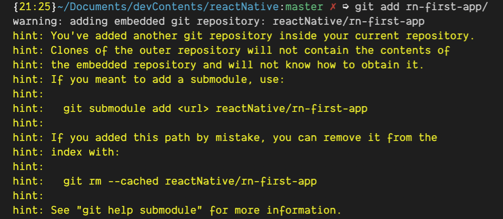

### Today I Learned

Today Point
: No special stuff but git error in case of repo in repo

깃 파일을 포함하고 있는 폴더를 특정 레포에 git add 할 경우 발생하는 에러로, `shift(⇧) + command(⌘) + .` 로 숨겨진 폴더 중 .git 폴더를 삭제한 뒤 git add / commit /push 하면 정상동작한다.
