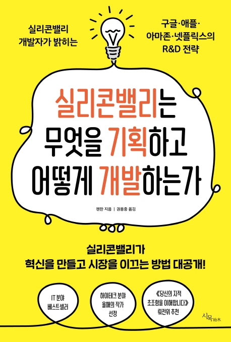

# Summary

#### 1. 마음을 담아야 사람을 움직인다.

구글의 첫 번째 무기는 '심리학' 이다.

- '선택의 역설(Paradox of choice)'.
  - 선택 기회가 적을수록 결정을 내리는 비율이 높아진다. 이른바 'Less is more' 인 셈이다.
  - 사실 두 번째 선택지를 끼워 넣은 진짜 의도는 세 번째 선택지가 얼마나 이득인지 돋보이게 만드는 것이다.
  - 고객에게 심리적으로 '결정 스트레스' 가 작은 쪽에서 점차 커지는 방향으로 각 단계를 구성해야만 중도 포기를 막을 수 있다.
  - 구글의 수익 모델과 제품구상의 핵심은 '어떻게 하면 고객을 좀 더 편리하게 만들어줄까' 이다.
- 구글은 고객의 시선과 관점에서 제품을 만들었고 심리학을 통해 전체 절차를 최적화했다.
- 제품 개발은 이처럼 고객 중심으로 이루어져야 한다. 이것이 바로 '고객 입장에서 생각하는 것' 의 핵심 내용이자 '제품 차원에서 생각하는 것' 의 본질이다. 핵심은, 제대로 설계함으로써 고객을 감탄하게 만드는 일이다.

고객을 불편하게 하면 만족도가 올라간다.

- 빠르다고 만족하진 않는다.
  - 인지가치 란 본인이 마음속에 느끼는 제품에 대한 가치를 가리킨다. 이와 대비되는 개념이 '실제가치' 이다. 이 인지가치는 실제가치보다 높을 수도 낮을 수도 있다.
  - 검색속도를 일부러 지연시키고 고객에게 이 사이트가 지금 어떤 일을 하고 있는지 알려줌으로써 고객이 '아, 이 사이트는 나를 위해 이렇게 열심히 일하고 있구나!' 라고 생각하게 만드는 것이다. 그럼으로써 고객은 사이트에 대한 인지가치가 높아져 해당 체험에 대해 후한 점수를 준다.
