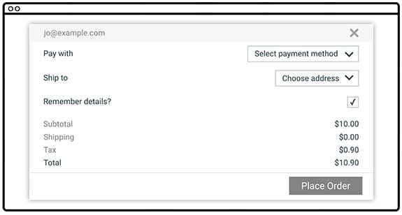
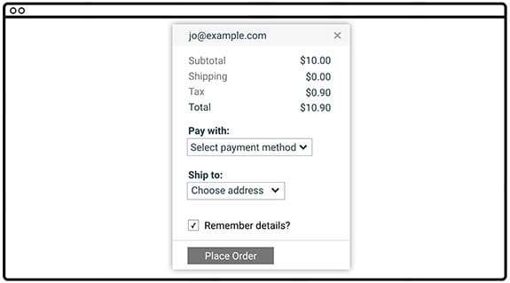
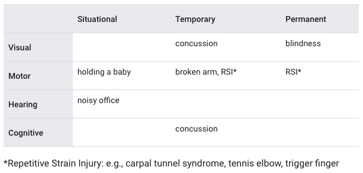

# **Overview**

## **What is accessibility?**

Broadly speaking, it means that the site's content is available, and its functionality can be operated, **by literally \*anyone**.\* All users can see and use a keyboard, mouse, or touch screen, and can interact with page content the same way we do.

1. Specifically, it concerns users who are experiencing some type of **impairment or disability** — and bear in mind that that experience might be non-physical or temporary.
2. We can all relate to the experience of using an interface that is **not accessible to us for other reasons**. For example, desktop site on a mobile phone.

This form has several accessibility issues.

before)

  

after)

  

We

1. made the text darker
2. modified the design so that the labels are close to the things they're labeling
3. Fixed the label to be associated with the checkbox so possible to toggle it by clicking the label as well.
    
    

## **Web Content Accessibility Guidelines**

WCAG is organized around four principles

- **Perceivable**: Can users perceive the content?
- **Operable**: Can users use UI components and navigate the content?
- **Understandable**: Can users understand the content?
- **Robust**: Can the content be consumed by a wide variety of user agents (browsers)?
   
   

## **Understanding users' diversity(permanent / temporary)**

A lot of modern web techniques have the unfortunate side effect of creating sites which don't work well with the tools used by blind users to access the web. However, there is actually more to accessibility than that. We find it useful think of impairments falling into four broad buckets: visual, motor(difficult to move one’s body or limited range of motion), hearing, and cognitive.

1. What to use for Visual impairments
   1. a screen reader or a braille display
   2. text-to-speech technology
   3. browser zoom
   4. high-contrast options: a high-contrast browser extension or a high-contrast theme for a website.
2. What to use for motor impairments
   1. keyboard
   2. switch device
   3. voice control
   4. an eye-tracking device
3. What to use for hearing impairments
   1. captions and transcripts
   2. some kind of alternative, if sound is part of the interface.
4. What to use for cognitive impairments 1. zoom functionality to make reading or concentrating easier
   
