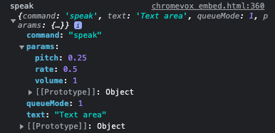
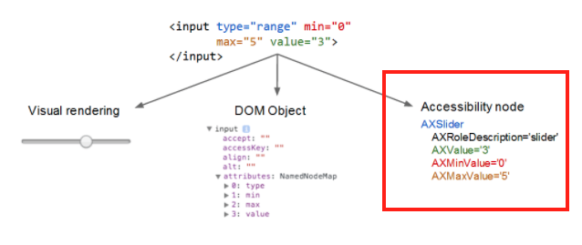

# **Introduction to Semantics**

## **Assistive Technology**

Assistive technology can include something as general as browser zoom, or as specific as a custom-designed game controller. It can be a separate physical device like a braille display, or be implemented completely in software like voice control. It can be built-in to the operating system like some screen readers, or it can be an add-on like a Chrome extension.

The line between assistive technology and technology in general is blurry; **after all, all technology is meant to assist people with some task or another.**
 
 

## **Affordances**

The better the affordance is designed, the more obvious or intuitive its use.

**GUI affordances are thus specifically designed to be unambiguous: buttons, check boxes, and scroll bars are meant to convey their usage with as little training as possible.**

Naturally, someone who can't see the visual clues provided by an element can't comprehend its meaning or intuitively grasp the value of the affordance. So

**we must make sure that the information is expressed flexibly enough to be accessed by assistive technology**

that can construct an alternative interface to suit its user's needs.

### This **non-visual exposure of an affordance's use** is called its **_semantics_**.

 
 

## **Screen reader**

experience using it: [ChromeVox lite demo page](http://udacity.github.io/ud891/lesson3-semantics-built-in/02-chromevox-lite/)

   

Think about the fact that a screen reader (or other assistive technology) actually creates a complete alternate user experience for the user based on **the programmatically expressed semantics.** Instead of a visual interface, the screen reader provides an audible interface.

Notice how the screen reader tells you some information about each interface element. You should expect a well-designed reader to tell you all, or at least most, of the following information about the elements it encounters.

- The element's *`role`* or `type`, if it is specified (**it should be**).
- The element's *`name`*, if it has one (**it should**).
- The element's *`value`*, if it has one (it may or may not).
- The element's *`state`*, e.g., whether it is enabled or disabled (if applicable).

The screen reader is able to construct this alternate UI because **the native elements contain built-in accessibility metadata**. Just as the rendering engine uses the native code to construct a visual interface, **the screen reader uses the metadata in the DOM nodes to construct an accessible version**, something like this.

   
