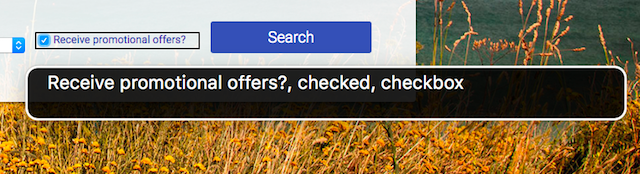

# **The Accessibility Tree**

   

This is basically what the browser actually presents to the screen reader. The browser takes the DOM tree and modifies it into a form that is useful to assistive technology. We refer to this modified tree as **the *Accessibility Tree***

The accessibility tree is what most assistive technologies interact with.

1. An application (the browser or other app) exposes a semantic version of its UI to assistive technology via an API.
2. The assistive technology may use the information it reads via the API to create an alternative user interface presentation for the user.
3. The assistive technology may also allow the user to interact with the app in a different way. For example, most screen readers provide hooks to allow a user to easily simulate a mouse click or finger tap.
4. The assistive technology relays the user intent (such as "click") back to the app via the accessibility API. The app then has the responsibility to interpret the action appropriately in the context of the original UI.

**Our job as web developers is just to be aware that this is going on, and to develop web pages that take advantage of this process to create an accessible experience for our users.**

**We do this by ensuring that we express the semantics of our pages correctly**
<br/>
<br/>

## **Semantics in native HTML**

We can take advantage of that **built-in accessibility by writing HTML** that expresses the semantics of our page elements.

Earlier we noted that screen readers will announce an **element's `role`, `name`, `state`, and `value`**. By using the right semantic element, role, state, and value are covered, but we must also ensure that we make an element's name discoverable.

Broadly, there are two types of names:

- _Visible labels_, which are used by all users to associate meaning with an element, and
- _Text alternatives_, which are only used when there is no need for a visual label.

For text-level elements, we don't need to do anything, because by definition it will have some text content. However, **for input or control elements, and visual content like images, we need to make sure that we specify a name.**

```jsx
<input id="promo" type="checkbox">
<label for="promo">Receive promotional offers?</label>
```

   
