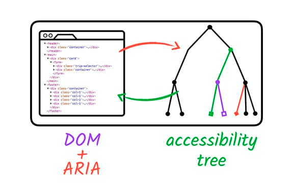
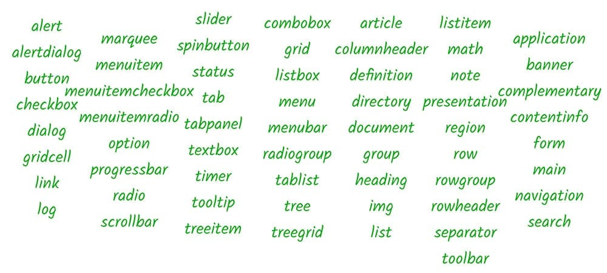

# **ARIA**

The [Web Accessibility Initiative's Accessible Rich Internet Applications specification](https://www.w3.org/TR/wai-aria/)
 (WAI-ARIA, or just ARIA) is **good for bridging areas with accessibility issues that can't be managed with native HTML**. It works by allowing you to specify attributes that modify the way an element is translated into the accessibility tree.

```jsx
//before
<li tabindex="0" class="checkbox" checked>
  Receive promotional offers
</li>

//after
<li tabindex="0" class="checkbox" role="checkbox" checked aria-checked="true">
  Receive promotional offers
</li>
```

- before: While this works fine for sighted users, **a screen reader will give no indication that the element is meant to be a checkbox**, so low-vision users may miss the element entirely.
- after: Using ARIA attributes, we've added the `role` and `aria-checked` attributes to explicitly identify the element as a checkbox and to specify that it is checked by default. **The list item will now be added to the accessibility tree and a screen reader will correctly report it as a checkbox.**

   
<br/>
<br/>

## **What can ARIA do?**

1. ARIA can modify existing element semantics or add semantics to elements where no native semantics exist.
2. It can also express semantic patterns that don't exist at all in HTML, like a menu or a tab panel.

```jsx
// ARIA can add extra label and description text that is only exposed to assistive technology APIs.
<button aria-label="screen reader only label"></button>

// ARIA can express semantic relationships between elements that extend the standard parent/child connection, such as a custom scrollbar that controls a specific region.
<div role="scrollbar" aria-controls="main"></div>
<div id="main">
. . .
</div>

// ARIA can make parts of the page "live," so they immediately inform assistive technology when they change.
<div aria-live="true">
  <span>GOOG: $400</span>
</div>
```

One of the core aspects of the ARIA system is **its collection of *roles***. A role in accessibility terms amounts to a shorthand indicator for a particular UI pattern. ARIA provides a vocabulary of patterns we can use via the `role`attribute on any HTML element.

   

## [ARIA Labels and Relationships](https://developers.google.com/web/fundamentals/accessibility/semantics-aria/aria-labels-and-relationships)

## [Hiding and Updating Content](https://developers.google.com/web/fundamentals/accessibility/semantics-aria/hiding-and-updating-content)

## [Accessible Styles](https://web.dev/accessible/#create-a-design-and-css-that-supports-users-with-different-needs)
