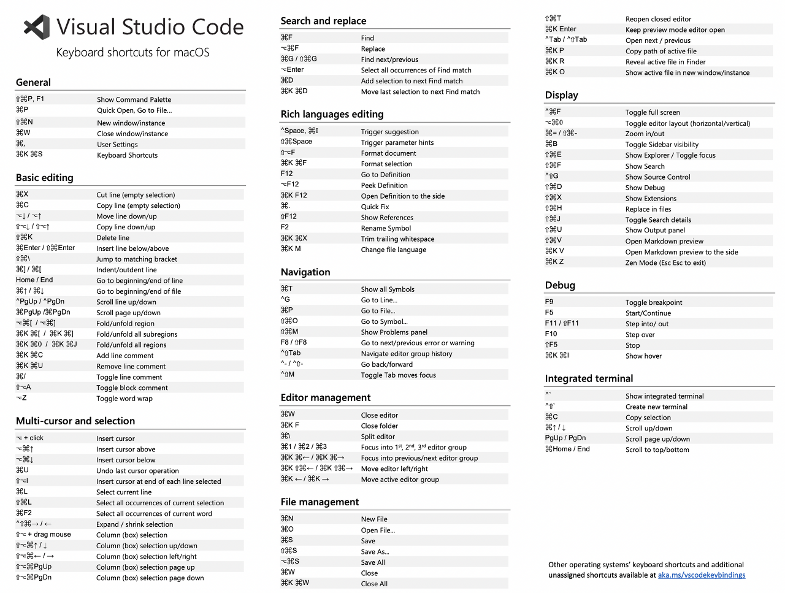

# Useful Shortcut for Mac

Splitting the terminal
: Command + \

Focusing on a terminal
: Command + Option + Number key

Switch Workspace
: Command + number

Switch Between Workspace and Terminal
: ctrl+`

Switch prev or next file
: shift + command + "[" or "]"

Switch among Working files
: option + tab

