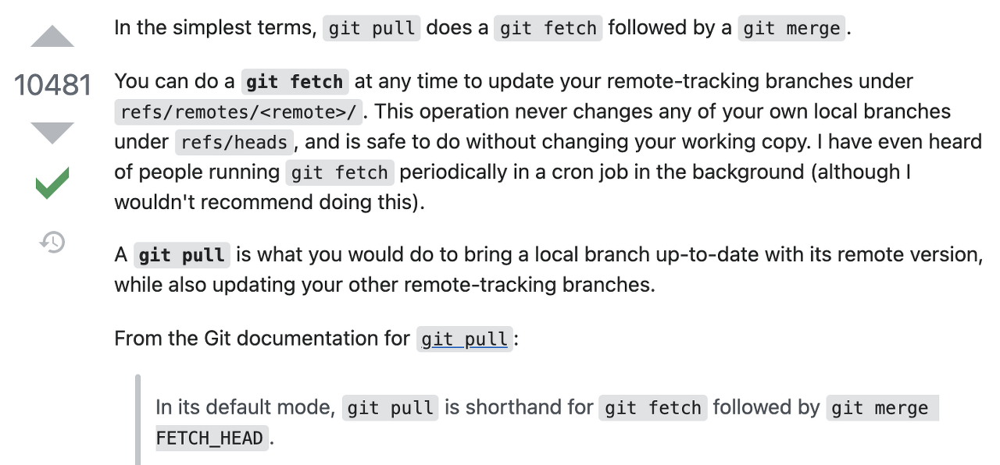

## Git Most useful Command

<!-- <p>&nbsp;</p> -->

#### 1. Cancel Git Modified

1. All modified in repo

```
$ cd {repository_root_dir}
$ git checkout .
```

2. Specific Folder

```
$ git checkout {dir}
```

3. Specific File

```
$ git checkout {file_name}
```

#### 2. Cancel Git Modified

In case that All files are in Staging Area by git add commend, the below commend can take the files to Unstage-state

```
$ git reset HEAD [file] //Specific file
$ git reset HEAD //All files
```

#### 3.Cancel GIT COMMIT

```
//1. Cancel commit and store the according files in working directory in Staged-state
$ git reset --soft HEAD^

//2. Cancel commit and store the according files in working directory in Unstaged-state
$ git reset --mixed HEAD^
$ git reset HEAD^
$ git reset HEAD~2 // cancel the last 2 commits

//3. Cancel commit and delete the according files from working directory in Unstaged-state
$ git reset --hard HEAD^
```

#### 4. Cancel GIT Pull

Be careful to use this because the content of local overwrites content of remote. this means all of commit info after the specific commit disappears. This can make synchronization problem in team project

1. cancel commits which are in no need

```
$ git reset HEAD~^^
```

2. go to wanted-point of directory

```
$ git reset HEAD@{number}
or
$ git reset [commit id]
```

3. new commit

```
$ git commit -m 'content'
```

4. force pushing to remote repo

```
$ git push <name of remote repo><branch name> -f
```

#### 4. Delete untracked file

```
$ git clean -f //files not directory
$ git clean -f -d//files and directory
$ git clean -f -d -x//files, ignored files and directory
```

#### 5. Git stash - temporary save without commit

- modified and tracked files
- files in staging area

1. save

```
$ git stash
or
$ git stash save [description]
```

2. check stash list

```
$ git stash list
```

3. apply stash

```
$ git stash apply
or
$ git stash apply [stash name]
or
//if you want apply and delete it from stash list
$ git stash pop
```

4. delete stash

```
$ git stash drop
or
$ git stash drop [stash name]
```

5. cancel applying stash

```
$ git stash show -p | git apply -R
or
$ git stash show -p [stash name] | git apply -R

```

#### 6. apply new modified or files to the last git commit

```
 $ git commit --amend
```

#### Difference between fetch and pull?


