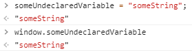
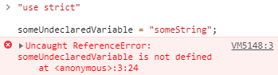

### 1. javascript 의 undeclared, undefined, null 의 차이점

1. undeclared (선언되지 않은) 상태
   먼저 undeclared의 경우 "use strict" 명령어를 통해 엄격모드 로 진입하지 않으면, 만나기 힘듭니다.
   아래와 같이 엄격모드가 아닌 자바스크립트에서 선언되지 않은 변수에 값을 할당하면 자동으로 global 변수로 취급되기 때문입니다.

      

   "use strict"로 엄격모드에 진입하면 선언되지 않은 변수에 값을 할당하려고 할 때 다음과 같은 에러가 등장합니다.

      

2. undefined (정의되지 않은) 상태

   정의되지 않은 상태는 변수를 선언한 뒤에 아무것도 할당하지 않은 상태를 말합니다. 만일 아무런 값도 반환하지 않는 함수를 특정 변수에 할당하면, 변수는 undefined 상태를 갖게 됩니다. 이러한 상태를 체크하기 위해 엄격한 동등 비교 ( === ) 연산자나 typeof 키워드를 사용하여 'undefined' 문자열을 받아낼 수 있습니다. 엄격하지 않은 동등 비교 ( == )는 null 값과 undefined를 비교했을 때도 true를 반환하므로 부정확합니다.

   ```js
   var foo;
   console.log(foo); // undefined
   console.log(foo === undefined); // true
   console.log(typeof foo === "undefined"); // true
   console.log(foo == null); // true 이래서 == 연산자를 조심해야 합니다.
   function bar() {}
   var baz = bar();
   console.log(baz); // undefined
   ```

3) null
   null 변수는 명시적으로 null이 할당된 경우 생깁니다. null은 아무런 값도 나타내지 않습니다만 무언가 할당은 된 것이기 때문에 undefined와 다릅니다. null을 체크하기 위해서는 간단하게 === 연산자를 사용하면 됩니다. null에 typeof를 하면 undefined에서는 'undefined'가 나왔던 것과 다르게 'object'가 나오게 되니 유의해야 합니다.

   ```js
   var foo = null;
   console.log(foo === null); // true
   console.log(typeof foo === "object"); // true
   console.log(foo == undefined); // true `==`는 trusy falsy만 비교하게 됩니다.
   ```
