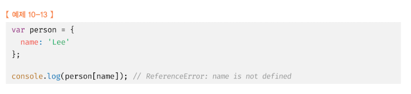
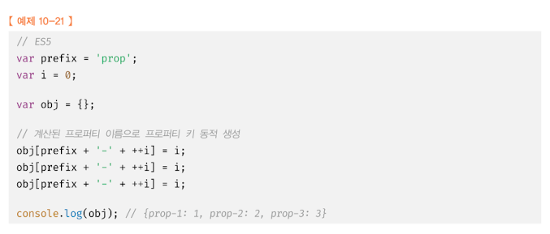

# 10. 객체 리터럴

## 10.1 객체란?

원시 타입은 단 하나의 값만 나타내지만 객체 타입은 다양한 타입의 값(원시 값 또는 다른 객체)을 하나의 단위로 구성한 복합적인 자료구조다.
또한 원시 타입의 값, 즉 원시 값은 변경 불가능한 값이지만 객체 타입의 값, 즉 객체는 변경 가능한 값이다.

프로퍼티 값이 함수일 경우, 일반 함수와 구분하기 위해 메서드라 부른다.
객체는 객체의 상태를 나타내는 값(프로퍼티)과 프로퍼티를 참조하고 조작할 수 있는 동작(메서드)을 모두 포함할 수 있기 때문에 상태와 동작을 하나의 단위로 구조화할 수 있어 유용하다.

## 10.2 객체 리터럴에 의한 객체 생성

인스턴스?
인스턴스란 클래스에 의해 생성되어 메모리에 저장된 실체를 말한다. 객체지향 프로그래밍에서 객체는 클래스와 인스턴스를 포함한 개념이다.
클래스는 인스턴스를 생성하기 위한 템플릿의 역할을 한다. 인스턴스는 객체가 메모리에 저장되어 실제로 존재하는 것에 초점을 맞춘 용어다.

자바스크립트는 프로토타입 기반 객체지향 언어로서 클래스 기반 객체지향 언어와는 달리 다양한 객체 생성 방법을 지원한다.

- 객체 리터럴
- Object 생성자 함수
- 생성자 함수
- Object.create 메서드
- 클래스(ES6)

객체 리터럴은 자바스크립트의 유연함과 강력함을 대표하는 객체 생성 방식이다. 객체를 생성하기 위해 클래스를 먼저 정의하고 new 연산자와 함께 생성자를 호출할 필요가 없다.

## 10.3 프로퍼티

객체는 프로퍼티의 집합이며, 프로퍼티는 키와 값으로 구성된다.

식별자 네이밍 규칙을 따르지 않는 이름에는 반드시 따옴표를 사용해야 한다.

## 10.5 프로퍼티 접근

대괄호 표기법을 사용하는 경우 **대괄호 프로퍼티 접근 연산자 내부에 지정하는 프로퍼티 키는 반드시 따옴표로 감싼 문자열**이어야 한다.
대괄호 프로퍼티 접근 연산자 내에 따옴표로 감싸지 않은 이름을 프로퍼티 키로 사용하면 자바스크립트 엔진은 식별자로 해석한다.

위 예제에서 ReferenceError 가 발생한 이유는 대괄호 연산자 내의 따옴표로 감싸지 않은 이름, 즉 식별자 name 을 평가하기 위해 선언된 name 을 찾았지만 찾지 못했기 때문이다.

## ES6에서 추가된 객체 리터럴의 확장 기능

### 10.9.2 계산된 프로퍼티 이름

문자열 또는 문자열로 타입 변환할 수 있는 값으로 평가되는 표현식을 사용해 프로퍼티 키를 동적으로 생성할 수도 있다. 단, 프로퍼티 키로 사용할 표현식을 대괄호로 묶어야 한다. 이를 계산된 프로퍼티 이름이라 한다.

