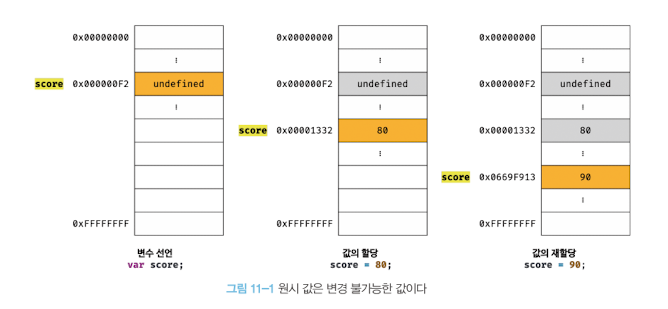
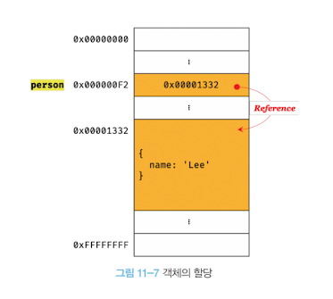
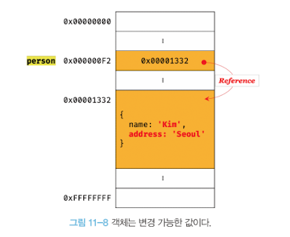
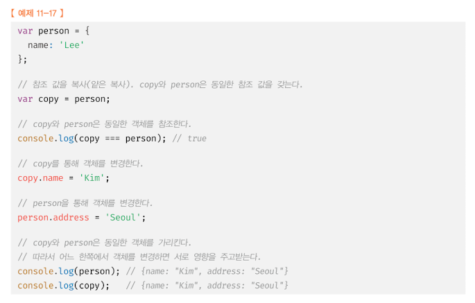

# 11. 원시 값과 객체의 비교

- 원시 타입의 값, 즉 원시 값은 변경 불가능한 값이다. 이에 비해 객체(참조) 타입의 값, 즉 객체는 변경 가능한 값이다.
- 원시 값을 변수에 할당하면 변수(확보된 메모리 공간) 에는 실제 값이 저장된다. 이에 비해 객체를 변수에 할당하면 변수(확보된 메모리 공간) 에는 참조 값이 저장된다.
- 원시 값을 갖는 변수를 다른 변수에 할당하면 원본의 원시 값이 복사되어 전달된다. 이를 값에 의한 전달이라 한다. 이에 비해 객체를 가리키는 변수를 다른 변수에 할당하면 원본의 참조 값이 복사되어 전달된다. 이를 전달이라 한다.

## 11.1 원시 값

변수는 하나의 값을 저장하기 위해 확보한 메모리 공간 자체 또는 그 메모리 공간을 식별하기 위해 붙인 이름이다.
값은 변수에 저장된 데이터로서 표현식이 평가되어 생성된 결과를 말한다.
**변경 불가능하다는 것은 변수가 아니라 값에 대한 진술이다.**

만약 원시 값이 변경 가능한 값이라면 변수에 새로운 원시 값을 재할당했을 때 변수가 가리키던 메모리 공간의 주소를 바꿀 필요없이 원시 값 자체를 변경하면 그만이다.
허나, 원시 값은 변경 불가능한 값이므로, 변수 값을 변경하기 위해 원시 값을 재할당하면 새로운 메모리 공간을 확보하고 재할당한 값을 저장한 후, 변수가 참조하던 메모리 공간의 주소를 변경한다. 값의 이러한 특성을 **불변성** 이라 한다.

## 11.2 객체

객체(참조) 타입의 값, 즉 객체는 변경 가능한 값이다.
객체를 할당한 변수가 기억하는 메모리 주소를 통해 메모리 공간에 접근하면 참조 값에 접근할 수 있다.

메모리를 효율적으로 사용하기 위해, 그리고 객체를 복사해 생성하는 비용을 절약하여 성능을 향상시키기 위해 객체는 변경 가능한 값으로 설계되어 있다.
메모리 사용의 효율성과 성능을 위해 어느 정도의 구조적인 단점을 감안한 설계라고 할 수 있다.
객체는 이러한 구조적 단점에 따른 부작용이 있다. 여러 개의 식별자가 하나의 객체를 공유할 수 있다는 것이다.

## 11.2.2 참조에 의한 전달

**결국, "값에 의한 전달" 과 "참조에 의한 전달" 은 식별자가 기억하는 메모리 공간에 저장되어 있는 값을 복사해서 전달한다는 면에서 동일하다.**
다만 식별자가 기억하는 메모리 공간, 즉 변수에 저장되어 있는 값이 원시 값이냐 참조 값이냐 차이만 있을 뿐이다.
**따라서 자바스크립트는 "참조에 의한 전달" 은 존재하지 않고 "값에 의한 전달" 만이 존재한다고 말할 수 있다.**
