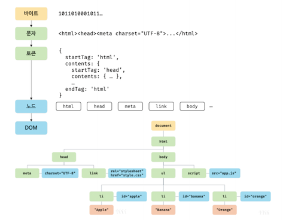

# 브라우저의 렌더링 과정

## 렌더링 요약

1. 브라우저가 HTML, CSS, 자바스크립트, 이미지, 폰트 파일 등 리소스를 서버에게 요청 및 응답을 받는다.
1. 브라우저의 렌더링 엔진이 응답 받은 HTML, CSS 를 파싱, DOM 과 CSSOM 을 생성하고 이를 결합하여 렌더 트리를 생성한다.
1. 브라우저의 자바스크립트 엔진이 응답 받은 자바스크립트를 파싱, AST(Abstract Syntax Tree) 를 생성, 이를 바이트 코드로 변환하여 실행한다. 이 때 자바스크립트는 DOM API 를 이용하여 DOM, CSSOM 을 조작할 수 있다.
1. 렌더 트리를 기반으로 HTML 요소의 레이아웃을 계산, 브라우저 화면에 HTML 요소를 페인팅 한다.

## HTML 파싱과 DOM 생성

서버로부터 응답 받은 HTML 문서는 문자열로 이루어진 순수한 텍스트이다. 이를 브라우저에 시각적인 픽셀로 렌더링하려면 HTML 문서를 브라우저가 이해할 수 있는 자료구조(객체) 로 변환하여 메모리에 저장해야 한다.  
아래 그림의 각 토큰을 객체로 변환하여 노드들을 생성한다.

 
<strong>즉, DOM 은 HTML 문서를 파싱한 결과물이다. </strong>
