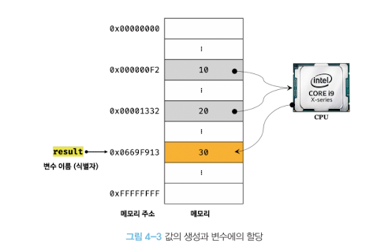
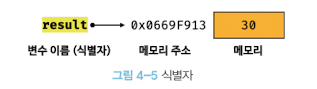
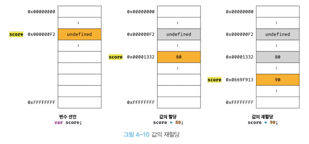

# 4.변수

## 4.1 변수란 무엇인가? 왜 필요한가?

컴퓨터는 CPU 를 사용해 연산하고, 메모리를 사용해 데이터를 기억한다. 메모리는 데이터를 저장할 수 있는 메모리 셀의 집합체다. 메모리 셀 하나의 크기는 1바이트(8비트) 이며, 컴퓨터는 메모리 셀의 크기, 즉 1바이트 단위로 데이터를 저장하거나 읽어들인다.
각 셀은 고유한 메모리 주소를 갖는다. 이 메모리 주소는 메모리 공간의 위치를 나타내며, 0부터 시작해서 메모리의 크기만큼 정수로 표현된다.

메모리 주소를 통해 값에 직접 접근한다는 것은 치명적 오류를 발생시킬 가능성이 높은 매우 위험한 일이다. 운영체제가 사용하고 있는 값을 변경하면 시스템을 멈추게 할 수 있기 때문이다. 자바스크립트는 개발자의 직접적인 메모리 제어를 허용하지 않는다.

값이 저장될 메모리 주소는 코드가 실행될 때 메모리의 상황에 따라 임의로 결정된다. 즉, <strong>동일한 컴퓨터에서 동일한 코드를 실행해도 코드가 실행될 때마다 값이 저장될 메모리 주소는 변경된다.</strong> 따라서 메모리 주소를 통해 직접 접근하려는 시도는 올바른 방법이 아니다.

프로그래밍 언어는 기억하고 싶은 값을 메모리에 저장하고, 저장된 값을 읽어 들여 재사용하기 위해 변수라는 메커니즘을 제공한다.

코드는 컴퓨터에게 내리는 명령이지만 개발자를 위한 문서이기도 하다. 개발자의 의도를 나타내는 명확한 네이밍은 코드를 이해하기 쉽게 만들며, 이는 협업과 품질 향상에 도움을 준다. <strong>변수 이름은 첫 아이 이름을 짓듯이 심사숙고해서 지어야 한다.</strong>

## 4.2 식별자

식별자는 어떤 값을 구별해서 식별할 수 있는 고유한 이름을 말한다. <strong>식별자는 어떤 값이 저장되어 있는 메모리 주소를 기억(저장)해야 한다. 즉, 식별자는 값이 저장되어 있는 메모리 주소와 매핑 관계를 맺으며, 이 매핑 정보도 메모리에 저장되어야 한다. </strong>

<strong>식별자로 값을 구별해서 식별한다는 것은 식별자가 기억하고 있는 메모리 주소를 통해 메모리 공간에 저장된 값에 접근할 수 있다는 의미다. 즉, 식별자는 메모리 주소에 붙인 이름이라고 할 수 있다.</strong>

식별자라는 용어는 변수 이름에만 국한해서 사용하지 않는다. 변수, 함수, 클래스 등의 이름은 모두 식별자다.

## 4.3 변수선언

변수를 선언한 이후, 아직 변수에 값을 할당하지 않았다. 따라서 변수 선언에 의해 확보된 메모리 공간은 비어 있을 것으로 생각할 수 있으나 <strong>확보된 메모리 공간에는 자바스크립트 엔진에 의해 undefined 라는 값이 암묵적으로 할당되어 초기화된다.</strong> 이것은 자바스크립트의 독특한 특징이다.

#### 변수 이름은 어디에 등록되는가?

변수 이름을 비롯한 모든 식별자는 <b>실행 컨텍스트</b>에 등록된다. <strong>실행 컨텍스트는 자바스크립트 엔진이 소스코드를 평가하고 실행하기 위해 필요한 환경을 제공하고 코드의 실행 결과를 실제로 관리하는 영역이다.</strong> 자바스크립트 엔진은 실행 컨텍스트를 통해 식별자와 스코프를 관리한다.

만약 초기화 단계를 거치지 않으면 확보된 메모리 공간에는 이전에 다른 애플리케이션이 사용했던 값이 남아있을 수 있다. 이러한 값을 쓰레기 값이라 한다.

만약 선언하지 않은 식별자에 접근하면 ReferenceError 가 발생한다.

## 4.4 변수 선언의 실행 시점과 변수 호이스팅

자바스크립트 엔진은 소스코드를 한 줄씩 순차적으로 실행하기(런타임)에 앞서 먼저 소스코드의 평가 과정을 거치면서 소스코드를 실행하기 위한 준비를 한다. <strong>즉, 변수 선언을 포함한 모든 선언문(변수, 함수)을 소스코드에서 찾아내 먼저 실행한다. 즉, 모든 선언(런타임 전) 후 소스코드 실행(런타임 중).</strong>

따라서 <strong>변수 선언이 소스코드의 어디에 위치하는지와 상관없이 어디서든지 변수를 참조할 수 있는데, 이처럼 변수 선언문이 코드의 선두로 끌어 올려진 것처럼 동작하는 자바스크립트 고유의 특징을 변수 호이스팅</strong>이라 한다.
var, let, const, function, function\*, class 키워드를 사용해서 선언하는 모든 식별자(변수, 함수, 클래스)는 호이스팅 된다. 모든 선언문은 런타임 이전 단계에서 먼저 실행되기 때문이다.

## 4.6 값의 재할당

현재 score 변수의 값은 90 이다. score 변수의 이전 값인 undefined 와 80 은 어떤 변수도 값으로 갖고 있지 않다. 즉, 어떤 식별자와도 연결되어 있지 않다. 이러한 불필요한 값들은 가비지 콜렉터에 의해 매모리에서 자동 해제된다. 단, 메모리에서 언제 해제될지는 예측할 수 없다.
