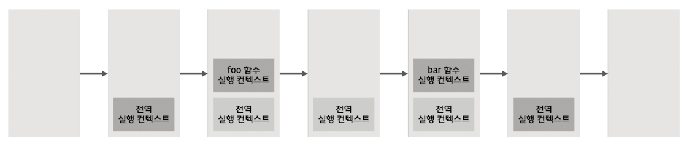
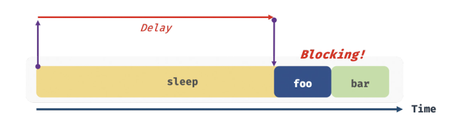
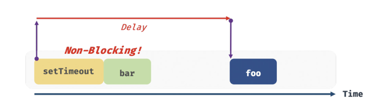
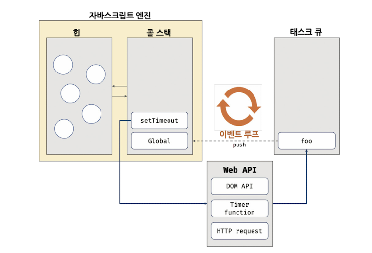
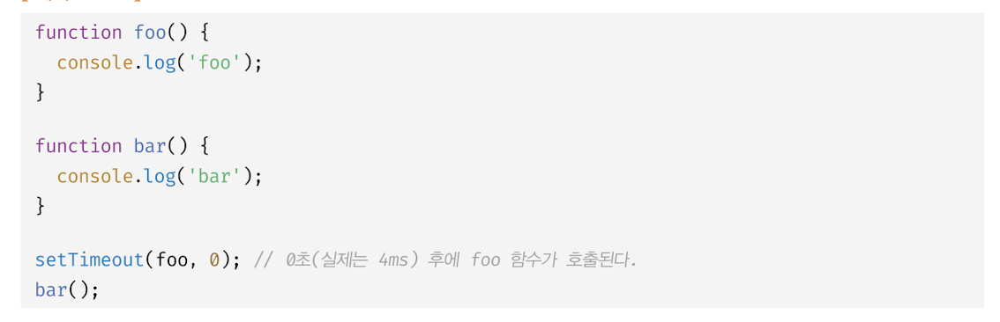

### 42.1 동기 처리와 비동기 처리

1. 함수 실행 프로세트
   1. 함수 호출 → 함수코드 평가 → 함수 실행 컨텍스트 생성
   2. 함수 실행 컨텍스트가 콜 스택에 푸시되어 함수 코드가 실행된다.
   3. 함수 코드 실행이 종료되면 콜 스택에서 팝 되어 제거된다.

&nbsp;&nbsp;

&nbsp;&nbsp;&nbsp;**함수의 실행 순서는 이 콜 스택으로 관리하는데, 자바스크립트 엔진은 단 하나의 실행 컨텍스트 스택(콜 스택)을 갖는다.**

2. 동기 처리로 인한 블로킹 현상
   이처럼 자바스크립트 엔진은 한 번에 하나의 태스크만 실행할 수 있는 **싱글 스레드(single thread)** 방식으로 동작하기 때문에 처리에 시간이 걸리는 태스크를 실행하는 경우 블로킹(작업중단) 현상이 발생한다.

3. 비동기 처리
   만약 타이머 함수인 setTimeout 을 이용하면 이후의 태스크를 블로킹하지 않고 곧바로 실행하는데, 이와 같이 현재 실행 중인 태스크가 종료되지 않은 상태에도 다음 태스크를 곧바로 실행하는 방식을 **비동기 처리**라 한다.

&nbsp;&nbsp;이처럼 타이머 함수인 setTimeout 과 setInterval, HTTP 요청, 이벤트 핸들러 는 비동기 처리 방식으로 동작한다.

### **42.2 이벤트 루프와 태스크 큐(비동기 처리하는 프로세스)**

브라우저의 동작을 보면 태스크가 동시에 처리되는 것처럼 느껴지는데, 이러첨 자바스크립트의 동시성(concurrency) 을 지원하는 것이 이벤트 루프(event loop)이다. 이벤트 루프는 브라우저에 내장되어 있는 기능이다.

- 힙: 객체가 저장되는 메모리 공간으로 콜 스택의 요소인 실행 컨텍스트는 힙에 저장된 객체를 참조한다. 저장할 객체는 원시 값과 달리 크기가 정해져 있지 않기 때문에 할당해야 할 메모리 공간의 크기를 런타임에 동적으로 할당해야 한다. 즉, 메모리 공간인 힙은 구조화 되어 있지 않다.  
- 태스크 큐: 비동기 함수의 콜백 함수 또는 이벤트 핸들러가 일시적으로 보관되는 영역  
- 이벤트 루프: 콜 스택과 태스크 큐를 반복해서 확인하고, 콜 스택이 비어 있고 태스크 큐에 대기 중인 함수가 있으면 이 이벤트 루프가 순차적으로 태스크 큐에서 콜 스택으로 함수를 이동 시킨다. 즉, 태스크 큐의 함수들은 비동기 처리 방식으로 동작하는 것이다.

비동기 처리에서 소스코드의 평가와 실행을 제외한 모든 처리는 자바스크립트 엔진을 구동하는 환경인 **브라우저 또는 Node.js** 가 담당한다.

- 자바스크립트 엔진: 비동기로 동작하는 setTimeout 의 콜백 함수의 평가와 실행 담당

- 브라우저 || Node.js: **호출 스케쥴링을 위한 타이머 설정과 콜백 함수 태스크 큐에 등록 담당**. 이를 위해 브라우저 환경이 태스크 큐와 이벤트 루프를 제공한다.

### 비동기처리 프로세스 예제

1. 전역 코드 평가 → 전역 실행 컨텍스트 생성 → 콜 스택 푸시

2. setTimeout 함수 실행 컨텍스트 생성 → 콜 스택 푸시

3. 브라우저가 setTimeout 함수의 콜백 함수를 호출 스케쥴링(타이머 설정) 하고, 이 setTimeout 함수는 콜 스택에서 팝 된다.

4. 병행 처리
   1. 브라우저: 타이머 만료시 콜백함수 foo 를 태스크 큐에 푸시한다.
   2. 자바스크립트 엔진: bar 함수 실행 컨텍스트 생성 → 콜스택 푸시 → 현재 실행 중인 실행 컨텍스트 → bar 함수 종료 → 콜스택에서 팝

5. 전역 코드 실행 종료 → 전역 실행 컨텍스트 팝

6. 이벤트 루프에 의해 콜스택 비어 있음이 감지 → 태스크 큐의 콜백함수 foo 가 콜스택에 푸시 되어 실행된다. → foo 팝

**자바스크립트 엔진은 싱글 스레드로 동작하고, 브라우저는 멀티 스레드로 동작하기 때문에 비동기 처리가 가능하다. 즉, 브라우저와 자바 스크립트 엔진이 협력하여 비동기 함수를 실행하는 것이다.**
