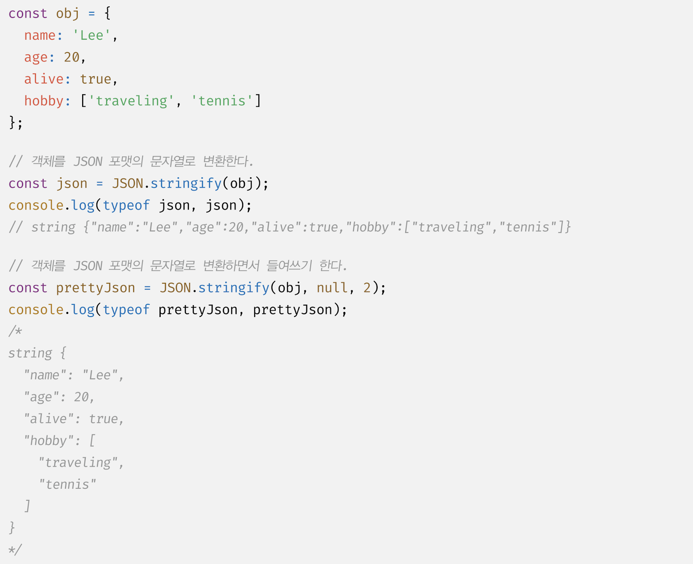
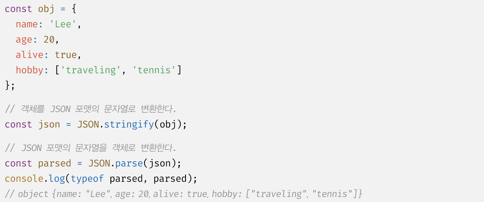
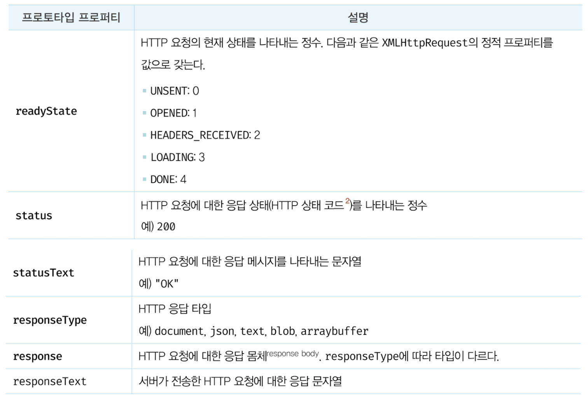
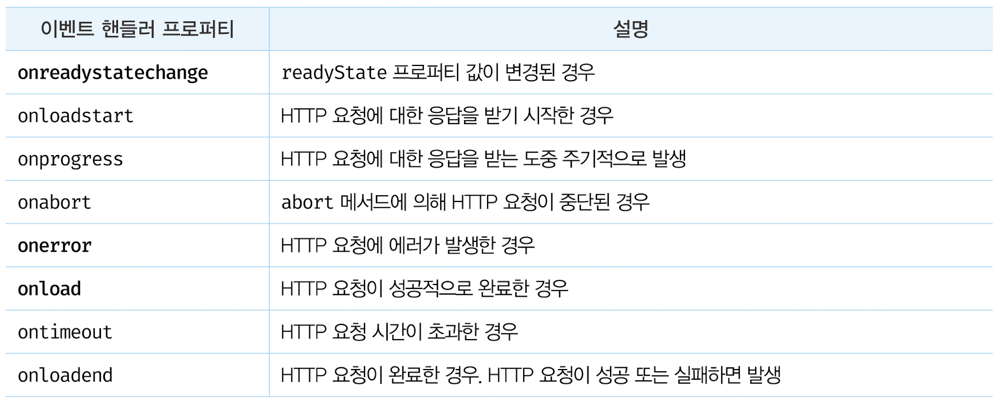
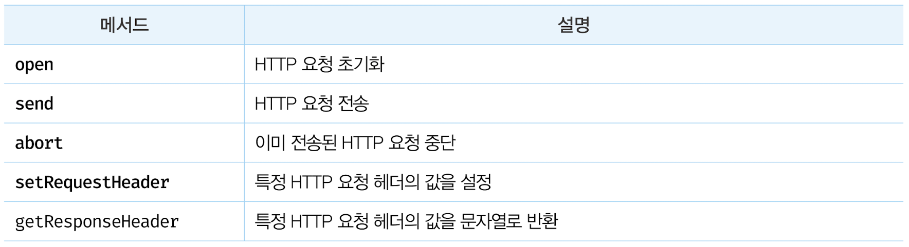
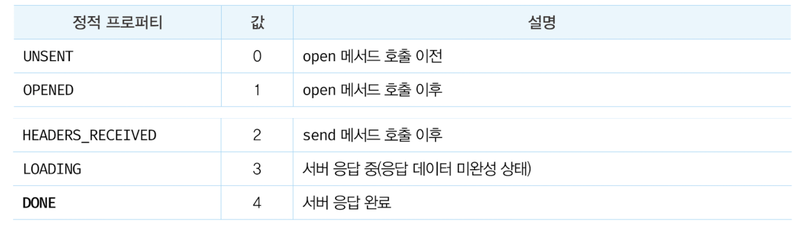
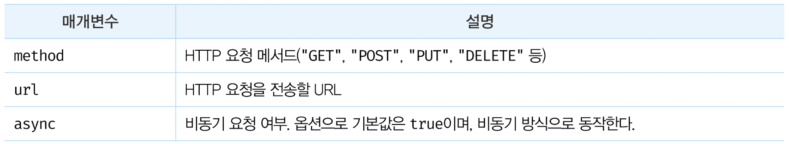
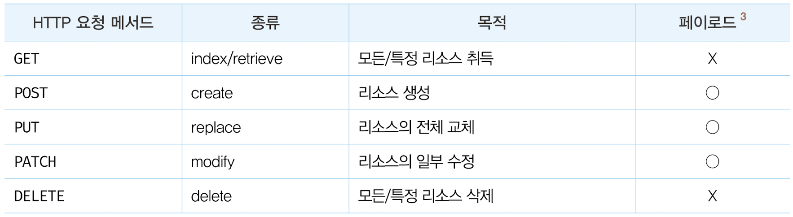
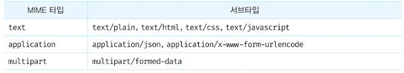
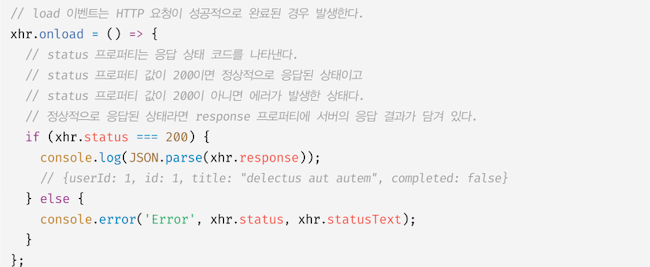

### 43.1 Ajax 란?

Asynchronous Javascript XML

- 자바스크립트를 사용하여 브라우저가 서버에게 <strong>비동기 방식</strong>으로 데이터를 요청하고, 서버가 응답한 데이터를 수신하여 웹페이지를 동적으로 갱신하는 프로그래밍 방식
- Ajax 는 브라우저에서 제공하는 Web API 인 XMLHttpRequest 객체를 기반으로 동작
- 이 객체는 HTTP 비동기 통신을 위한 메서드와 프로퍼티를 제공

\*XML

- XML stands for eXtensible Markup Language
- Much like HTML
- XML was designed to store and transport data
- XML is a W3C Recommendation
- Difference between XML and HTML
  - HTML was designed to display data with focus on how data looks
  - XML tags are not predefined like HTML tags are(e.g. to, from tags)
  ```xml
  <note>
    <to>Tove</to>
    <from>Jani<from>
    <heading>Reminder</heading>
    <body>Today Schedule!</body>
  </note>
  ```

Ajax 등장 전의 웹페이지

- html 태그로 시작해서 html 태그로 끝나는 완전한 HTML 을 서버로부터 전송받아 웹페이지 전체를 처음부터 다시 렌더링
- 변경할 필요없는 부분까지 다시 렌더링하여 깜빡거림
- 동기 방식으로 동작하여 서버로부터 응답이 있을때까지 다음 동작은 블로킹됨

Ajax 등장 후

- 서버로부터 웹페이지의 변경에 필요한 데이터만 비동기 방식으로 전송받아 이 부분만 한정적으로 렌더링이 가능해짐
- 브라우저에서도 데스크탑 어플과 유사한 빠른 퍼포먼스와 부드러운 화면 전환이 가능해짐

### 43.2 JSON

Javascript Object Notation

- 서버 간의 HTTP 통신을 위한 텍스트 데이터 포맷
- 자바스크립트에 종속되지 않은 언어 독립형 데이터 포맷

  43.2.1 JSON 표기 방식

```json
{
  "name": "Kim",
  "age": 30,
  "alive": true,
  "hobby": ["cooking", "programming"]
}
```

43.2.2 JSON.stringify(object → string)

이 메서드는 객체/배열을 JSON 포맷의 문자열로 변환한다. 이처럼 클라이언트가 서버로 객체를 전송하려면 객체를 문자열화(string)해야 하는데 이를 직렬화(serializing) 라고 한다. 두 번째 인수로 replacer 함수를 전달한다.


43.2.3 JSON.parse(string → object)

이 메서드는 JSON 포맷의 문자열을 객체로 변환한다. 서버로부터 클라이언트에 전송된 JSON 데이터는 문자열이기 때문에 JSON 포맷 문자열을 객체화해야 하는데 이를 역직렬화(deserializing) 이라고 한다.  


### 43.3 XMLHttpRequest

- 브라우저는 주소창, HTML 의 form, a 태그를 통해 HTTP 요청 전송 기능을 기본 제공한다.
- 자바스크립트를 사용하여 HTTP 요청을 전송하려면 XMLHttpRequest 객체를 사용한다.

아래와 같은 코드 프로세스로 요청을 보낸다.

```jsx
// XMLHttpRequest 객체 생성
const xhr = new XMLHttpRequest();

// HTTP 요청 초기화
xhr.open("GET", "/users");

// HTTP 요청 헤더 설정
// 클라이언트가 서버로 전송할 데이터의 MIME 타입 지정: json
xhr.setRequestHeader("content-type", "application/json");

// HTTP 요청 전송
xhr.send(JSON.stringify({ id: 1, content: "HTML", completed: false }));

// HTTP 요청 응답 처리
xhr.onreadystatechange = () => {
  // readyState 프로퍼티는 HTTP 요청의 현재 상태를 나타낸다.
  // readyState 프로퍼티 값이 4(XMLHttpRequest.DONE)가 아니면 서버 응답이 완료되지 않은 상태이다.
  if (xhr.readyState !== XMLHttpReqeust.DONE) return;
  if (xhr.status === 200) {
    console.log(JSON.parse(xhr.response));
  } else {
    console.error("Error", xhr.status, xhr.statusText);
  }
};
```

43.3.1 XMLHttpRequest 객체 생성

```jsx
const xhr = new XMLHttpRequest();
```

43.3.2 XMLHttpRequest 객체의 프로퍼티와 메서드

1.  프로토타입 프로퍼티

    

2.  이벤트 핸들러 프로퍼티

    

3.  메서드

    

4.  정적 프로퍼티

    

43.3.3 HTTP 요청 전송

- XMLHttpRequest.prototype.open 메서드로 HTTP 요청 초기화
- XMLHttpRequest.prototype.setRequestHeader 메서드로 특정 HTTP 요청의 헤더 값 설정
- XMLHttpRequest.prototype.send 메서드로 HTTP 요청을 전송

1.  XMLHttpRequest.prototype.open

    ```jsx
    xhr.open(method, url[, async])
    ```

     
     

2.  XMLHttpRequest.prototype.send
    <br/>

    - GET 요청 메서드: 데이터를 URL의 일부인 쿼리 문자열로 서버에 전송
    - POST 요청 메서드: 데이터(페이로드)를 요청 몸체(Request Body)에 담아 전송

    send 메서드에는 요청 몸체에 담아 전송할 데이터를 인수로 전달할 수 있다.

    ```jsx
     xhr.send(JSON.stringify({ id: 1, content: "HTML", completed: false }));
    ```

3.  XMLHttpRequest.prototype.setRequestHeader
    <br/>

    아래와 같이 특정 HTTP 요청의 헤더 값을 설정한다.
    <br/>

    a) Content-type
    **Request Body 에 담아 전송할 데이터의 \*MIME 타입 정보를 표현** 

    \*MIME: Multipurpose Internet Mail Extensions
    : 전자우편의 데이터 형식을 정의한 표준 포맷

    ```jsx
    xhr.setRequestHeader("content-type", "application/json");
    ```

    b) Accept
    서버가 응답할 데이터의 MIME 타입을 표현한다. 즉, 클라이언트가 이해할 수 있는 MIME 타입을 알려주는 것

    ```jsx
    xhr.setRequestHeader("accept", "application/json");
    ```

    설정하지 않을 시 Accept 헤더가 */* 로 전송된다.

43.3.4 HTTP 응답 처리

서버가 전송한 응답을 처리하려면 XMLHttpRequest 객체가 발생시키는 이벤트를 캐치해야 하는데, `onreadystatechange`, `onload` , `onerror` 같은 이벤트 핸들러 프로퍼티로 이를 처리할 수 있다.


