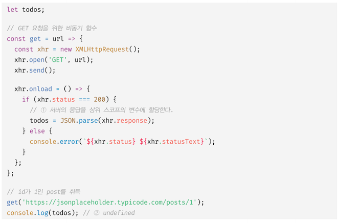
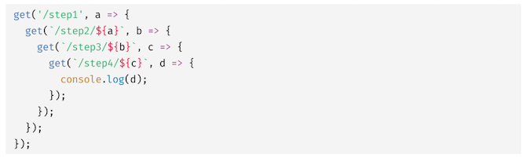
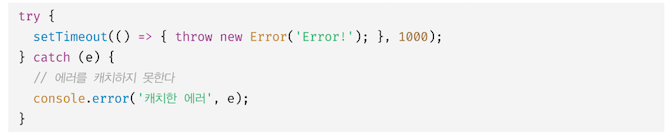
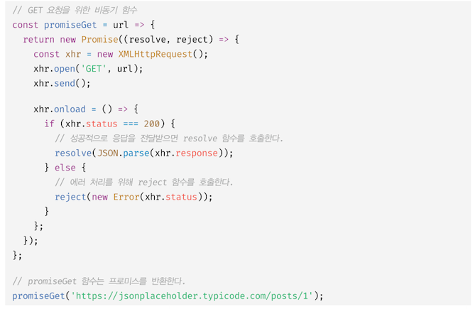
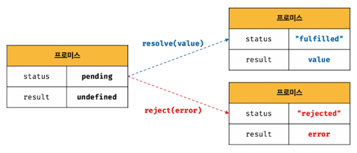
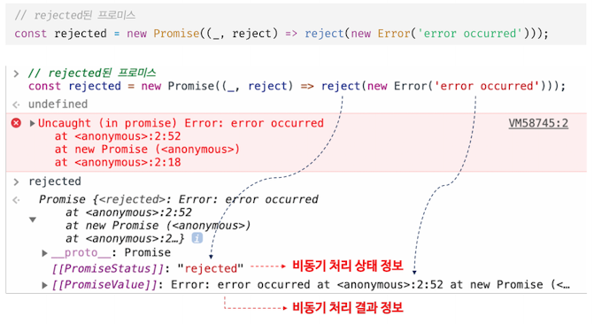

### 45.1 비동기 처리를 위한 콜백 패턴의 단점 = 콜백 헬

비동기 함수 내부의 비동기로 동작하는 코드는 비동기 함수가 종료된 이후에 완료된다. 따라서 비동기 함수 내부의 비동기로 동작하는 코드에서 처리 결과를 외부로 반환하거나 상위 스코프의 변수에 할당하면 기대한 대로 동작하지 않는다.

&nbsp;&nbsp;

xhr.onload 이벤트 핸들러 프로퍼티에 바인딩한 이벤트 핸들러는 언제나 (2) 의 console.log 가 종료한 이후에 호출된다.

1. get 함수가 종료되면 get 함수의 실행 컨텍스트가 콜 스택에서 팝되고, 바로 (2) 의 console.log 가 호출된다.

2. console.log 의 실행 컨텍스트가 생성되어 실행 컨텍스트 스택에 푸시된다.

3. 서버로부터 응답이 도착하면 xhr 객체에서 load 이벤트가 발생한다. 이 비동기 이벤트는 일단 태스크 큐에 저장되어 대기하다, 콜 스택이 비면 이벤트 루프에 의해 콜 스택으로 푸시되어 실행된다. (2) 는 이미 종료된 이후이다.

비동기 함수는 **1) 비동기 처리 결과를 외부에 반환할 수도 없고 2) 상위 스코프의 변수에 할당할 수도 없다.**
즉, 비동기 함수의 처리결과(서버의 응답 등) 에 대한 후속 처리는 비동기 함수 내부에서 수행해야 한다.

이때 콜백 함수를 전달하는게 일반적이다.

콜백 함수를 통해 비동기 처리 결과에 대한 후속 처리를 수행하는 비동기 함수가 비동기 처리 결과를 가지고 또다시 비동기 함수를 호출해야 할 경우, 콜백 함수 호출이 중첩되어 복잡도가 높아지는 현상이 발생하는데 이를 **콜백 헬**(**callback hell**) 이라 한다.

&nbsp;&nbsp;

### 45.1.2 에러 처리의 한계

비동기 처리를 위한 콜백 패턴의 문제점 중 가장 심각한 것은 **에러 처리가 곤란하다**는 것이다.

&nbsp;&nbsp;

에러는 호출자(caller) 방향으로 전파된다. 즉, 실행 중인 실행 컨텍스트가 푸시되기 직전에 푸시된 실행 컨텍스트 방향으로 전파된다.  
하지만 setTimeout 함수의 콜백 함수를 호출한 것은 setTimeout 함수가 아니다(setTimout 함수의 콜백 함수가 실행될 때 setTimeout 함수는 이미 콜 스택에서 제거된 상태). 따라서 setTimeout 함수의 콜백 함수가 발생시킨 에러는 catch 블록에서 캐치되지 않는다.  
이러한 콜백 패턴은 **1) 콜백 헬**이나 **2) 에러처리가 곤란하다**는 문제가 있기에 이를 극복하기 위해 ES6에서 프로미스가 도입되었다.

### 45.2 프로미스의 생성

비동기 처리는 Promise 생성자 함수가 인수로 전달받은 콜백 함수 내부에서 수행한다.
비동기 처리가 성공하면 비동기 처리 결과를 resolve 함수에 인수로 전달하면서 호출하고,
비동기 처리가 실패하면 에러를 reject 함수에 인수로 전달하면서 호출한다.

&nbsp;&nbsp;

프로미스는 현재 비동기 처리가 어떻게 진행되고 있는지를 나타내는 상태 정보를 갖는다. 그리고 프로미스의 상태는 resolve 또는 reject 함수를 호출하는 것으로 결정된다. 즉, **프로미스는 비동기 처리 상태와 처리 결과를 관리하는 객체**다.

&nbsp;&nbsp;
&nbsp;&nbsp;
