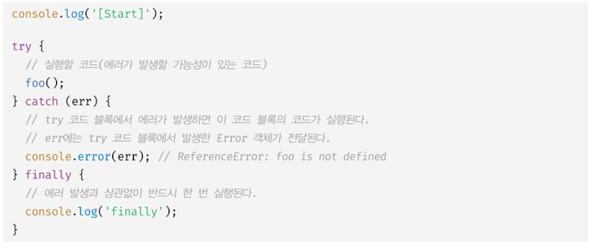
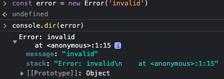
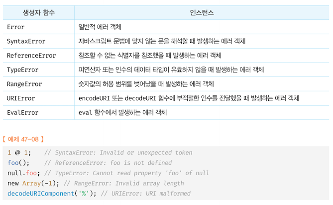
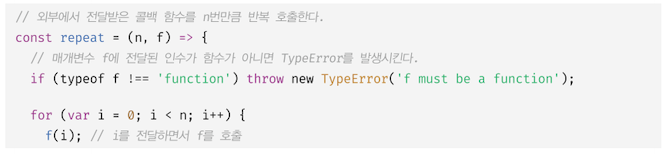
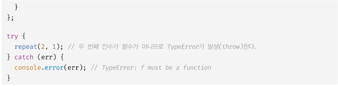
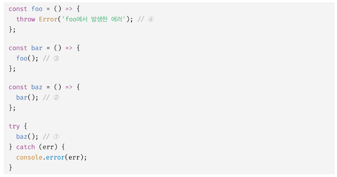

### 47.1 에러 처리의 필요성

발생한 에러를 대처하지 않고 방치하면 프로그램은 강제 종료된다.

이 때 try...catch 문을 사용하면 에러가 발생하더라도 계속해서 코드 실행이 가능하다.

에러 처리를 구현하는 방법은 두가지가 있다.

1. 반환하는 값이 null 또는 -1 같은 경우, 이것을 if문이나 단축 평가 또는 옵셔널 체이닝 연산자를 통해 확인해서 처리하는 방법
2. 에러 처리 코드를 미리 등록해두고 에러 발생 시 에러 처리 코드로 점프하도록 하는 방법

### 47.2 try...catch...finally 문

try...catch...finally 문으로 에러를 처리하면 프로그램이 강제 종료되지 않는다.
&nbsp;&nbsp;

### 47.3 Error 객체

Error 생성자 함수는 에러 객체를 생성한다. 에러 메세지를 인수로 전달할 수도 있다.

Error 생성자 함수가 생성한 에러 객체는 message 프로퍼티와 stack 프로퍼티를 갖는데,

- message 프로퍼티 값은 Error 생성자 함수에 인수로 전달한 에러메세지
- stack 프로퍼티 값은 에러를 발생시킨 콜스택의 호출 정보를 나타내는 문자열로 디버깅

목적으로 사용한다.
&nbsp;&nbsp;

자바스크립트는 총 7가지의 에러 객체를 생성할 수 있는 Error 생성자 함수를 제공한다. 에러 객체의 프로토타입은 모두 Error.prototype 을 상속받는다.
&nbsp;&nbsp;

### 47.4 throw 문

에러를 발생시키려면 try 코드 블록에서 throw 문으로 에러 객체를 던져야 한다.
throw 문의 표현식은 어떤 값이라도 상관없지만 일반적으로 에러 객체를 지정한다.
&nbsp;&nbsp;
&nbsp;&nbsp;

### 47.5 에러의 전파

에러는 콜 스택의 아래 방향(실행 중인 실행 컨텍스트가 푸시되기 직전에 푸시된 실행 컨텍스트 방향) 으로 전파된다.
&nbsp;&nbsp;

