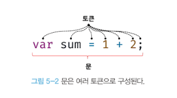

# 5. 표현식과 문

## 5.1 값

값은 식(표현식)이 평가되어 생성된 결과를 말한다.
메모리에 저장된 값은 데이터 타입에 따라 다르게 해석될 수 있다.

## 5.2 리터럴

리터럴은 사람이 이해할 수 있는 문자 또는 약속된 기호를 사용해 값을 생성하는 표기법을 말한다.
자바스크립트 엔진은 코드가 실행되는 시점인 런타임에 리터럴을 평가해 값을 생성한다. 즉, 리터럴은 값을 생성하기 위해 미리 약속된 표기법이라고 할 수 있다.


## 5.3 표현식

표현식(expression) 은 값으로 평가될 수 있는 문이다. 즉, 표현식 평가되면 새로운 값을 생성하거나 기존 값을 참조한다.
이미 선언된 변수 식별자를 참조하면 변수 값으로 평가된다. 식별자 참조는 값을 생성하지는 않지만 값으로 평가되므로 표현식이다.
<strong>표현식은 값으로 평가된다. 표현식과 표현식이 평가된 값은 동등한 관계, 즉 동치다.
예를 들어 `1+2=3` 에서 `1+2` 는 `3` 과 동치다. 이 때문에 표현식은 값처럼 사용할 수 있다. 이것은 문법적으로 값이 위치할 수 있는 자리에는 표현식도 위치할 수 있다는 것을 의미한다.</strong>

## 5.4 문

<strong>문(statement) 은 프로그램을 구성하는 기본 단위이자 최소 실행 단위다.</strong> 문의 집합으로 이뤄진 것이 프로그램이며, 문을 작성하고 순서에 맞게 나열하는 것이 프로그래밍이다.
문은 여러 토근으로 구성된다. <strong>토큰(token) 이란 문법적인 의미를 가지며, 문법적으로 더 이상 나눌 수 없는 코드의 기본 요소를 의미한다.</strong> 예를 들어, 키워드, 식별자, 연산자, 리터럴, 세미콜론이나 마침표 등의 특수 기호는 문법적인 의미를 가지며, 문법적으로 더 이상 나눌 수 없는 코드의 기본 요소이므로 모두 토큰이다.



## 5.5 세미콜콘과 세미콜론 자동 삽입 기능

<strong>세미콜론은 문의 종료를 나타낸다. 즉, 자바스크립트 엔진은 세미콜론으로 문이 종료한 위치를 파악하고 순차적으로 하나씩 문을 실행한다.</strong> 따라서 문을 끝낼 때는 세미콜론을 붙여야 한다. 하지만, 코드 블록(`{}`)은 언제나 문의 종료를 의미하는 자체 종결성이 있기 때문에 세미콜론을 붙일 필요가 없다.

## 5.6 표현식인 문과 표현식이 아닌 문

<strong>이를 확인하는 가장 간단하고 명료한 방법은 변수에 할당해 보는 것이다.</strong> 표현식인 문은 값으로 평가되므로 변수에 할당할 수 있다. 하지만 표현식이 아닌 문은 값으로 평가할 수 없으므로 변수에 할당하면 에러가 발생한다.

```js
var foo = var x; //SyntaxError: Unexpected token var
```
