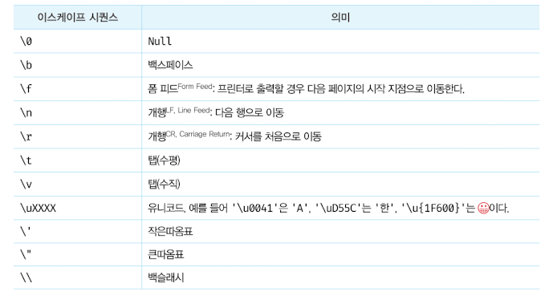
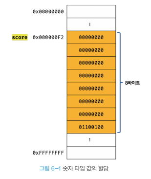

# 6. 데이터 타입

## 6.1 숫자 타입

ECMAScript 사양에 따르면 숫자 타입의 값은 배정밀도 64비트 부동소수점 형식을 따른다. 즉, 모든 수를 실수로 처리하며, 정수만 표현하기 위한 데이터 타입이 별도로 존재하지 않는다.
숫자 타입은 추가적으로 세 가지 특별한 값도 표현할 수 있다.

- Infinity: 양의 무한대
- -Infinity: 음의 무한대
- NaN: 산술 연산 불가(not-a-number)
  ```js
  console.log(10 / 0); //Infinity
  console.log(10 / -0); // -Infinity
  console.log(1 * "String"); //Nan
  ```

## 6.2 문자열 타입

문자열은 0개 이상의 16비트 유니코드 문자(UTF-16) 의 집합으로 전 세계 대부분의 문자를 표현할 수 있다.
<strong>다른 타입의 값과 달리 문자열을 따옴표로 감싸는 이유는 키워드나 식별자 같은 토큰과 구분하기 위해서다.</strong> 먄약 문자열을 따옴표로 감싸지 않으면 자바스크립트 엔은 키워드나 식별자 같은 토큰으로 인식한다.

C는 문자열 타입을 제공하지 않고 문자의 배열로 문자열을 표현하고, 자바는 문자열을 객체로 표현한다. 그러나 자바스크립트의 문자열은 원시 타입이며, 변경 불가능한 값이다.

## 6.3 템플릿 리터럴

ES6부터 템플릿 리터럴이라고 하는 새로운 문자열 표기법이 도입되었다. <strong>템플릿 리터럴은 멀티라인 문자열, 표현식 삽입, 태그드 템플릿 등 편리한 문자열 처리 기능을 제공한다. 템플릿 리터럴은 런타임에 일반 문자열로 변환되어 처리된다.</strong>

### 6.3.1 멀티라인 문자열

일반 문자열 내에서 줄바꿈 등의 공백을 표현하려면 백슬래시(\)로 시작하는 <b>이스케이프 시퀀스</b>를 사용해야 한다.



일반 문자열과 달리 템플릿 리터럴 내에서는 이스케이프 시퀀스를 사용하지 않고도 줄바꿈이 허용되며, 모든 공백도 있는 그대로 적용된다.

```js
var template = `<ul>
  <li><a href="#">Home</a></li>
<ul>
`;
```

출력 결과는 아래와 같다.

```html
<ul>
  <li><a href="#">Home</a></li>
</ul>
```

### 6.3.2 표현식 삽입

템플릿 리터럴 내에서는 표현식 삽입을 통해 간단히 문자열을 삽입할 수 있다.
<strong>표현식을 삽입하려면 `${}` 으로 표현식을 감싼다. 이때 표현식의 평가 결과가 문자열이 아니더라도 문자열로 타입이 강제로 변환되어 삽입된다.</strong>

## 6.4 불리언 타입

## 6.5 undefined 타입

undefined 는 개발자가 의도적으로 할당하기 위한 값이 아니라 자바스크립트 엔진이 변수를 초기화할 때 사용하는 값이다.

## 6.6 null 타입

프로그래밍 언어에서 null 은 변수에 값이 없다는 것을 의도적으로 명시할 때 사용한다. 변수에 null 을 할당하는 것은 변수가 이전에 참조하던 값을 더 이상 참조하지 않겠다는 의미다. <strong>이는 이전에 할당되어 있던 값에 대한 참조를 명시적으로 제거하는 것을 의미하며, 자바스크립트 엔진은 누구도 참조하지 않는 메모리 공간에 대해 가비지 콜렉션을 수행할 것이다.</strong>

## 6.7 심벌 타입

## 6.8 객체 타입

## 6.9 데이터 타입의 필요성

자바스크립트 엔진은 데이터 타입, 즉 값의 종류에 따라 정해진 크기의 메모리 공간을 확보한다. 즉, 변수에 할당되는 값의 데이터 타입에 따라 확보해야 할 메모리 공간의 크기가 결정된다.



이때 값을 참조하려면 한 번에 읽어 들여야 할 메모리 공간의 크기, 즉 메모리 셀의 개수(바이트 수)를 알아야 한다. score 변수의 경우, 저장되어 있는 값이 숫자 타입이므로 8바이트 단위로 읽어 들이지 않으면 값이 훼손된다.
score 변수에는 숫자 타입의 값이 할당되어 있으므로 자바스크립트 엔진은 score 변수를 숫자 타입으로 인식한다. 숫자 타입은 8바이트 단위로 저장되므로 score 변수를 참조하면 8바이트 단위로 메모리 공간에 저장된 값을 읽어 들인다.

## 6.10 동적 타이핑

### 6.10.1 동적 티입 언어와 정적 타입 언어

<strong>정적 타입 언어는 컴파일 시점에 타입 체크(선언한 데이터 타입에 맞는 값을 할당했는지 검사하는 처리)를 수행한다. 만약 타입 체크를 통과하지 못했다면 에러를 발생시키고 프로그램의 실행 자체를 막는다. 이를 통해 타입의 일관성을 강제함으로써 더욱 안정적인 코드의 구현을 통해 런타임에 발생하는 에러를 줄인다.</strong> 대표적인 정적 타입 언어로 C, C++, 자바, 코틀린, 고, 하스켈, 러스트, 스칼라 등이 있다.

정적 타입 언어는 <strong>변수 선언 시점에 변수의 타입이 결정</strong>되고 변수의 타입을 변경할 수 없다. 자바스크립트에서는 <strong>값을 할당하는 시점에 변수의 타입이 동적으로 결정</strong>되고 변수의 타입을 언제든지 자유롭게 변경할 수 있다.

다시 말해, 자바스크립트의 변수는 선언이 아닌 할당에 의해 타입이 결정(<b>타입 추론</b>) 된다. 그리고 재할당에 의해 변수의 타입은 언제든지 동적으로 변할 수 있다. 이러한 특징을 동적 타이핑이라 하며, 자바스크립트를 정적 타입 언어와 구별하기 위해 동적 타입 언어라 한다. 대표적인 동적 타입 언어로는 자바스크립트, 파이썬, PHP, 루비, 리스프, 펄 등이 있다.

### 6.10.2 동적 타입 언어와 변수

자바스크립트는 개발자의 의도와는 상관없이 자바스크립트 엔진에 의해 암묵적으로 타입이 자동으로 변환되기도 한다(타입스크립트의 탄생 이유). <strong>즉, 동적 타입 언어는 유연성은 높지만 신뢰성은 떨어진다.</strong>
