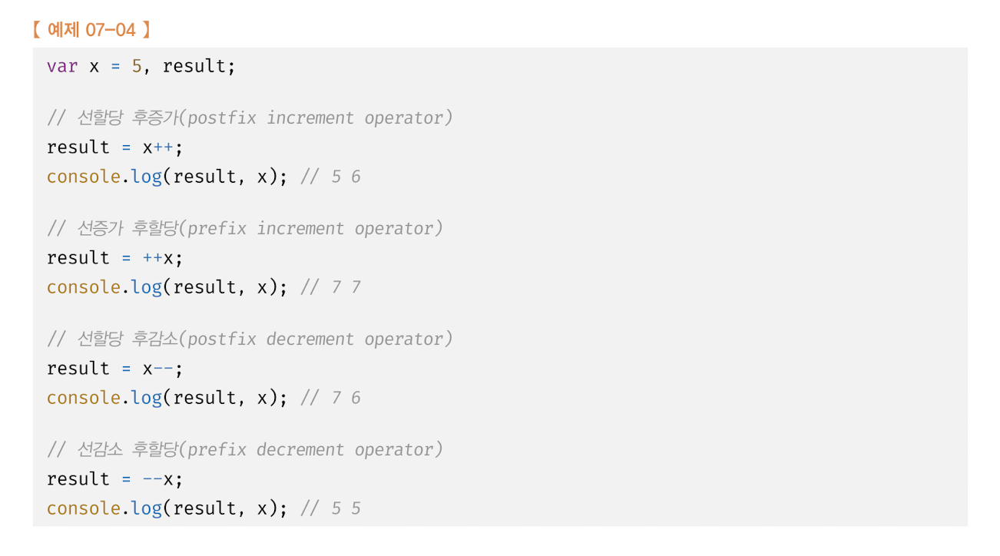
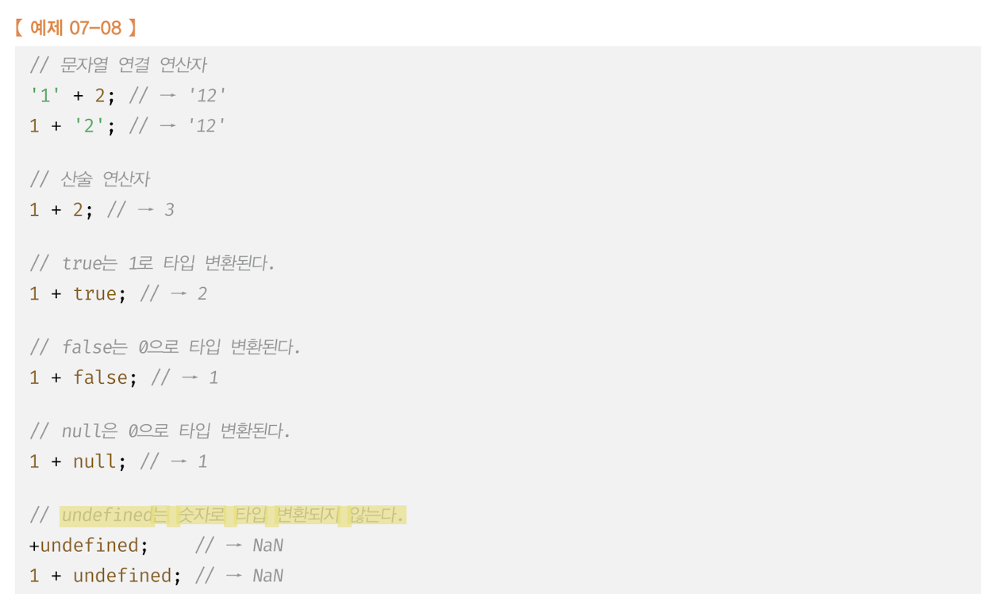
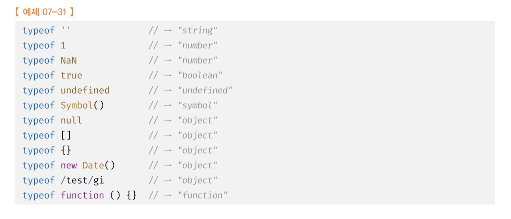
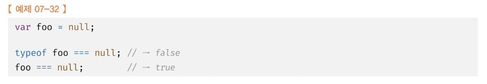
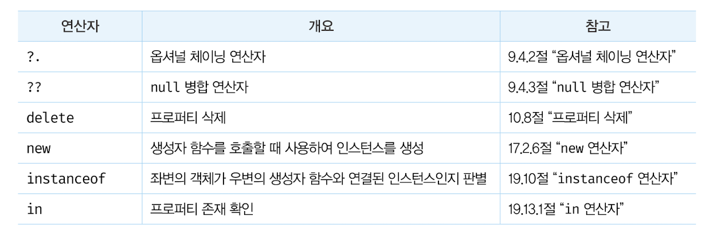
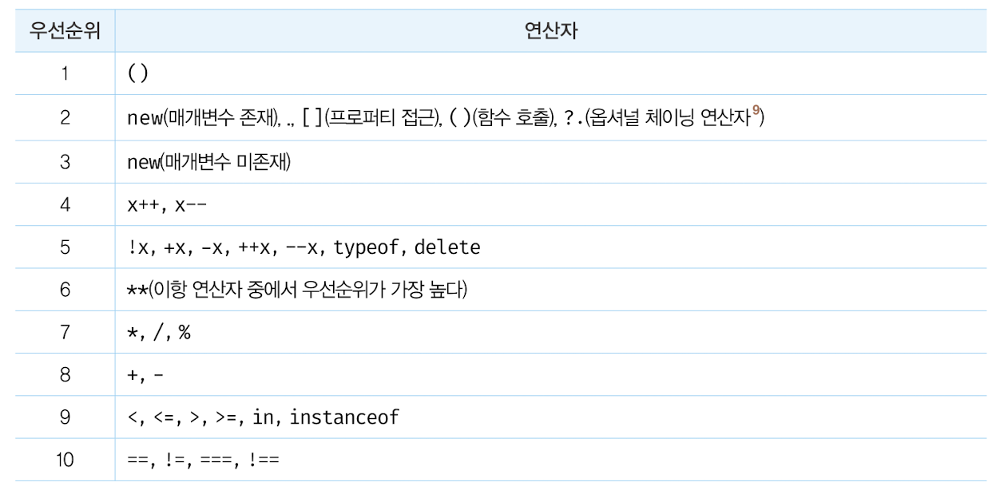
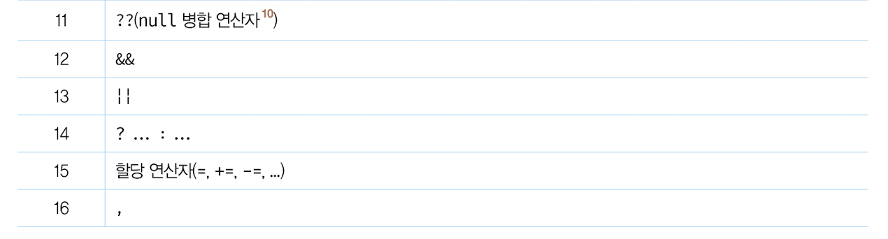

# 7. 연산자

## 7.1 산술 연산자

### 7.1.2 단항 산술 연산자

이항 산술 연산자와는 달리 증가/감소(++/--) 연산자는 피연산자의 값을 변경하는 부수효과가 있다.
즉, 증가/감소 연산을 하면 피연산자의 값을 변경하는 암묵적인 할당이 이뤄진다. 예를 들어,



피연산자는 연산의 대상이 되어야 하므로 값으로 평가할 수 있어야 한다.

- Infinity: 양의 무한대
- -Infinity: 음의 무한대
- NaN: 산술 연산 불가(not-a-number)
  ```js
  console.log(10 / 0); //Infinity
  console.log(10 / -0); // -Infinity
  console.log(1 * "String"); //Nan
  ```

### 7.1.3 문자열 연결 연산자

- 연산자는 피연산자 중 하나 이상의 문자열인 경우 문자열 연결 연산자로 동작한다.



이 예제에서 주목할 것은 <strong>개발자의 의도와는 상관없이 자바스크립트 엔진에 의해 암묵적으로 타입이 자동 변환되기도 한다</strong>는 것이다.
이를 <strong>암묵적 타입 변환(implicit coercion) 또는 타입 강제 변환(type coercion)</strong> 이라고 한다.

## 7.3 비교 연산자

### 7.4.2 동등/일치 비교 연산자

동등 비교(==) 연산자는 좌항과 우항의 피연산자를 비교할 때 먼저 암묵적 타입 변환을 통해 타입을 일치시킨 후 같은 값인지 비교한다.
일치 비교(===) 연산자는 좌항과 우항의 피연산자가 타입도 같고 값도 같은 경우에 한하여 true 를 반환한다.
NaN 은 자신과 일치하지 않는 유일한 값이다. `NaN === NaN // -> false`

## 7.8 typeof 연산자



<strong>typeof 연산자로 null 값을 연산해 보면 "null" 이 아닌 "object" 를 반환한다.</strong> 이것은 자바스크립트의 첫 번째 버전의 버그다. 하지만 기존 코드에 영향을 줄 수 있기 때문에 아직까지 수정되지 못하고 있다.
따라서 값이 null 타입인지 확인할 때는 typeof 연산자를 사용하지 말고 일치 연산자(===) 를 사용하자.



## 7.10 그 외의 연산자



## 7.12 연산자 우선순위




