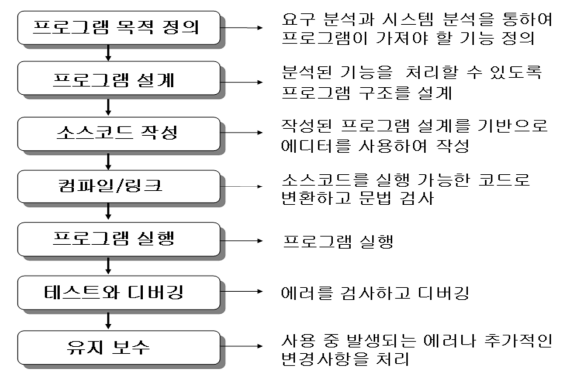
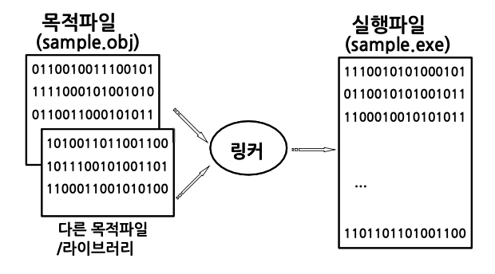
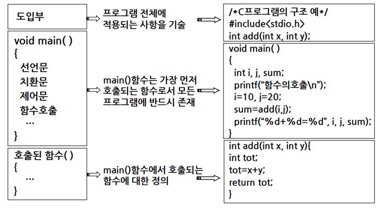

# 1. C언어의 개요

## C 언어의 정의, 특징

C 언어 : 컴파일러가 필요

- 논리적이며 구조적인 시스템 프로그래밍 언어이다.
- 하드웨어 제어가 가능하다.
- 프로그램 이식성이 높다.
- 간략한 문법 표현으로 함축적인 프로그램 작성이 용이하다.
- 저급 언어 특성을 가진 고급 언어이다(고급언어이지만 하드웨어 제어가 가능하기 때문).

*고급언어: 인간이 이해하기 쉬운 언어
*저급언어: 어셈블리어와 같이 컴퓨터가 이해하기 쉬운 언어

컴파일러
: 프로그래밍 언어로 작성된 프로그램을 컴퓨터가 이해할 수 있도록 기계어로 번역해주는 번역기

- 어셈블러(assembler)
  : 기호로 표현된 어셈블리 코드를 기계어로 번역하는 번역기
- 인터프리터(interpreter)
  : 소스 프로그램을 한번에 기계어로 변환시키는 컴파일러와는 달리 프로그램을 한 단계씩 기계어로 해석하여 실행하는 ‘언어처리 프로그램’

## 프로그램의 작성 및 준비

### 프로그램 개발 단계

### C 프로그램의 완성 과정

- 코딩(coding) 단계
  : 주어진 문제에 대한 설계를 바탕으로 소스코드(source code)를 작성하여 소스파일(source file)을 생성하는 과정. c 확장자 파일로 저장.

- 컴파일(compile) 단계(sample.c → sample.obj)
  : 소스파일이 목적파일(object file)로 변환되는 과정

- 링킹(linking) 단계(sample.obj → sample.exe)
  : 목적파일을 실행파일(execution file)로 변환하는 과정
  컴파일된 목적파일들을 라이브러리 파일과 연결하여 실행 파일을 만들어낸다. 컴파일러는 대부분 링커 기능까지 제공하기에 컴파일 시 링킹 과정이 자동으로 처리된다.
  

## 프로그램의 구성

기본 구조

- C 프로그램은 반드시 하나 이상의 함수를 포함해야 한다.
- main( )함수가 반드시 존재해야 한다.
- 함수의 시작과 끝을 알리는 중괄호 { } 를 사용해야 한다.
- 중괄호 안에는 변수선언문, 치환문, 연산문, 함수 등의 명령을 기입한다.
- 선행처리기(preprocessor)를 제외하고 문장의 끝에는 세미콜론( ; )을 붙인다.

C 프로그램의 구성 요소

컴파일러는 프로그램을 구성하는 문자들을 기본 처리 단위인 **토큰**으로 분리하고 그것이 올바른 규칙을 따르는지 검사하여 올바르면 실행 코드를 생성한다. 아래는 기본 토큰들이다.

- 예약어 : int, char, if, for, ...
- 명칭 : 변수, 배열, 함수, ... 등의 이름
- 상수 : 값이 불변인 자료
- 연산자:=, -, \*, /, ++, ...
- 설명문 : 프로그램에 대한 주석

예약어(reserved word)

- 자료형 관련 예약어
  : char, int, float, short, long, double, unsigned, union, enum, void, …
- 기억 관련 예약어
  : auto, static, extern, register, …
- 제어 관련 예약어
  : if~else, for, while, do~while, switch~case, break, continue, return, …
- 기타 예약어
  : main, sizeof, include, …
