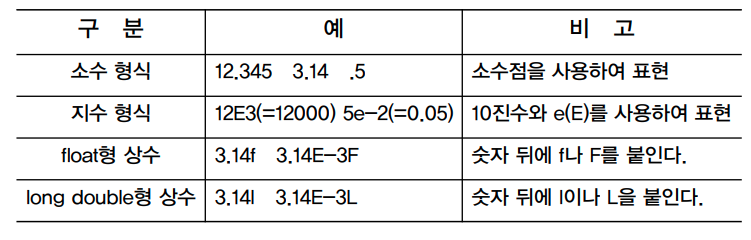
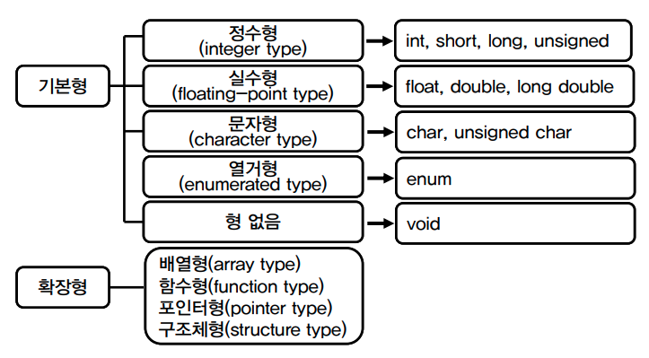
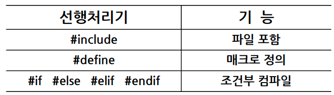
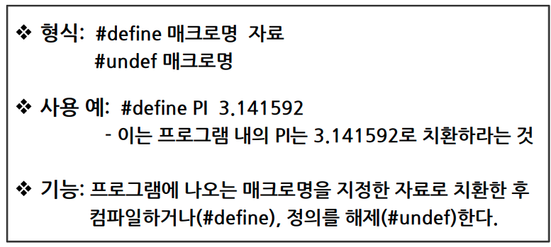
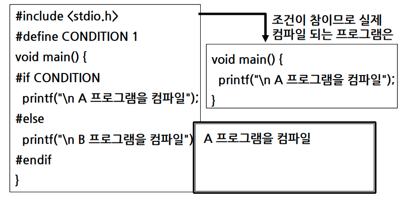

## 2. 자료형과 선행처리기

### 상수와 변수

상수

항상 고정된 값을 갖는 자료. 값이 한번 정해지면 프로그램 도중 그 값을 변경할 수 없는 수

- 정수형 상수
- 실수형 상수
- 문자형 상수
- 문자열 상수

정수형 상수
10진수 , 8진수, 16진수로 표현

 
실수형 상수

- 부동 소수점 형 상수
- double형을 기본 자료형으로 사용

변수

- 모든 변수는 이름이 있다.(변수명)
- 모든 변수는 정해진 자료형이 있다
- 모든 변수는 할당된 값을 갖는다.

## 자료형

## 선행처리기

컴파일에 앞서 프로그램 선두에 선언된 지시자들을 미리 처리하는 역할을 수행

### 파일포함

"#include"

- #include는 C언어에서 제공되는 헤더파일(\*.h)를 자신의 소스파일에 읽어 들여 함께 컴파일 하고자 할 때 사용
- C 프로그램에서 표준함수인 printf( ), scanf( ) 등을 사용하려면 이 함수들의 원형(prototype)이 선언되어 있는 표준 입출력 헤더파일인 stdio.h를 #include시켜야 함

### 매크로 정의

"#define"

- #define은 매크로를 정의할 때 사용

매크로(macro)

- 선행처리기 #define을 사용하여 단순 치환되는 자료
- 프로그램 작성 시에 명령이나 수식 또는 상수값이 자주
  사용될 때 이들을 대표하는 이름을 붙여 사용하는 대상

매크로 정의

- 매크로 상수 정의

  

- 매크로 함수 정의

  

### 조건부 컴파일

"#if #else #elif #endif"

- 조건에 따라 프로그램을 컴파일하는 명령
- 최적의 코드로 프로그램을 작성할 수 있기 때문에 시스템의 성능 향상

"#if 와 #elif 다음에는 컴파일 여부를 결정하는 조건문 필요"

- 조건문은 선행처리과정에서 진위 여부를 판단할 수 있어야 함
- 변수 지정이나 함수 호출 불가
- 주로 매크로 값이 사용

  
