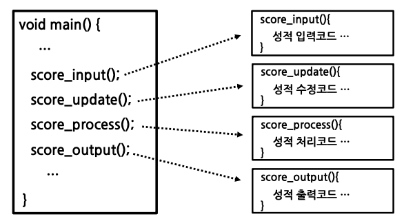
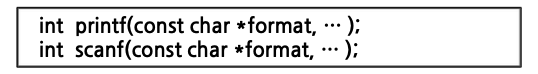
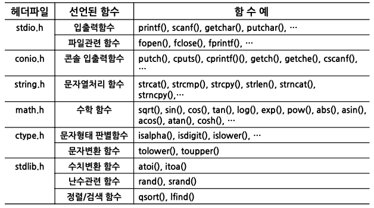
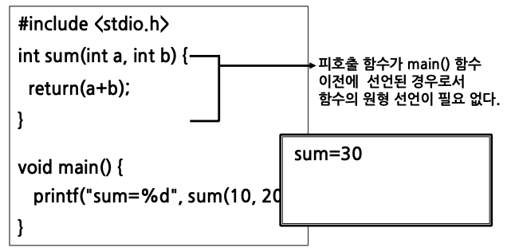

# 함수와 기억클래스(1)

## 함수의 개념

함수

- 함수란 특정한 작업(기능)을 수행하도록 설계된 독립적인 프로그램
- 이러한 함수들이 정해진 순서에 따라 실행됨으로써 프로그램의 기능을 수행

C 프로그램은 함수들로 구성

- 전체의 실행 내용을 몇 개의 모듈(module)로 분류
- 각각의 모듈에 해당하는 내용을 함수로 작성
- 실행순서에 따라 그 함수들을 차례로 호출하여 실행

아래와 같이 기능별 독립된 단위(함수)로 구성한 경우 효율적이다.

## 표준 함수

C언어에서의 함수

- 표준함수 : C언어 자체에서 제공하는 함수
- 사용자 정의함수 : 사용자가 정의하여 사용하는 함수

표준 함수

- 표준함수의 원형은 헤더파일에 정의
- 표준함수의 실체는 라이브러리 파일에 수록
- 표준함수를 사용하려면 원형이 선언되어 있는 헤더파일을 #include 시켜 주어야 한다.

표준함수의 원형 예

## 사용자 정의 함수

사용자가 단위 프로그램을 함수로 정의하여 사용

## 함수의 사용

1. 함수의 원형 선언
2. 함수의 호출
3. 함수의 정의로 구성

원형선언이 필요 없는 경우 예

