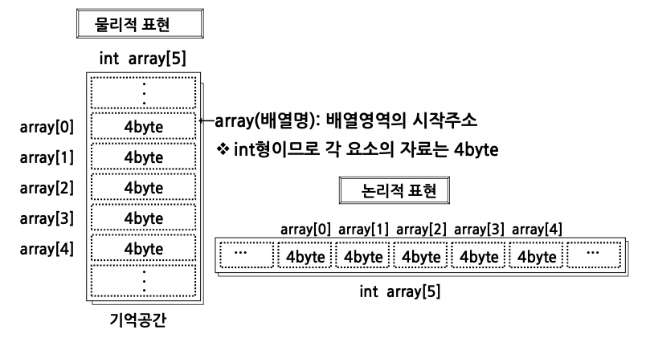
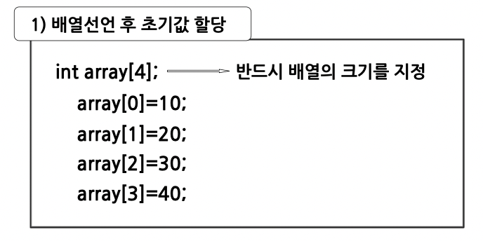
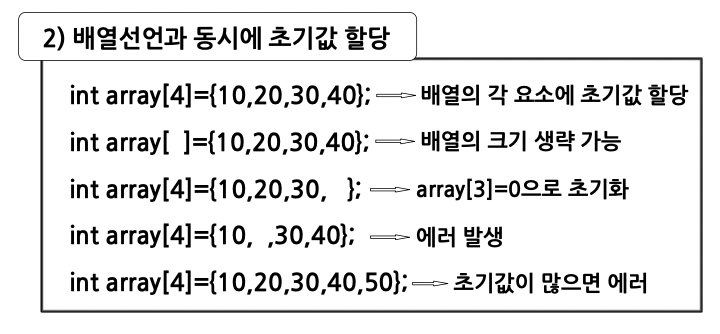
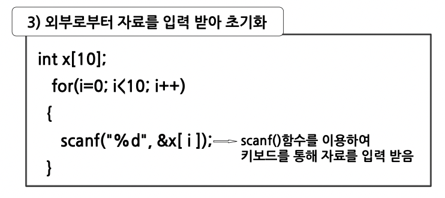
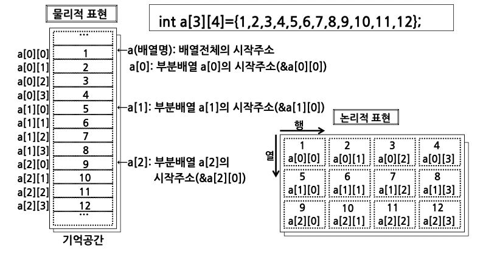
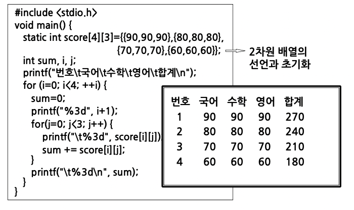
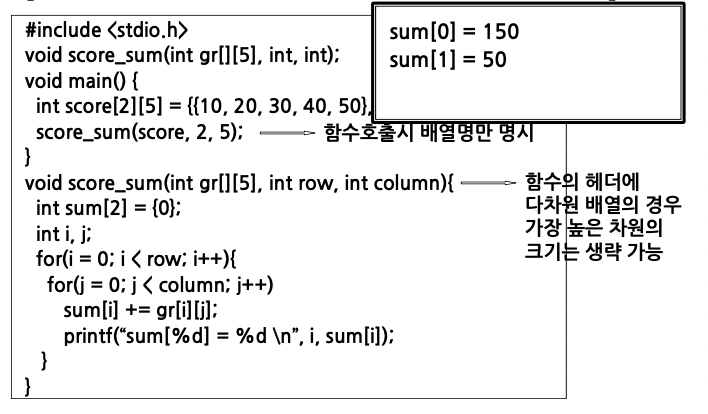

# 배열과 포인터1

## 배열

### 1차원 배열

- 배열의 첨자가 하나만 있는 배열
- 첨자의 개수는 배열 전체의 구성요소의 개수를 의미
- 배열의 각 요소는 배열명과 첨자로 구분
  - 첨자는 0부터 시작
  - 자료형과 기억 클래스를 갖는다.

#### 1차원 배열 선언

- 형식: 자료형 배열명[개수]
- 사용 예: int a[10]
- 의미: 1차원 배열로서, 배열명은 a 이고 배열의 크기는 10 이며, 정수값이 기억됨

#### 1차원 배열의 기억공간 표현



#### 1차원 배열의 초기화

배열을 선언하면 기억공간을 초기화 해야함

초기화 방법

1. 배열선언 후 초기값 할당
2. 배열선언과 동시에 초기값 할당
3. 외부로부터 자료를 입력 받아 초기화





```c
#include <stdio.h>

void main()
{
    static int x[ ] = {1,2,3,4};
    static int y[ ] = {10,20,30,40};
    int i, z[4];
    for (i=0; i<4; ++i)
      z[i] = x[i] + y[3-i];
    printf("반대 위치의 배열요소 합\n");
    for(i=0; i<4; ++i)
      printf("%d + %d = %d\n", x[i], y[3-i], z[i]);
}
```

### 다차원 배열

#### 2차원 배열 선언

- 형식: 자료형 배열명[행의 수][열의 수]
- 사용 예: int a[3][4]
- 의미: 2차원 배열로서, 배열명은 a 이고 3행 4열로 된 12개의 요소를 가진 정수형 배열

#### 2차원 배열 선언과 초기화

```c
int array[3][3] = {1, 2, 3, 4, 5, 6, 7, 8, 9};
int array[3][3] = {{1, 2, 3},{4, 5, 6},{7, 8, 9}};
int array[3][3] = { {1, 2, 3}, {4, 5, 6},
{7, 8, 9}};
```

#### 2차원 배열의 기억공간 표현



#### 2차원 배열의 사용 예



#### 3차원 배열 선언

- 형식: 자료형 배열명[면의 수][행의 수][열의 수]
- 사용 예: int a[2][3][4]
- 의미: 3차원 배열로서, 배열명은 a 이고 2면 3행 4열로 된 24개의 요소를 가진 정수형 배열

#### 3차원 배열의 초기화와 기억공간 표현

```c
int a[2][3][4]={{{1, 2, 3, 4}, {5, 6, 7, 8}, {9, 10, 11, 12}},
{{13, 14, 15, 16}, {17, 18, 19, 20}, {21, 22, 23, 24}}}
```


### char형 배열과 문자열

#### char형 배열

- 형식: char 배열명[문자열 길이 + 1]
- 사용 예: char str[12]
- 의미: 배열명이 str 이고, 12문자 길이를 가진 char형 배열


### 함수와 배열

- 배열을 함수의 매개변수로 사용할 경우
  - 함수 호출 시 배열명만 명시하여 호출
  ```c
  int score[2][5] = {{10,20,30,40,50},{10,10,10,10,10}};
  score_sum(score,2,5)
  ```
  - 함수의 헤더에는
    - 1차원 배열의 경우 크기 생략 가능
    - 다차원 배열의 경우 가장 높은 차원의 크기 생략 가능


