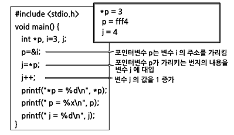
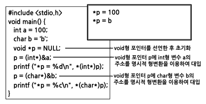
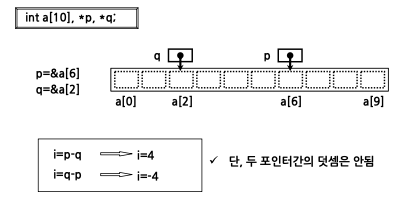
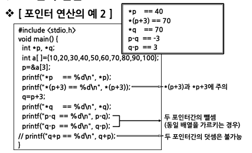

# 배열과 포인터2

## 포인터의 개념

- 포인터(pointer) : 변수의 일종
  - 변수: 특정 데이터 값을 가지고 있음
  - 포인터: 특정 데이터가 저장된 기억장소의 주소(번지)값을 가지고 있음
- 따라서 포인터는 기억공간을 변수명으로 접근하지 않고 주소로 접근하기 위해 사용

## 포인터변수의 선언과 참조

void 형 포인터

- 형식: void \* 포인터명;
- 의미
  - 프로그램 실행시에 자료형이 결정되는 경우에 사용
  - 저장하기 전에 명시적 형변환이 필요

## 포인터 연산

포인터와 기억공간의 대응관계

