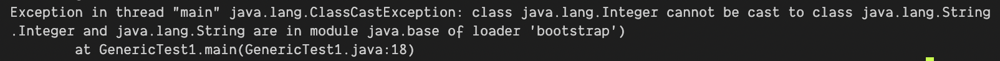
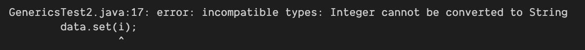

# 제네릭과 람다식

## 제네릭

소스 코드를 모듈화시켜 프로그램의 재사용성을 높이고 소스 코드를 컴파일할 때 자료형 검사를 보다 엄격하게 수행하여 실행시간 오류를 최소화하기 위한 기법

- 클래스나 인터페이스 또는 메소드가 하나가 아닌 다양한 유형의 객체에 대해 동작하게끔 하는 프로그래밍 기술
- 자료형을 매개변수로 갖는 java의 클래스나 인터페이스를 정의할 수 있다.
- 메소드를 정의할 때도 자료형을 매개변수화할 수 있다.
- 메소드를 정의할 때 매개변수의 타입을 선언하고 상응하는 값을 대입시켜 메소드를 호출하는 것처럼 제네릭을 정의할 때 '타입 매개변수(또는 타입 파라미터)'를 선언하고 사용할 때 타입을 지정한다.

장점

- 컴파일 시 엄격한 자료형 검사가 가능하여 실행 오류를 줄일 수 있다.
- 제네릭을 사용하면 캐스트 연산자로 명시적 형변환을 할 필요가 없다.
- 다양한 자료형을 처리하는 범용 알고리즘의 작성할 수 있다.

예시) 아래의 코드처럼, 컴파일러는 저장되는 원소가 String 형인지 검사하며 추출되는 원소가 String 형임을 보장한다.

```java
List<String> list = new ArrayList<String>();
list.add("java");
String s = list.get(0);
```

제네릭을 사용하지 않은 코드

```java
List list = new ArrayList();
list.add("java");
String s = (String)list.get(0);
```

제네릭을 사용한 코드

```java
List<String> list = new ArrayList<String>();
list.add("java");
String s = list.get(0);
```

### 제네릭 타입

자료형을 매개변수화할 수 있는 클래스와 인터페이스를 **제네릭 타입** 이라고 한다.

#### 제네릭 타입의 필요성

```java
class Data {
    private Object object;
    public void set(Object object) {this.object = object; }
    public Object get() { return object; }
}

public class GenericTest1 {
    public static void main(String args[]) {
        Data data = new Data();
        Integer i = new Integer(20);
        data.set(i);
        String s = (String)data.get();
    }
}
```

String 객체와 Integer 객체는 서로 연관관계가 없기 때문에 캐스트 연산자로 형변환 되지 않는다. 컴파일 시 소스 코드의 각 라인이 문법적으로 올바른지만 확인하기 때문에 해당 문제를 발견하지 못한다. Integer 클래스와 String 클래스가 모두 Object 클래스의 서브 클래스이기 때문에 set(), get() 메소드 호출하는 문장에는 문법적인 문제는 없지만 실제 실행 시 문제가 발생한다.



### 제네릭 타입 정의하기

```java
class Data<T> {
    private T t;

    public void set(T t) {
        this.t = t;
    }

    public T get() {
        return t;
    }
}

public class GenericsTest2 {
    public static void main(String args[]) {
        Data<String> data = new Data<String>();
        Integer i = new Integer(20);
        data.set(i);
        String s = (String) data.get();
    }
}
```

컴파일 할 때 오류를 발생시킨다.



### Raw 타입

- 타입 매개변수 없이 사용되는 제네릭 타입을 Raw 타입이라고 한다.
- 제네릭 타입이 Raw 타입으로 사용될 경우, 그 안에서 사용되는 모든 자료형은 Object 클래스의 객체로 간주되어 실행된다.

### 제네릭 메소드

- 자료형을 매개변수로 갖는 메소드를 제네릭 메소드라고 한다.
- `public static <K, V> boolean compare(Pair<K,V> p1, Pair<K,V> p2){...}`

### 제네릭의 타입 제한

- 자료형을 매개변수화하여 클래스, 인터페이스 또는 메소드를 정의할 때 적용가능한 타입에 제한을 둘 수 있다.
- 타입 매개변수에 'T extends Number' 라고 선언하면 T 자리에 들어갈 수 있는 자료형은 Number의 서브 클래스에 한정된다.

### 제네릭 타입의 상속과 형변환

- 제네릭 타입의 경우 제네릭 타입 간에 명시적인 상속관계가 정의되어 있어야 형변환이 가능하다.

```java
// 정상 동작
class FormattedData <T> extends Data <T> {...}
Data <Integer> data = new FormattedData <Integer> ();
// 컴파일 오류 발생.
Data <Number> data1 = new Data <Integer> ();
```

### 제네릭 타입 사용 시 유의사항

- 기본 자료형을 타입 매개변수에 대입할 수 없다.
  - byte, short, int, long, float, double, char, boolean
- 타입 매개변수를 static 필드의 타입으로 사용할 수 없다.
- 제네릭 타입의 배열을 선언할 수 없다.

## 람다식

매개변수를 갖는 코드 블록으로 익명 클래스의 객체를 생성하는 부분을 수식화한 것. 람다식을 사용하면 코드를 보다 간단하게 작성할 수 있음.

- 매개변수를 갖는 코드 블록으로 '익명 구현 클래스' 의 객체를 생성하는 부분을 수식화한 것을 말한다.
- 익명 서브 클래스로 객체를 생성하는 구문은 람다식이 될 수 없고, 람다식에 사용되는 인터페이스에는 몸체가 없는 추상 메소드가 1개만 포함되어 있어야 한다.
- 추상 메소드 1개만을 포함하고 있는 인터페이스를 Java 에서는 함수적 인터페이스라고 한다.
- 생성자, 타입의 이름, 필드 등이 필요없는 단순히 함수적 인터페이스를 구현한 객체가 필요할 때 람다식을 사용한다.

### 람다식 문법

'익명 구현 클래스'의 객체를 생성하는 부분을 아래와 같이 작성하고, CheckPerson 을 함수적 인터페이스로 가정한다.

```java
new CheckPerson(){
    public boolean test(Person p) {
        return p.getGender() == Person.Sex.MALE
          && p.getAge() >= 18 && p.getAge() <= 25;
    }
}
```

이를 람다식으로 바꾸면 아래와 같다.

```java
// 1)
p -> p.getGender() == Person.Sex.MALE && p.getAge() >= 18 && p.getAge() <= 25
// 2)
(Person p) -> p.getGender() == Person.Sex.MALE && p.getAge() >= 18 && p.getAge() <= 25
// 3)
p -> {
    return p.getGender() == Person.Sex.MALE && p.getAge() >= 18 && p.getAge() <= 25
}
```
