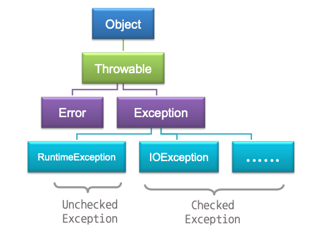

# 패키지와 예외처리

패키지는 일종의 라이브러리로 Java 프로그램에서 자주 사용되는 기능들을 클래스 형태로 구현하여 묶어 둔 것을 의미하며, 예외처리는 Java 프로그램이 실행 중에 오류를 만났을 때 이를 처리하는 것을 의미한다.

## 패키지

- 모든 패키지에는 고유한 이름이 있는데 이때 패키지의 이름은 클래스나 인터페이스가 저장된 폴더를 의미한다.
- 타입이란 클래스와 인터페이스를 말하며, 패키지는 관련이 있는 클래스와 인터페이스의 묶음이다.
- Java 의 기본 API는 패키지 단위로 계층적으로 분류되어 있다. 전체적으로 폴더의 계층구조와 같고, 하나의 패키지가 하나의 폴더에 해당한다.
- 패키지의 기준 위치는 패키지를 사용하는 프로그램이 위치한 폴더이거나 운영체제에서 정한 특정한 경로(환경변수 CLASSPATH에 지정)에 위치한다.

### 사용자 정의 패키지 만들기

```java
package <패키지 이름>;

public class <클래스 이름>{...}
```

아래의 com.vehicle 패키지 않에 정의된 클래스와 소스 코드 들은 com\vehicle\ 에 저장된다.

```java
package com.vehicle;

public class Car {
    private String szType = "자동차";

    public String getType() {
        return szType;
    }
}
```

```java
package com.vehicle;

public class Sedan extends Car {
    private String szType = "승용차";
}
```

```java
package com.vehicle;

public class Bus extends Car {
    private String szType = "버스";
}
```

```java
package com.vehicle;

public class Truck extends Car {
    private String szType = "트럭";
}
```

### 패키지 사용하기

```java
import <패키지 이름.*>;
import <패키지 이름.클래스 이름>;
```

시스템 패키지 사용 예

```java
import java.util.ArrayList;

public class PackageTest {
    public static void main(String args[]){
        ArrayList al = new ArrayList();
    }
}
```

컴파일러와 java VM 은 프로그램에서 사용한 클래스나 패키지를 찾을 때 CLASSPATH 환경변수에 지정된 경로상에서 찾는다. 예를 들어, com\vehicle\ 은 CLASSPATH 에 설정된 경로 중 하나에 위치해야 한다.

사용자 정의 패키지 com.vehicle 사용 예

```java
import com.vehicle.*;

public class PackageTest {
    public static void main(String args[]){
        Bus bus = new Bus();
        System.out.println(bus.getType());
    }
}
```

## 예외와 예외처리

java 프로그램 실행 도중, 실행을 중단할 정도의 심각한 오류는 아니지만 정상적 흐름을 벗어난 상황을 만날 수 있는데 java 에서 이것을 예외(exception) 라고 한다.
예외가 발생한 프로그램의 관점에서 예외의 발생을 '예외 객체를 만들어 던진다(throw)'라고 표현하기도 한다.



### 1. checked Exception

소스 코드가 예외처리 구문을 포함하고 있는지를 컴파일러가 반드시 확인하는 예외이다. 만일 프로그래머가 만든 소스 코드가 checked Exception 으로 분류되는 예외를 발생시킬 수 있는 부분을 포함한다면, 해당 소스 코드에 예외처리 구문을 반드시 포함시켜야 한다. 만약 포함되지 않으면 컴파일러에 의해 컴파일 오류가 발생한다.

### 2. unchecked Exception

컴파일러가 예외처리 구문의 포함 여부를 확인하지 않는 예외이다. 따라서 unchecked Exception 이 발생할 수 있는 코드에 대해서는 예외처리 구문이 정의되어 있지 않더라도 컴파일러 오류가 발생하지 않는다.

unchecked Exception 은 매우 자주 발생하는 예외이며 숫자를 0으로 나누거나 범위를 벗어나 배열 첨자를 참조하거나 널 객체의 메소드를 호출하는 경우이다.

### 3. 예외처리

```java
try {
  //예외가 발생할 수 있는 구문
} catch(발생하는 예외 선언){
  //예외처리 구문
}
```

checked Exception 처리 예

```java
import java.io.*;

public class ExceptionTest {
    public static void main(String args[]){
        DataInputStream dis = new DataInputStream(System.in);
        try {
            ...
        } catch (EOFException e1) {
          ...
        } catch (IOFException e2) {
          ...
        }
    }
}

```

unchecked Exception 발생 예

```java
public class ExceptionTest{
    public static void main(String args[]){
        int i = 5 / 0;
        System.out.println(i);

        int[] a = new int[5];
        a[6] = 10;
    }
}
```

두 개의 unchecked Exception 예외가 발생한다. 예외처리 코드가 없어도 컴파일 오류는 발생하지 않지만 실행 도중 프로그램은 비정상적으로 종료될 것이다.

1. `int i = 5 / 0;` -> ArithmeticException
2. `a[6] = 10;` -> ArrayIndexOutOfBoundsException

```java
public class ExceptionTest{
    public static void main(String args[]){
        try {
          int i = 5 / 0;
        } catch (ArithmeticException e){
          System.out.println(e);
        }
        System.out.println(i);

        int[] a = new int[5];
        try {
          a[6] = 10;
        } catch (ArrayIndexOutOfBoundsException e){
          System.out.println(e);
        }
    }
}
```

### 4. finally 블록

finally 블록은 try-catch 구문과 함께 사용되는데 finally 블록에 들어가는 명령문은 catch 블록과 달리 예외 발생 여부와 무관히 항상 실행된다. 즉, 프로그램에서 사용했던 리소스를 확실히 되돌려 주기 위한 것이다.

### 5. 예외의 전파

`System.in.read()` 에서 발생할 수 있는 예외를 `getInput()` 메소드를 호출한 곳으로 전파한다. 따라서 `main()` 메소드에서 `getInput()` 메소드 호출을 try-catch 구문을 사용하여 예외처리 하고 있다.

```java
import java.io.*;

class CharInput {
    int nInput = 0;
    public char getInput() throws IOException {
        nInput = System.in.read();
        return (char)nInput;
    }
}

public class ExceptionTest {
    public static void main(String args[]){
        CharInput charInput = new CharInput();
        try {
          System.out.println(charInput.getInput());
        } catch (IOException ex) {
            System.out.println(ex);
        }
    }
}
```
