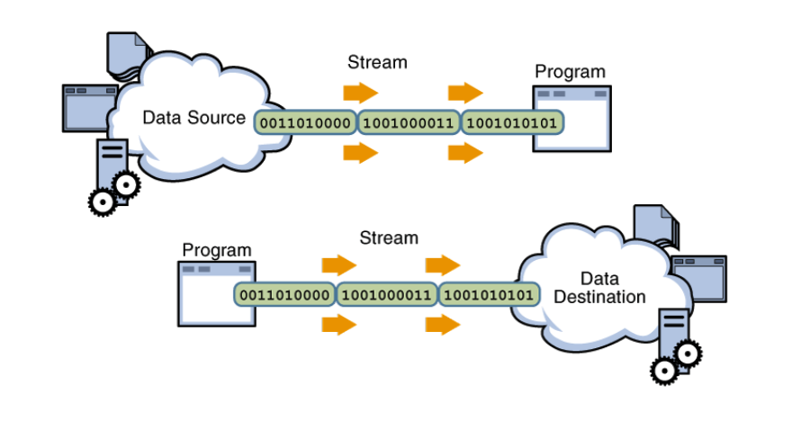

# java.io 패키지와 스트림

## 스트림

- 순서가 있는 일련의 데이터 흐름
- 데이터 생산자(소스)와 데이터 소비자(목적지) 사이의 데이터 통로
- java 언어는 스트림을 통해 입출력을 수행할 수 있음
  - 입력 스트림-소스
  - 출력 스트림-목적지



### 스트림 분류와 관련 클래스

- 바이트 스트림은 byte 단위로, 문자 스트림은 char 단위로 데이터를 다룸
- 기본 스트림을 반드시 사용해야 함
- 보조 스트림이 필요할 경우, 먼저 생성된 기본 스트림을 감싸 보조 스트림 객체를 생성
  ```java
  FileInputStream fis = new FileInputStream( );
  BufferedInputStream bis = new BufferedInputStream(fis);
  ```

java.io 패키지의 스트림 클래스


## 바이트 스트림

- inputStream 클래스
  - 바이트 단위 입력 스트림 클래스의 최상위 클래스
  - [methods]('https://www.tutorialspoint.com/java/io/java_io_inputstream.htm')
- outputStream 클래스
  - 바이트 단위 출력 스트림 클래스의 최상위 클래스
  - [methods]("https://www.tutorialspoint.com/java/io/java_io_outputstream.htm")

## 캐릭터 스트림

- Reader 클래스
  - 입력용 캐릭터 단위 스트림 클래스의 최상위 클래스
  - [methods]('https://www.tutorialspoint.com/java/io/java_io_reader.htm')
- Writer 클래스
  - 출력용 캐릭터 단위 스트림 클래스의 최상위 클래스
  - [methods]("https://www.tutorialspoint.com/java/io/java_io_writer.htm")

## 파일 입출력

