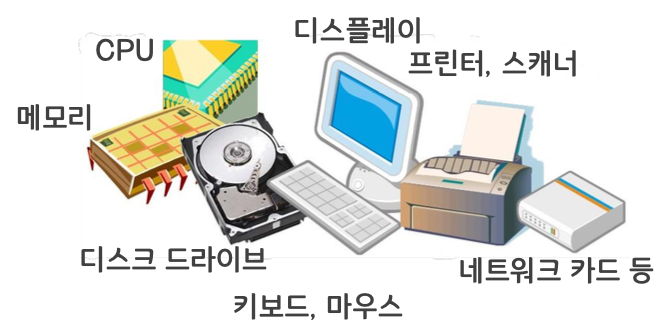
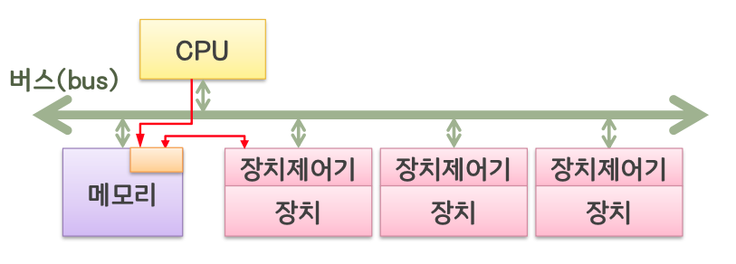
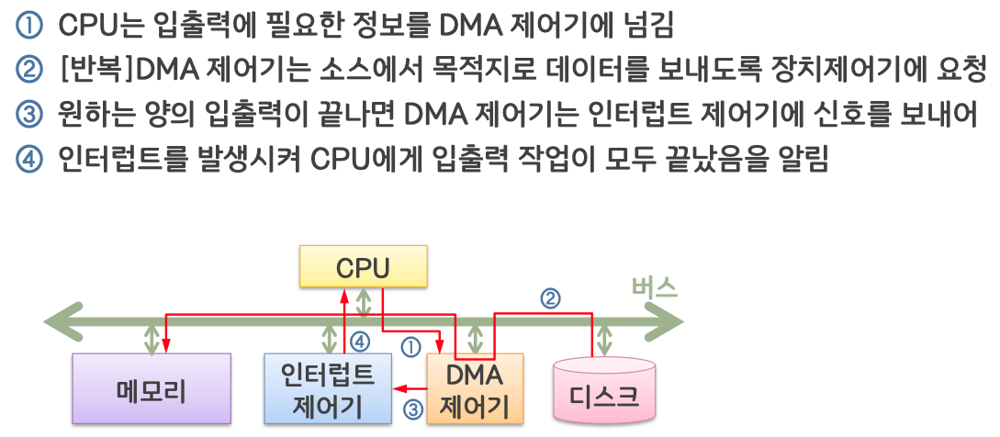
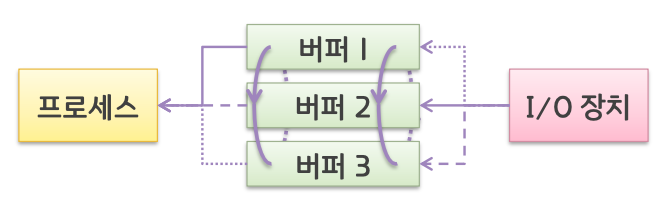

# 장치 관리

## 장치의 개념

### 다양한 장치들

- CPU, 메모리: 프로세스 실행에 필수
- 나머지 장치들: 프로세스 실행 시 데이터 입력이나 출력에 사용하는 입출력장치
  - 입출력장치는 기능적 특징과 장치 관리자의 관리 방법에 따라 구분
    - 전용장치
      - 한 번에 하나의 프로세스에 할당 가능
      - 대기 시간이 길어질 수 있음
      - 테이프 드라이브, 프린터 등
    - 공용장치
      - 여러 프로세스에 동시에 할당 가능
      - 스케줄링 기법 필요
      - 디스크 같은 직접접근 저장장치
    - 가상장치
      - 전용장치를 가상의 공용장치처럼 보이게 함
      - 디스크 같은 공용장치 이용
      - 스풀링을 적용한 플로터 등

## 장치의 구성

장치제어기

- 장치를 직접적으로 다루는 전자장치
- 장치에서 발생하는 각종 데이터를 전자적인 신호로 변환하여 운영체제 로 보냄
- 운영체제가 요청하는 명령을 받아 장치를 구동
- 운영체제가 보내는 출력을 장치에 맞게 변환

장치 드라이버

- 응용 프로그램의 입출력 요청을 해당 장치에 맞도록 변환
- 장치의 종류나 제조사에 따라 장치제어기가 이해하는 명령이나 명령의 종류가 다를 수 있기 때문
- 보통 장치 제조사에서 해당 장치의 드라이버도 같이 제공

### 물리적 구성

CPU 의 장치 사용법

- 장치제어기 내의 레지스터 활용
- 장치의 상태 확인(읽기), 장치에 명령(쓰기)
- 두가지 방법

  - 입출력 명령

    - CPU 가 장치제어기 내의 레지스터들의 값을 보고 상태를 확인하고 레지스터들에 값을 써서 장치에 명령을 할 수 있다.

      

  - 메모리 사상 입출력

    - 메모리의 특정 영역을 장치 제어기의 레지스터와 대응시켜 두어 메모리에서 읽고 쓰는 일반적인 명령을 수행하여 레지스터를 읽고 쓰는 것과 동일한 효과를 얻는다.

      

## 입출력 처리 유형

- 프로그램 방법
  - CPU 만을 이용하여 입출력 처리
  - 폴링 이용
    - Polling. CPU 가 입출력장치의 상태를 지속적으로 확인, 원하는 상태를 기다리는 것
  - CPU 의 낭비가 심하므로 비효율적
- 인터럽트 방법

  - 인터럽트 이용
  - 프로세스를 대기 상태로 보내고 인터럽트가 발생할 때까지 CPU 는 다른 작업을 하면됨
  - 인터럽트 처리과정

      

- DMA 방법

  - Direct Memory Access. CPU 를 통하지 않고 직접 메모리에 접근
  - 프로세스를 대기 상태로 보내고 인터럽트가 발생할 때까지 CPU 는 다른 작업을 하면됨
  - 한 번에 입출력 양이 많은 경우에도 한 번의 인터럽트만 발생하므로 CPU 의 효율 증대
  - 처리과정

    

  - 문제 및 해결
    - CPU 와 DMA 제어기가 동시에 메모리 액세스 시도할 경우 충돌 발생
    - 사이클 스틸링으로 해결
      - CPU 보다 DMA 제어기에 우선권 부여하여 CPU 로부터 메모리 사이클을 훔쳐 내는 것

## 입출력 관리

### 버퍼링

- CPU 의 데이터 처리 속도와 입출력장치의 데이터 전송 속도 차이로 인한 문제를 버퍼로 해결
- 버퍼
  : 입출력 데이터 등의 정보를 전송할 때 일시적 데이터 저장 장소로 사용되는 메모리의 일부

- 세가지 방법

  - 단일 버퍼링

    - 버퍼에 데이터를 저장하는 동안엔 데이터에 대한 처리가 이뤄지지 않고, 데이터가 처리되는 동안은 다른 데이터가 저장될 수 없기에 다소 비효율적

    

  - 이중 버퍼링

    - 데이터의 저장과 처리가 동시에 가능
    - 2개의 버퍼를 서로 교대로 번갈아 사용하는 플리플롭 버퍼링 방식

    

  - 순환 버퍼링

    - 이를 더 확장한 방법

    

### 스풀링

- 입출력 프로세스와 저속 입출력장치 사이의 데이터 전송을 자기 디스크와 같은 고속 장치를 통하도록 하는 것(일종의 버퍼링)
- 입출력 작업이 빨리 끝나게 할 수 있음
- 전용장치를 가상장치로 변화시켜 줌

    
