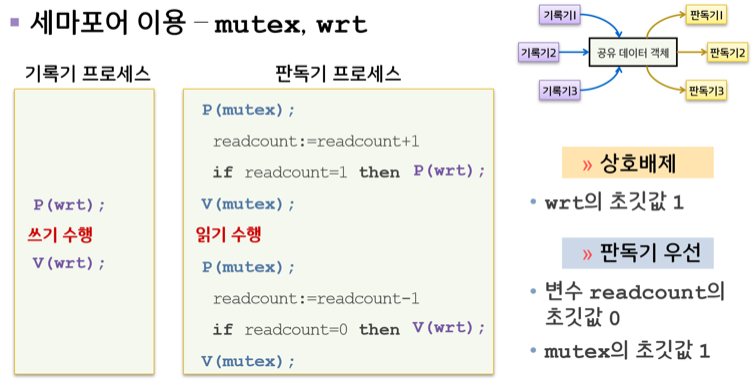
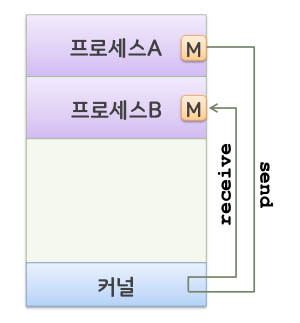
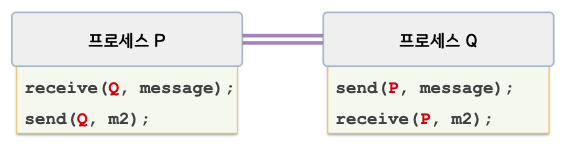
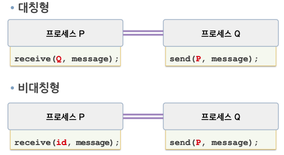
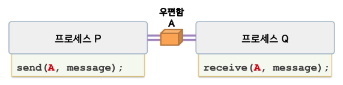
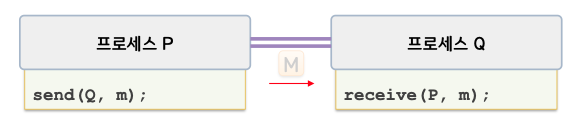
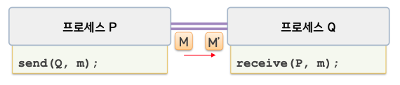

# 병행 프로세스2

## 프로세스의 상호협력

병행 프로세스들의 상호협력

- 공통작업을 수행하기 위해 서로 협동하는 경우
- 예: 생산자/소비자 문제, 판독기/기록기 문제

## 생산자/소비자 문제

### 유한 버퍼 문제

  

세마포어 이용 - mutex, empty, full (정수값 변수)

  

empty 는 n 또는 0

## 판독기/기록기 문제

  

우선순위에 따른 문제의 변형

- 제1판독기/기록기 문제(판독기 우선인 경우)
  - 기록기가 이미 공유객체의 사용을 허가 받은 것이 아니라면 판독기는 대기하지 않는다.
  - 기록기의 기아상태 유발 가능
- 제2판독기/기록기 문제(기록기 우선)
  - 일단 기록기가 준비되면 기록을 가능한 한 빨리 수행할 수 있도록 함
  - 판독기의 기아상태 유발 가능

제1판독기/기록기 문제의 해결

P(wrt), V(wrt)
: 판독기(읽는 작업)과 기록기(쓰는 작업)를 상호배제 시킨다.

P(mutex), V(mutex)
: 여러 판독기들 사이에 상호배제를 시킨다.

readcount
: 판독기 몇 개가 읽고 있는지 나타냄

- readcount 가 1이면 즉, 첫번째 판독기 이므로 P(wrt) 로 기록기가 사용하고 있는지 확인한다.
- readcount 가 1이 아니라면, 누군가가 이미 읽고 있는 것이므로 바로 작업 가능.

1개의 기록기가 임계영역에 있고 n개의 판독기가 대기 중일 때에는 n-1 개의 판독기가 mutex 에 대한 큐에 들어 있는 반면 1개의 프로세스는 wrt 에 대한 큐에 들어있다.
또한 기록기가 V(wrt)를 수행 도중, 대기 중인 판독기나 대기 중인 하나의 기록기 중에서 실행을 계속 시킬 수 있는데, 선택은 스케쥴러에 달려 있다.

## 프로세스 간의 통신

IPC, InterProcess Communication

병행 프로세스 사이의 통신을 위한 방법

- 공유기억장치 기법
- 메시지 시스템 기법
  두 방법으 상호 배타적이지 않지만 단일 운영체제 내에서 동시에 사용 가능하다.

### 공유기억장치 기법

- 프로세스 간에 공유변수를 이용하여 정보를 교환. 예) 유한 버퍼
- 고속 통신 가능
- 통신기능 제공의 책임: 응용 프로그래머

### 메세지 시스템 기법

- 메시지 교환방식으로 정보를 교환
- send/receive 연산자
- 소량의 데이터 교환에 유용
- 통신기능 제공의 책임: 운영체제

  

#### 통신 링크

- 프로세스들 사이에 메시지를 주고받기 위한 연결통로

#### 직접 통신

- 메시지 전달 연산에 수신자나 송신자 이름을 명시
- 통신 링크는 자동 설정됨
- 하나의 링크는 두 프로세스 사이만 연관되며, 각 통신 프로세스 쌍 사이에는 하나의 링크만이 존재
- 링크는 양방향

  
  

#### 간접 통신

- 메시지 전달 연산에 우편함 이름을 명시
- 통신 링크는 공유 우편함이 있는 경우에만 설정됨
- 하나의 링크는 2개 이상의 프로세스들과 연관될 수 있으며 각 통신 프로세스 쌍 사이에는 여러 링크가 존재 가능
- 링크는 단방향 또는 양방향임

  
  

#### 링크의 용량

링크의 용량이 '0' 이 아닌 경우 비동기적 통신을 이용하여 메시지 도착 여부를 인지할 수 있다. send(P, "ack")

#### 예외조건 처리

프로세스가 종료된 경우

메시지를 상실한 경우

- 운영체제가 탐지 후 메시지 전송
- 송신 프로세스가 탐지 후 메시지 재전송
- 운영체제가 탐지 후 송신 프로세스에게 통지
- 탐지방법: 시간제한

메시지가 혼합된 경우

- 오류 탐지 후 재전송
- 탐지방법: checksum

\*checksum
: 체크섬(checksum)은 중복 검사의 한 형태로, 오류 정정을 통해, 공간(전자 통신)이나 시간(기억 장치) 속에서 송신된 자료의 무결성을 보호하는 단순한 방법이다. 나열된 데이터를 더하여 체크섬 숫자를 얻고, 정해진 비트 수의 모듈라로 정해진 비트 수로 재구성한다. 만약 체크섬이 맞아 떨어지지 않는다면 메시지가 손상되었다고 결론을 내릴 수 있다.
