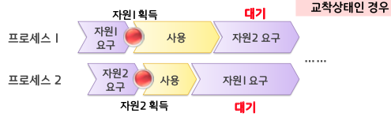
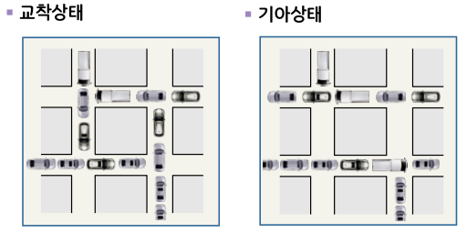
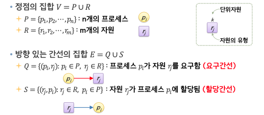
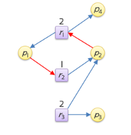

# 교착상태1

## 교착상태의 개념

- 2개 이상의 프로세스가 서로 상대방의 작업이 끝나기만을 기다리고 있는 상태
- 결과적으로 아무도 완료하지 못함

  
  

## 교착상태의 특성

### 교착상태의 필요조건

- 상호배제 조건
  - 프로세스들이 자원헤 대한 배타적인 통제권을 요구
  - 적어도 하나 이상의 자원은 공동 사용될 수 없음
  - 필요로 하는 자원을 다른 프로세스가 점유하고 있으면 반드시 대기해야 함
- 점유 대기 조건
  - 프로세스가 이미 다른 자원을 할당받아 배타적으로 점유하고 있는 상황에서 다른 프로세스가 점유하고 있는 자원이 해제되기를 기다리는 상황
- 비선점 조건
  - 프로세스에 할당된 자원은 그 프로세스가 사용을 마치고 스스로 반환하기 전에 제거되지 않음
  - 다른 프로세스에 의해서는 해제되지 않음
- 환형 대기 조건
  - 프로세스의 자원 점유 및 점유된 자원의 요구 관계가 환형을 이루며 대기

### 자원할당 그래프

G = (V, E)

#### 교착상태와의 관계

- 상호배제 조건 - 할당간선
- 점유 대기 조건 - 할당간선
- 비선점 조건 - 요구간선
- 환형 대기 조건 - 사이클

• 자원할당 그래프에 사이클이 없음→교착상태 발생 X
• 자원할당 그래프에 사이클 존재→교착상태 발생 O/X

사이클이 존재하지만 교착상태가 아닌 예

- p4 가 자원을 모두 사용하면 해결된다.

## 교착 상태 처리

교착상태 방지

- 교착상태의 필요조건 중 하나라도 발생할 수 없도록 막음

교착상태 회피

- 프로세스에 필요한 자원의 최대량에 대한 정보를 활용하여 교착상태가 발생하지 않도록 함

교착상태 탐지 및 복구

- 교착상태가 발생하면 이에 따른 적절한 조치를 취하여 정상 상태로 복구

### 교착상태 방지

점유대기 조건의 제거

- 프로세스가 자원을 요청할 때 그 프로세스는 어떠한 자원도 할당받지 않은 상태여야 함
- 방법 1
  » 프로세스가 수행을 시작하기 전에 필요한 모든 자원을 한꺼번에 요구하여 할당받음
  » 자원 이용률이 매우 낮아질 수 있음
- 방법 2
  » 자원을 부분적으로 요청하여 할당 받을 수 있도록 하되, 자원을 추가로 요청할 때에는 이전에 가지고 있던 자원을 반드시 모두 해제한 후 할당받음
  » 기아상태가 발생할 수 있음

비선점 조건의 제거

- 방법 1
  » 자원을 점유하고 있는 프로세스가 즉시 사용할 수 없는 상황의 다른 자원을 요청하는 경우 점유하고 있던 자원을 해제
- 방법 2
  » 프로세스가 가용하지 않은 자원을 요청
  » 그 자원이 할당된 프로세스가 다른자원을 기다리며 대기 중인지 조사
  » 대기 중이면 대기상태인 프로세스로부터 자원을 선점하여 요청한 프로세스에게 할당, 대기 중이 아니라면 요청한 프로세스는 대기
  » 상태를 쉽게 보관하고 복구할 수 있는 자원이 아니라면 적용이 불가능

환형 대기 조건의 제거

- 모든 자원의 유형에 일련번호를 지정하기 위해 함수 𝑓 정의
  𝑓:𝑅 → 𝑁(R: 자원 유형의 집합 N: 자연수)
- 방법 1
  » 프로세스는 자원을 일련번호 기준으로 항상 오름차순으로 요청
  즉, 자원 𝑟을 점유하고 있는 경우 반드시 𝑓(𝑟i) < 𝑓(𝑟j) 인 경우만 𝑟j를 요청할 수 있음
- 방법 2
  » 프로세스가 자원𝑟j를 요구할 때마다 𝑓(𝑟j)≤𝑓(𝑟i)인 자원 𝑟i은 모두 해제
  » 함수 𝑓의 정의는 전체 시스템의 성능에 큰 영향을 미치므로 실제로 사용되는 순서를 감안하여 정의해야 함
