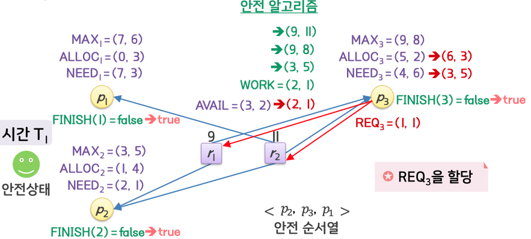
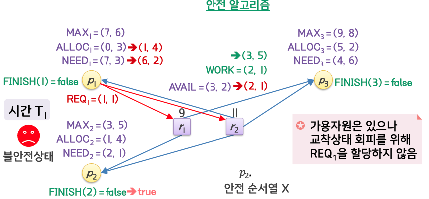
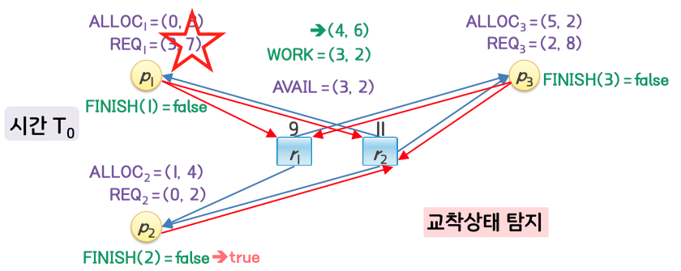
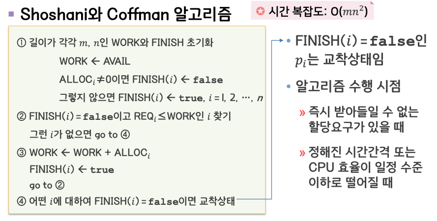

# 교착상태2

## 교착상태 회피

- 프로세스의 자원 사용에 대한 사전 정보를 활용, 교착상태가 발생하지 않는 상태에 머물도록 하는 방법

  - 필요한 정보: 현재 할당된 자원, 가용상태의 자원, 프로세스들의 최대 요구량

- 교착상태는 불안전상태에서 발생
  - 불안전상태: 할당 과정에 따라 교착상태가 될 수도 있는 상태
- 프로세스가 가용상태의 자원을 요구하더라도 안전상태를 유지하기 위해 프로세스는 대기상태가 될 수 있음

  

\*안전상태
: 교착상태를 회피하면서 각 프로세스에게 그들의 최대 요구량까지 빠짐없이 자원을 할당할 수 있는 상태

### 안전 순서열

- 순서 있는 프로세스의 집합<p1, p2, ... pn>
- 각 pi 에 대해 pi 가 추가로 요구할 수 있는 자원 소요량이 현재 가용 상태이거나 혹은 현재 가용인 자원에 pj(단, j < i)에 할당된 자원까지 포함하여 할당 가능한 경우
- 첫번째 순서는 현재 가용 가능한 자원으로 현재 요구량을 충족할 수 있는 프로세스가 가져간다.

  
  

### 교착상태 회피 알고리즘

- 각 자원 유형의 단위자원이 여러 개일 경우 -> 은행원 알고리즘
- 각 자원 유형의 단위자원이 하나밖에 없는 경우 -> 변형된 자원할당 그래프

#### 은행원 알고리즘

- 자원을 요청 받으면 그 자원을 할당해 주고 난 후의 상태를 계산해서 그것이 안전상태가 보장되는 경우에만 자원 할당

  

선 REQ 가 있을 경우

  
  

#### 알고리즘 프로세스

  

\*시간 복잡도

- m: 자원유형 갯수
- n: 프로세스 갯수. 프로세스 갯수만큼 반복되기 때문에 n 제곱

#### 변형된 자원할당 그래프

- 자원을 요청받으면 그 요구간선을 할당간선으로 변환하여도 사이클이 발생되지 않는 경우에만 자원을 할당

  

## 교착상태 탐지 및 복구

교착상태 탐지

- 시스템의 교착상태 여부를 탐지하기 위해 주기적으로 상태 조사 알고리즘을 수행
- **교착상태 회피 알고리즘**의 경우, 현재가 아니라 미래에 발생할 것을 막기 위함. NEED 를 사용. **탐지 알고리즘**은 REQ 사용
- **Shoshani 와 Coffman** 알고리즘

교착상태 복구

- 교착상태가 탐지된 경우 복구조치에 들어감

### Shoshani 와 Coffman 알고리즘

p2 -> p1 -> p3

p2 -> X

#### 알고리즘 프로세스

### 교착상태 복구

복구의 주체

- 오퍼레이터: 교착상태 발생을 알려주면 수작업으로 복구
- 시스템: 자동적으로 복구

복구의 방법

- 교착상태 프로세스 종료
- 교착상태 프로세스로부터 자원 회수

프로세스 종료

- 모든 교착상태 프로세스를 종료
  - 그동안 진행했던 내용들에 대한 (교착상태가 아닌 프로세스) 복원 비용이 큼
- 사이클이 제거될 때까지 프로세스를 하나씩 종료
  - 종료 대상을 선택하기 위한 비용, 매번 교착상태 재확인을 위한 비용이 듬

자원 회수

- 사이클이 제거될 때까지 자원을 단계적으로 선점하여 다른 프로세스들에 할당
- 고려사항: 프로세스 희생자 선택, 복귀(process rollback)에 대한 판단, 특정 프로세스 기아 상태 문제

## 복합적 접근방법

방지, 회피, 탐지 및 복구를 복합적으로 사용

- 자원을 유형에 따라 계층적으로 분류
- 각 계층에 대하여 자원순서를 부여
- 각 계층별로 방지, 회피, 탐지 및 복구 중 적절한 방법을 적용
