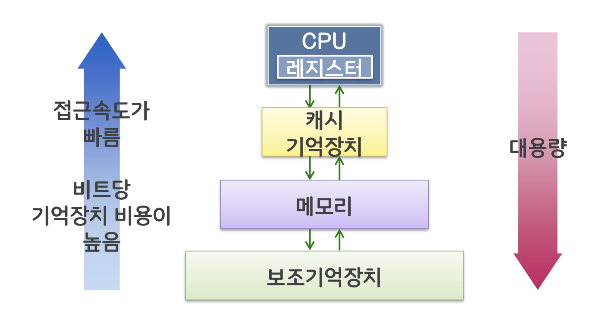
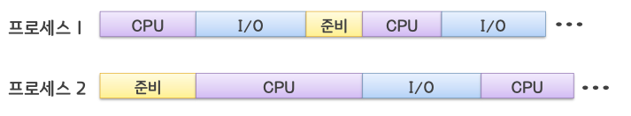
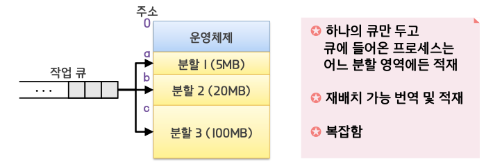
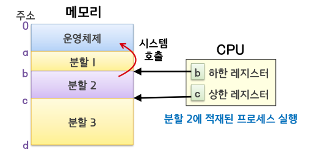

# 메모리 관리

## 프로세스와 메모리

### 프로세스의 동작

- 프로그램 카운터를 참조하여 메모리로부터 수행될 명령을 읽어 CPU 의 해당 명령을 수행
- 0(운영체제)에서 시작하여 MAX 방향으로 진행됨

\*프로그램 카운터
: 마이크로프로세서(CPU) 내부에 있는 레지스터 중의 하나로서, 다음에 실행될 명령어의 주소를 가지고 있어 실행할 기계어 코드의 위치를 지정한다. 때문에 명령어 포인터라고도 한다.

보조기억장치에 프로그램이 보관되어 있다.

### 기억장치 계층구조

적절한 비용으로 높은 성능을 낼 수 있도록 계층적으로 구성되어 있어 프로세스에 따라 어떤 메모리 장치를 이용할지가 결정된다.

### 메모리 관리 포인트

- 메모리 호출
  - 언제 새로운 프로세스를 메모리에 둘 것인가?
- 메모리 배치
  - 실행될 프로세스를 메모리 내의 어느 곳에 둘 것인가?
- 메모리 교체
  - 메모리가 꽉 찬 상태에서 새로운 프로세스를 적재해야 한다면 어떤 프로세스를 제거할 것인가?
- 그 외
  - 메모리를 고정 분할할 것인가 동적 분할할 것인가?
  - 프로세스의 적재 영역이 고정적인가 유동적인가?

## 단일 프로그래밍 환경

초기의 시스템

- 오직 하나의 프로세스만 메모리를 전용으로 사용(선점이 불가능)
- 프로세스는 하나의 연속된 블록으로 메모리에 할당(연속 메모리 할당)

문제점

- 메모리 용량을 초과하는 프로세스는 실행 불
- 메모리 낭비. 당장 사용되지 않는 프로세스 영역도 계속 적재
- 자원의 낭비
  - CPU 또는 I/O 가 노는 시간이 생긴다.
    

## 다중 프로그래밍 환경

다중 프로그래밍(멀티 프로그래밍)

- 여러 개의 프로세스가 메모리에 동시에 적재되는 것
- CPU 연산과 입출력을 동시에 함으로써 CPU 이용도와 시스템 처리량 증가

### 메모리 분할

- 여러 프로세스를 메모리에 적재하기 위해 고안된 방법
- 하나의 분할에 하나의 프로세스 적재
- 고정 분할, 동적 분할

#### 고정 분할

- 메모리를 여러 개의 고정된 크기의 영역으로 분할

문제점

- 내부 단편화
  - 프로세스의 크기가 적재된 분할 영역의 크기보다 작아 분할 영역 내에 남는 메모리가 낭비됨

사용자가 분할 1 에서만 돌릴 수 있는 프로그램들만 실행시키는 경우, 분할 2, 3 의 메모리는 텅텅 비어 메모리 효율성이 낮아진다. 절대번역의 문제점.

\*절대 번역
: 프로그램이 만들어 졌을때 내부적으로 사용되는 주소(변수의 주소 등)가 있는데, 이 메모리의 주소값들을 고정시키는 방법

#### 동적 분할

- 메모리의 분할 경계가 고정되지 않음
- 각 프로세스에게 필요한 만큼의 메모리만을 할당

문제점

- 외부 단편화
  - 메모리의 할당과 반환이 반복됨에 따라 작은 크기의 공백이 메모리 공간에 흩어져 생김

외부 단편화 해결방법

- 통합
  - 인접된 공백을 더 큰 하나의 공백으로 만든다.
  - 하지만 통합이 되어도 여전히 여러 공백이 메모리 내에서 분산되어 있을 수 있음
- 집약
  - 메모리 내의 모든 공백을 하나로 모음

#### 메모리 보호(분할 시 고려사항)

- 여러 프로세스가 동시에 메모리에 상주하므로 프로세스가 다른 할당영역을 침범하지 않게 하는 것
- CPU 의 하한, 상한 레지스터를 이용
- 분할이 운영체제를 쓰고 싶을 때는 시스템 호출을 이용한다. 시스템 호출 하에선 이 하한, 상한 레지스터가 주소 영역 체크를 하지 않는다.

## 메모리 배치기법

새로 반입된 프로그램이나 데이터를 메모리의 어느 위치에 배치할 것인가 결정

### 최초 적합

프로세스가 적재될 수 있는 빈 공간 중 가장 먼저 발견되는 곳을 할당

### 후속 적합

최초 적합의 변형으로 이전에 탐색이 끝난 그 다음 부분부터 시작

### 최적 적합

필요한 공간을 제공할 수 있는 빈 공간 중 가장 작은 곳을 선택하여 할당

### 최악 적합

필요한 공간을 제공할 수 있는 빈 공간 중 가장 큰 곳을 선택하여 할당
가장 큰 곳을 선택하면 그만큼 남은 공간도 클 것이기 때문에 다른 프로세스도 할당할 수 있다는 생각
