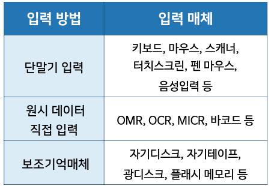
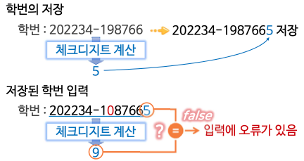

# 컴퓨터의 입출력

## 데이터 입력

  

### 현대의 단말기

- 그래픽 단말기
- 개인용 컴퓨터
  - 신 클라이언트(thin client) : 대부분의 계산 및 처리, 저장 기능을 서버가 담당하고, 사용자에게 그래픽 사용자 인터페이스만 제공하는 필수 요소만으로 구성된 저사양 컴퓨터
  - 팻 클라이언트(fat client) : 각종 응용프로그램을 내장하고, 서버와 독립적인 처리 능력을 갖는 컴퓨터
- 키보드
- 마우스
- 터치 스크린
  - 정전식, 감압식, 광학식
- 그래픽 태블릿

\*단말기란

: 컴퓨터에 데이터를 입력하고 컴퓨터가 내보내는 데이터를 출력하는 장치

- 단순 터미널: 극히 제한된 제어 코드(CR, LF 등) 외에는 처리 능력이 없음
- 지능적 터미널 : 마이크로프로세서를 포함하고 있어 주컴퓨터에 데이터를 보내기 전에 간단한 편집을 하는 등의 일부 입력 데이터 처리를 자체적으로 수행할 수 있음

### 원시 데이터 직접 입력

- 광학마크 인식(Optical Mark Recognition)
- 광학문자 인식(Optical Character Recognition)
- 자기잉크문자 인식(Magnetic Ink Character Recognition)
- 바코드

### 기타 컴퓨터 입력

- 판매점(Point of Sale) 단말기
  - 고객과 거래가 일어나는 시간과 장소에서 즉시 컴퓨터시스템에 데이터를 입력함
- 이미지 스캐너, 디지털 카메라
- 매스릭스 코드(2차원 바코드)
- RFID(Radio-Frequency IDentification)
  - IC칩과 전자기장을 이용한 무선 데이터 전송 기술을 이용
  - 안테나와 집적회로로 구성된 RFID 태그 사용
  - 태그 안에 정보를 저장하거나 수정할 수 있음
  - 여러 개의 태그를 동시에 구분할 수 있음
- 보조기억장치를 통한 입력
  - 데이터를 자기디스크나 광디스크, 플래시메모리 등의 보조기억장치에 저장 후 이 데이터를 입력으로 사용

## 입력 데이터 편집

### 입력 데이터 정확성 확인을 위한 검사

- 문자 종류 확인
  - 입력된 자료의 유형이 올바른지 검사
- 타당성 테스트
  - 데이터가 정상이거나 인정되는 범위 안에 있는지의 여부 확인
- 범위 테스트
  - 입력된 값이 정상적인 범위에 속하는 값인가를 검사
- 일관성 테스트
  - 입력된 값에 모순이 있는지 검사
  - 예) 왕복 항공원 예약의 경우 가는 날보다 오는 날이 과거인 경우.
- 체크디지트

  - 데이터 입력 과정에서 발생되는 오류를 검사하기 위해 추가된 숫자
  - 데이터에 미리 정해 놓은 연산을 통해 얻은 체크디지트를 실제 데이터와 함께 입력하거나 전송

    

## 정보의 출력

  

#### 기타 컴퓨터 출력장치

- 플로터
- 비디오 프로젝터
- 헤드 마운티드 디스플레이
  - 3차원 입체 장면으로 가상현실 환경을 보여 주거나 실세계의 시야에 컴퓨터가 생성한 정보를 겹쳐서 보여주기 위해 사용된다.
- 3차원 프린터
