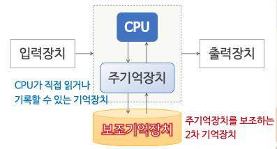
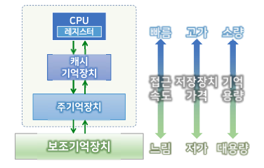
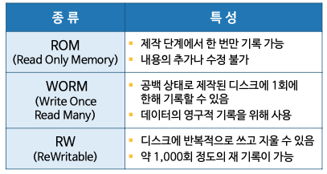
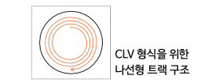
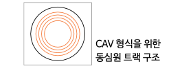
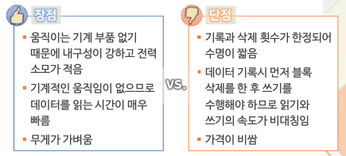

# 보고기억장치와 데이터 저장

## 보조기억장치 개요

  

### 보조기억장치의 필요성

- 대용량 기억장치가 필요함
  - 컴퓨터 응용분야의 확대 및 데이터 생산량 폭증
  - 프로그램과 데이터를 주기억장치에 모두 저장하기에 한계
- 비휘발성 기억장치
  - 전원 공급 없이 데이터를 보관할 수 있어야 함
- 주기억장치의 효율적 사용
  - 지역성의 원리 활용: 필요한 부분만 주기억장치에 저장하고 나머지는 보조기억 장치에 저장

### 기억장치 계층구조

  
  

## 자기테이프 기억장치

- 순차접근 기억장치
  - 물리적 순서에 따라 데이터를 저장함
  - 기록된 순서에 따라 읽을 수 있음
- 원하는 위치에 신속하게 접근할 수 없음
  - 대화식 처리에 직접 사용하기 적합하지 않음
  - 데이터의 백업 용으로 사용함
- 최근의 자기테이프는 카트리지 내부에 장착됨
  - 테이프를 보호하고 다루기 편리하게 함
- 대용량 저장장치
  - 최대 수 엑사 바이트에 이르는 대용량 저장장치
  - 백업, 자주 사용되지 않는 데이터의 저장 등의 용도로 활용됨

## 자기디스크 기억장치

직접접근 저장장치

- 데이터의 위치를 지정하여 데이터를 저장하거나 읽어낼 수 있는 저장장치
- 대화식 처리를 위한 빠른 데이터 처리를 위해서는 직접접근 저장장치가 필요함
- 자기디스크, 광디스크, 반도체 저장장치 등

자성체가 코팅된 원판 형태의 기록 매체 위에서 판독/기록 헤드를 움직여 원하는 위치에 접근하는 직접접근 저장장치

- 플로피디스크
- 하드디스크

  - 1개의 회전축에 자성체가 코팅된 여러 개의 금속 디스크를 결합하여 고속 회전
  - 액추에이터 암에 연결된 읽기, 쓰기 헤드가 각각의 기록면 위에서 이동하여 원하는 위치하여 원하는 위치에서 읽기, 쓰기를 함
  - 디스크 표면에 여러 개의 원형 트랙이 배열되어 있음
  - 각각의 트랙은 정해진 양의 데이터를 저장하는 구획 섹터로 나뉨
  - 동일 반경에 위치한 트랙의 집합을 실런더라고 함

    

- 고성능 디스크의 구성
  - 디스크 어레이
    - 여러 개의 하드디스크에 데이터를 분산하여 저장함
    - 데이터 저장의 신뢰성을 높이고 접근 성능을 향상 시킴
    - Redundant Array of Inexpensive Disks

## 광디스크

레이저를 이용하여 기록면에서 데이터를 읽음
한 장의 마스터로부터 대용량 데이터를 인쇄하듯 찍어내어 대량생산이 가능함

기록 방법에 따른 분류

광 디스크의 데이터 저장

- CLV(Constant Linear Velocity) 형식
  - 일정한 선속도로 회전하여 기록 밀도를 일정하게 유지함
  - 디스크의 중앙에서 바깥쪽으로 향하는 하나의 나선형 트랙
  - CAV 방식에 비해 직접접근 속도가 느림

- CAV(Constant Angular Velocity) 형식
  - 일정한 각속도로 회전함
  - 직접접근을 빠르게 할 수 있는 방식
  - 일반 데이터 저장용으로 사용하는 경우를 위해 광디스크 드라이브에서 지원하기도 함

## 반도체 기억장치

USB플래시 드라이브

- 플래시 메모리 + USB

  - 플래시 메모리: 전기적으로 데이터를 지우고 다시 기록할 수 있는 비휘발성 반도체 메모리
  - USB: 컴퓨터와 주변기기 사이의 데이터 교환 버스 규격
    - USB2.0(최대 480Mbps), USB3.2(최대 20Gbps)
  - 컴퓨터가 켜진 상태에서 자유롭게 연결, 분리 가능
  - 휴대용 저장장치로 적합

    

SSD(Solid State Drive)

- 자기디스크와 동일한 인터페이스를 가지나 디스크 대신 반도체 메모리를 사용하여 데이터를 저장
- 플래시 메모리를 이용하는 방식과 DRAM 과 배터리를 사용하는 방식이 있음
- 자기디스크와 비교

    

## 클라우드 저장장치의 활용
클라우드 저장장치
- 클라우드 컴퓨팅
  - 인터넷을 기반으로 컴퓨터의 계산능력, 저장공간, 서비스 등 다양한 컴퓨터의 자원을 언제, 어디서나 필요한만큼 이용하고 비용을 지불하는 컴퓨팅 방식
- 클라우드 저장장치
  - 서비스를 제공하는 사업자는 다수의 분산된 저장장치로 거대한 저장공간을 구성
  - 사용자는 서비스를 제공자와의 계약을 통해 사용량에 따른 비용을 지불하고 사용

파일 호스팅 서비스 
- 사용자에게 파일 저장 공간을 제공하는 인터넷 호스팅 서비스 
  - Google Drive, Microsoft OneDrive 등
- 개인 파일 저장 서비스 
- 파일 동기화 및 공유 서비스
