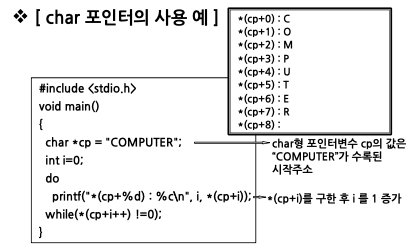
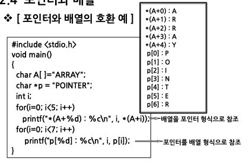
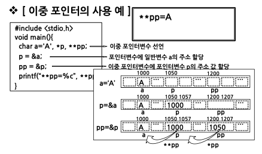

# 배열과 포인터3

## char형 포인터

char 포인터

- 포인터는 문자열 처리에 효과적
- 문자열 처리에 char형 포인터 사용
  char \*cp= “COMPUTER”;

## 포인터와 배열의 관계

### 포인터를 이용한 1차원 배열의 참조

### 포인터를 이용한 2차원 배열의 참조

### 포인터와 배열은 서로 호환적이다.

### 포인터와 배열의 차이점

배열과 포인터의 값 변경

- 배열 A[i] 에서 A++, A-- 와 같이 값 변경 불가
- 포인터 \*p 에서 p++, p-- 와 같이 값 변경 가능

배열과 포인터의 기억공간 확보

- 배열
  - 기억공간 중 자료영역을 고정적으로 확보
- 포인터
  - 기억공간 중 자료영역을 유동적으로 확보
  - 필요할 때만 자료용 기억공간을 확보
  - 자료의 개수가 가변적인 경우 효과적

#### 포인터가 배열보다 활용의 폭이 넓다.

## 포인터 배열

- 2차원 배열과 동일
- 2차원 배열에 비해 기억공간 절약효과
  - 포인터 배열은 자료의 크기만큼만 기억공간 할당

## 이중 포인터

자료가 있는 곳을 이중으로 가리키는 포인터

- 포인터에 대한 포인터
- 이중 포인터가 가리키는 주소로 가보면 자료가 아닌 주소 값이 들어 있고, 그 주소에 자료가 들어 있음

`int **p`

P : 기억공간 주소
*P : 주소 P에 수록되어 있는 값. 이 값이 주소로 사용됨
\*\*P : 주소가 *P인 곳에 수록되어 있는 값. 즉 int형 자료

