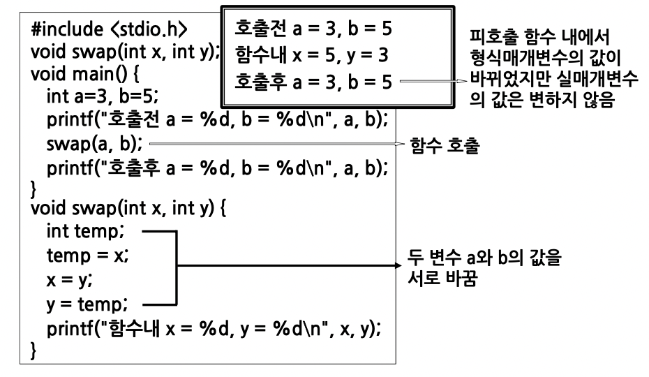
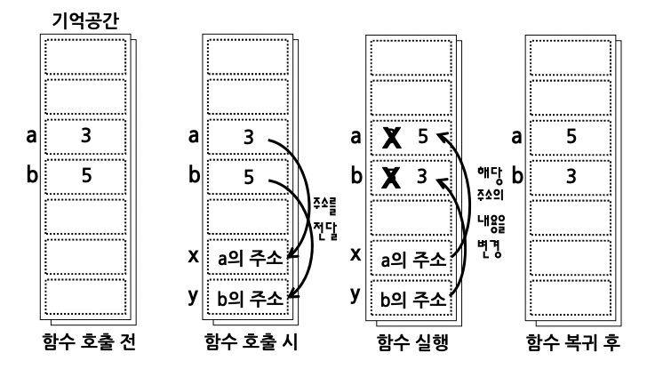
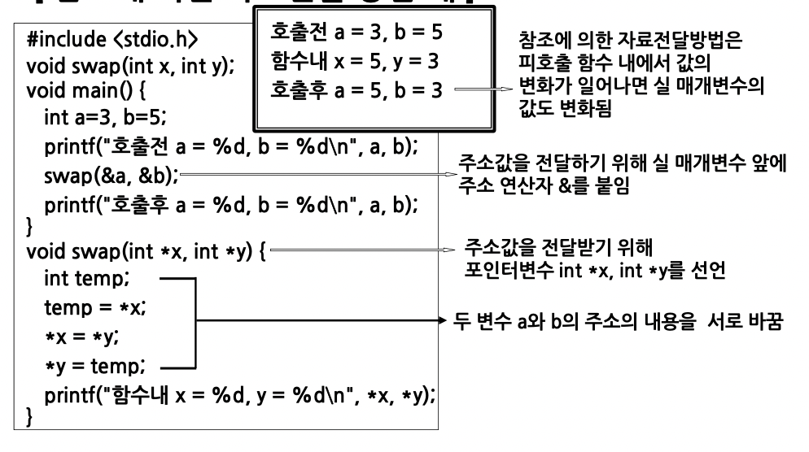
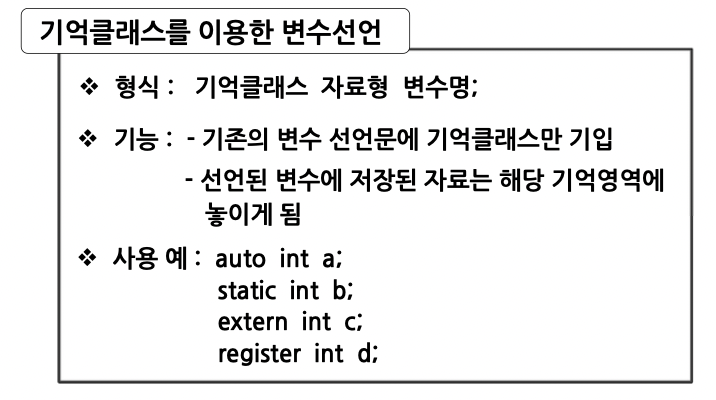
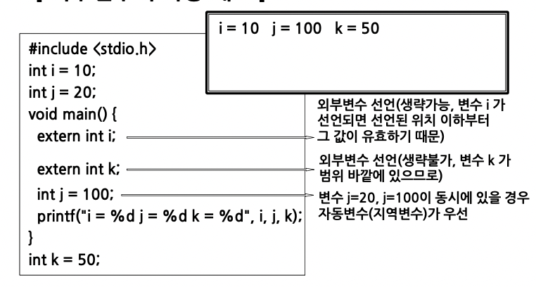
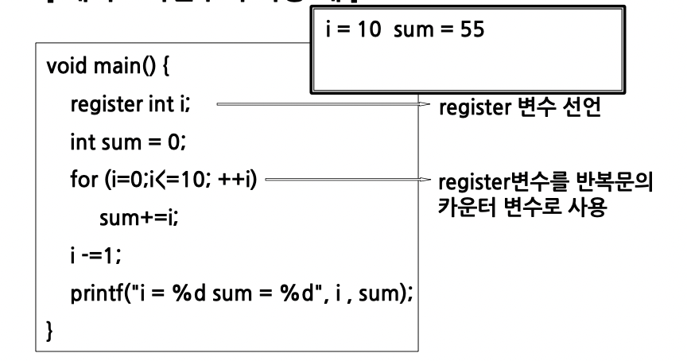

# 함수와 기억클래스2

## 매개변수 사이의 자료전달

### 값에 의한 자료전달

- 기본적인 자료전달 방법
- 실 매개변수와 형식 매개변수 사이에 값의 전달
- 호출한 함수의 실행이 끝난 다음 전달받은 값을 되돌려 받지는 못한다.

### 참조에 의한 자료전달

- 호출함수와 피 호출함수의 매개변수 값을 서로 교환할 수 있는 자료전달 방법
- 값을 전달하는 것이 아니라 실 매개변수의 값이 들어있는 주소 값이 전달된다.
- 주소 연산자(&)와 포인터변수(\*) 사용

## 기억 클래스

- 변수를 기억공간의 특정영역에 할당하는 방법
- 각 변수의 유효범위와 존속기간을 설정
- 변수의 사용위치에 따라 1)지역변수 2)전역변수
- 변수의 존속기간에 따라 1)자동변수 2)정적변수 3)외부변수 4)레지스터변수

### 변수의 기억클래스 종류

- 변수의 초기화, 존속기간, 유효범위에 따라 구별

#### 자동변수

- 함수 실행시 만들어지고, 실행이 끝나면 기억공간이 제거됨
- 예약어 auto 를 사용(생략가능)
- 통용 범위는 변수가 선언된 블록이나 함수 내로 한정
- 지역변수에 해당
- 초기화가 필요

#### 정적변수

- 기억영역이 프로그램 끝날 때까지 유지
- 예약어 static 을 사용
- 전역 변수에 해당
- 변수의 값은 프로그램 실행 중 계속 유지
- 초기화가 없으면 0으로 초기화 됨

#### 외부변수

- 함수의 외부에서 선언
- 예약어 extern 사용
- 전역 변수에 해당
- 초기화가 없으면 0 으로 초기화 됨
- 다른 파일에서 외부변수로 선언된 변수의 값을 참조할 수 있다.

#### 레지스터변수

- CPU 내의 레지스터에 자료를 저장하고자 할 때 사용
- 예약어 register 사용
- 자동 변수와 동일한 속성
- 프로그램의 실행속도 증가를 목적으로 사용(주로 반복문에서 카운터 변수로 사용)

