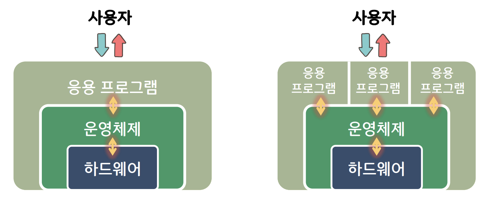
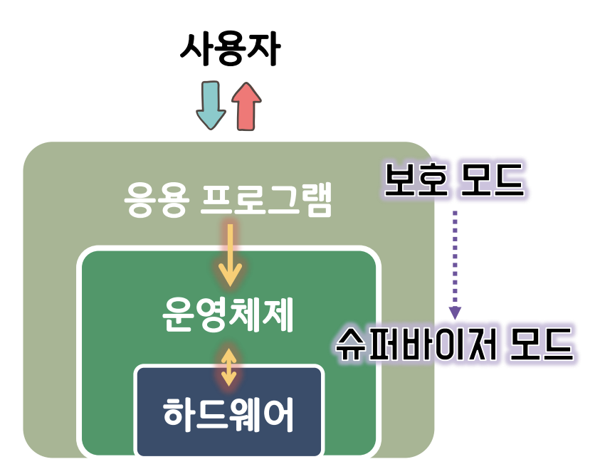

## 1.1 운영체제 개요

### 1.1.1 운영체제의 역할

컴퓨터의 하드웨어 자원을 관리, 컴퓨터 프로그램 동작을 위한 서비스를 제공하는 시스템 소프트웨어

(1) 컴퓨터 시스템의 운영

운영체제는 컴퓨터 시스템의 자원을 제어 및 관리하여 컴퓨터 시스템을 효율적으로 운영하는 역할.

응용 프로그램들의 실행을 위해 아래의 자원들이 적절히 활용되도록 제어 및 관리하는 역할.

e.g. 디스크에서 데이터 읽어오기. 키보드, 마우스 등의 장치를 제어. 여러 프로그램이 동시에 실행될 경우 CPU 와 메모리 관리를 효율적으로 관리. 모두 컴퓨터 시스템을 제어, 관리, 운영하는 것.

(2) 사용자 지원

사용자가 편리하게 컴퓨터를 사용할 수 있도록 지원하는 역할. 사용자가 내린 명령을 실행, 사용자와 하드웨어 사이의 매개체 역할.

### 1.1.2 컴퓨터 시스템과 운영체제

운영체제가 하드웨어와 응용 프로그램 사이에 위치

- 하드웨어에 대한 제어는 운영체제만 함
- 응용 프로그램은 운영체제를 통해서만 하드웨어 이용

### CPU 동작 모드

슈퍼바이저 모드(커널 모드)

- 운영체제의 커널이 동작되는 모드
- 하드웨어를 직접 제어할 수 있는 CPU 명령어 사용 가능

보호 모드(사용자 모드)

- 응용 프로그램이 동작되는 모드
- 하드웨어를 직접 제어할 수 있는 CPU 명령어 사용 불가능

시스템 호출
: 응용 프로그램이 운영체제에게 서비스를 요청하는 메커니즘

**시스템호출 ➔ 보호모드에서 슈퍼바이저 모드로 변경 ➔ 커널동작 ➔ 하드웨어제어**

커널?

- 운영체제의 핵심요소
- 응용프로그램과 하드웨어 수준의 처리 사이의 가교 역할

일체형 커널(monolithic kernel)

- 운영체제의 모든 서비스가 커널 내에 포함됨

장점

- 커널 내부 요소들이 서로 효율적으로 상호작용을 할 수 있음

단점

- 한 요소에 있는 오류로 인해 시스템 전체에 장애가 발생할 수 있음

마이크로 커널(microkernel)

- 운영체제의 대부분의 요소들을 커널 외부로 분리
- 커널 내에는 메모리 관리, 멀티태스킹, 프로세스 간 통신(IPC) 등 최소한의 요소들만 남김

장점

- 새로운 서비스를 추가하여 운영체제를 확장하기 쉬움
- 유지보수가 용이하며 안정성이 우수함

단점

- 커널 외부 요소들 사이는 IPC를 통해야만 하므로(외부에서 커널을 거친 후 다른 요소에 접근해야 함) 성능 저하가 발생함

## 1.2 운영체제의 구성

프로세스 관리자

- 프로세스를 생성, 삭제, CPU 할당을 위한 스케줄 결정
- 프로세스의 상태(준비, 실행, 대기)를 관리하며 상태 전이를 처리

\*프로세스: 메모리 상에 올라와서 실행중인 프로그램

메모리 관리자

- 메모리(주기억장치) 공간에 대한 요구의 유효성 체크
- 메모리 할당 및 회수
- 메모리 공간 보호

장치 관리자

- 컴퓨터 시스템의 모든 장치를 관리
- 시스템의 장치를 할당, 작동 시작, 반환

파일 관리자

- 컴퓨터 시스템의 모든 파일을 관리
- 파일의 접근 제한 관리
- 파일을 열어 자원을 할당하거나 파일을 닫아 자원을 회수

## 1.3 운영체제의 유형

일괄처리 운영체제(batch processing)

- 작업을 모아서 처리
- 사용자와 상호작용 없이 순차적으로 실행
- 효율성 평가: 처리량, 반환시간

대화형 운영체제(interactive)

- 시분할 운영체제라고도 함
- 일괄처리 운영체제보다 빠르지만 실시간 운영체제 보다는 느린 응답시간
- 이용자에게 즉각적인 피드백을 제공

실시간 운영체제(real-time)

- 가장 빠른 응답시간
- 처리의 결과가 현재의 결정에 영향을 주는 환경에서 사용
- 우주선 비행 시스템, 미사일 제어, 증권거래 관리 시스템, 은행 입출금 시스템 등에 사용

하이브리드 운영체제(hybrid)

- 일괄처리 운영체제와 대화형 운영체제의 결합
- 이용자는 터미널을 통해 접속하고 빠른 응답시간을 얻음
- 대화형 작업이 많지 않을 경우 백그라운드에서 배치 프로그램 실행
- 현재 사용되고 있는 대부분의 대형 컴퓨터 시스템은 하이브리드 운영체제
