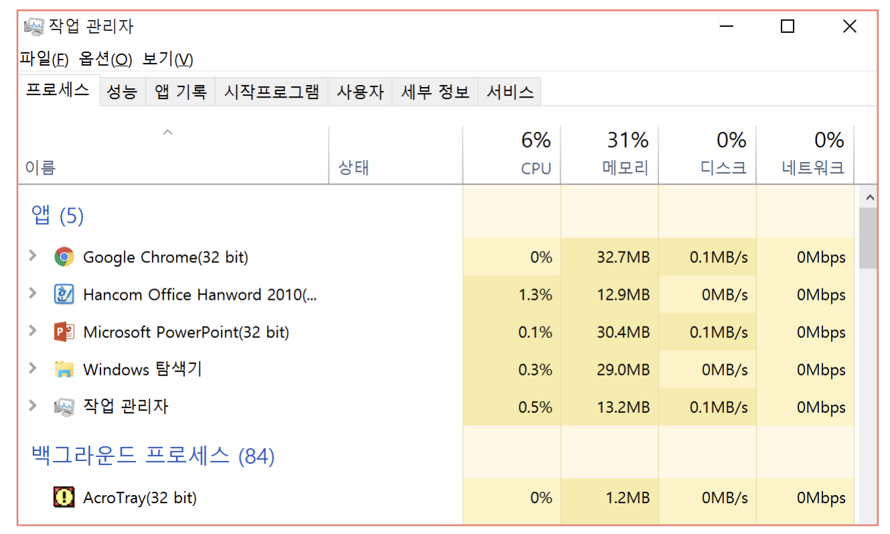
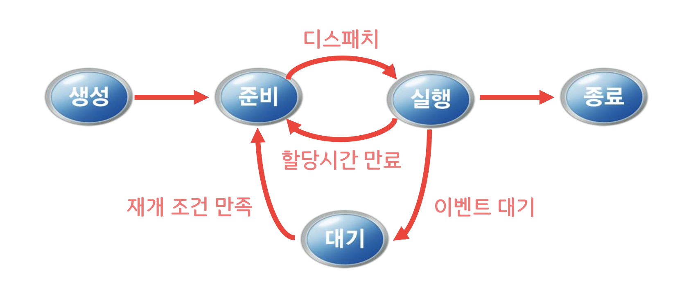

## 2.1 프로세스

프로세스 = 실행중인 프로그램

프로세스
: 운영체제로부터 자원을 할당 받아 동작

- 자원: CPU, 메모리, 입출력장치, 파일 등
- 동작: CPU가 프로세스의 명령을 실행

사용자 및 시스템 프로세스 존재

운영체제
: 프로세스 관리자의 역할

- 프로세스를 생성 및 삭제
- 프로세스 실행(CPU 할당)을 위한 스케줄 결정
- 프로세스의 상태를 관리하며 상태 전이를 처리

### 2.1.1 프로세스의 상태변화

생성상태 → 준비상태
: 스케쥴러에 의해 호출. 메모리의 이용 가능성과 어떤 장치가 요구되는지 검사

준비상태 → 실행상태
: 사전에 정의된 알고리즘(FCFS, SJF, SRT, RR 등) 에 따라 스케쥴러에 의해 처리된다. 디스패치라고 한다.

실행상태 → 준비상태
: 할당시간 만료나 우선순위 알고리즘을 택하고 있는 시스템에서 높은 우선순위 프로세스가 오는 경우 스케쥴러에 의해 처리된다.

실행상태 → 대기상태

대기상태 → 준비상태

실행상태 → 종료상태

### 2.1.2 프로세스 제어블록(Process Control Block, PCB)

#### 프로세스 제어 블록

- 프로세스의 관리를 위한 목적
- 프로세스의 정보를 보관
- 각 프로세스마다 존재
- 프로세스가 진행함에 따라 내용 변경

프로세스 번호: 프로세스 기준이 되는 ID

프로세스 카운터: 다음 명령의 주소 표시

레지스터: CPU 레지스터 정보를 이곳에 저장. 다시 실행될 때 프로세스의 정확한 수행을 계속할 수 있게 한다.

#### 프로세스 생성과 종료

- 프로세스 생성 작업
  - 프로세스의 이름(번호, PID) 결정
  - 준비 큐에 삽입
  - 초기 우선순위 부여
  - 프로세스 제어 블록(PCB) 생성 등
- 프로세스 생성 방법: **시스템 호출** (보호 모드 → 슈퍼바이저 모드)
- 프로세스 생성 시스템 호출
  - 하나의 프로세스가 프로세스 생성 시스템 호출을 통해 새로운 프로세스를 생성
    • 예: fork( )
  - 호출하는 프로세스: 부모 프로세스
  - 생성되는 프로세스: 자식 프로세스
- 시스템 프로세스와 사용자 프로세스 모두 부모 프로세스 가능

- 생성되는 프로세스의 자원
  - 운영체제로부터 직접 얻는 경우
  - 부모 프로세스 자원의 일부를 얻는 경우
- 자식 프로세스의 자원은 부모 프로세스의 자원으로 제한
  - 과도한 자식 프로세스 생성에 따른 시스템 과부하 방지
- 프로세스 종료
  - 프로세스의 마지막 명령이 실행을 마치는 경우
  - 프로세스 종료 시스템 호출(예: exit( ))을 통하는 경우
  - 프로세스 종료 후 부모 프로세스에게 실행결과를 되돌려 줌
- 프로세스 종료 시스템 호출
  - 부모에 의해서만 호출
  - 자식 프로세스가 할당된 자원의 사용을 초과할 때 혹은 더 이상 필요치 않을 때

#### 프로세스 간의 관계

## 2.2 쓰레드

쓰레드(Thread)

- 프로세스 내에서의 다중처리를 위해 제안된 개념
- 하나의 프로세스 내에는 하나 이상의 쓰레드가 존재
- 하나의 쓰레드 내에서는 하나의 실행점만 존재(디스패칭의 단위)
- 실행에 필요한 최소한의 정보만을 가지며, 자신이 속해 있는 프로세스의 실행환경을 공유

## 2.3 스케쥴링

### 스케줄링 단계

상위단계 스케줄링

- 시스템에 들어오는 작업들을 선택하여 프로세스를 생성한 후 프로세스 준비 큐에 전달
- 선택 기준: 시스템의 자원을 효율적으로 이용할 수 있도록 하는 것
- 입출력(I/O) 중심 작업과 연산 중심 작업을 균형있게 선택

하위단계 스케줄링

- 사용 가능한 CPU를 준비상태의 어느 프로세스에게 배당할지를 결정
- CPU를 배당받은 프로세스는 결국 실행상태가 되어 프로세스가 처리됨
- 수행 주체: 디스패처(dispatcher)

중간단계 스케줄링

- 프로세스를 일시적으로 메모리에서 제거하여 중지시키거나 다시 활성화시킴
- 시스템에 대한 단기적인 부하를 조절

### 스케줄링 정책

스케줄링 기본 목표

- 공정성: 모든 프로세스가 적정 수준에서 CPU 작업을 할 수 있게 함
- 균형: 시스템의 자원들이 충분히 활용될 수 있게 함

선점(Preemptive) 스케줄링 정책

- 진행 중인 프로세스에 인터럽트를 걸고 다른 프로세스에 CPU를 할당하는 스케줄링 전략
- 높은 우선순위의 프로세스를 긴급하게 처리하는 경우에 유용
- 대화식 시분할 시스템에서 빠른 응답시간을 유지하는데 유용
- \*문맥 교환에 따른 오버헤드 발생

\*문맥: CPU의 모든 레지스터와 기타 운영체제에 따라 요구되는 프로세스의 상태

비선점(Nonpreemptive) 스케줄링 정책

- 프로세스가 CPU를 할당받아 실행이 시작되면 작업 자체가 I/O 인터럽트를 걸거나 작업을 종료할 때까지
  실행상태에 있게 됨
- 모든 프로세스가 공정하게 순서에 따라 실행됨 → 응답시간 예측 가능
- 짧은 프로세스가 긴 프로세스를 기다리게 될 수 있음
