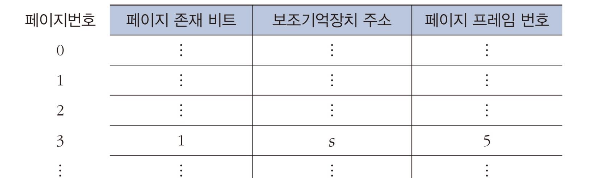

# 가상 메모리1

## 가상 메모리 개념

- 메모리 크기보다 더 큰 기억공간이 필요한 프로세스를 실행할 수 있게 하는 방법
- 프로세스에 의해 참조되는 주소를 메모리에서 사용하는 주소와 분리
- 현재 필요한 일부만 메모리에 적재

### 사상(mapping)

- 프로세스 실행을 위해 가상주소를 실주소로 변환하는 것
- 동적 주소 변환(Dynamic Address Translate): 프로세스가 실행되는 동안 사상
- 인위적 연속성: 가상주소 공간에서는 연속이지만 실주소 공간에서는 연속일 필요 없음

## 블록 단위 주소 변환

- 블록 단위로 분류하여 각 블록이 메모리의 어디에 위치하는지를 관리
- 블록의 크기
  - 작을 경우 -> 사상 표에 들어갈 블록 수가 많아짐
  - 커질 경우 -> 블록 전송 시간 증가 및 적재 가능한 프로세스 수 감소

### 블록 구성 방식에 따른 분류

- 페이징 기법: 블록의 크기가 동일한 페이지로 구성
- 세그먼테이션 기법: 블록의 크기가 서로 다른 세그먼트로 구성

#### 페이징 기법

페이지와 페이지 프레임

- 가상 메모리를 고정된 크기의 블록인 페이지 단위로 나누어 관리
- 메모리 영역도 페이지와 동일한 크기의 블록인 페이지 프레임으로 나눔

페이지 사상표

- 가상주소를 실주소로 동적 변환하기 위해 필요
- 가상주소를 페이지 번호에 대한 실주소의 페이지 프레임 번호를 저장

- 직접 사상: 페이지 사상표를 직접 이용. 페이지 존재 비트 여부(0 또는 1)에 따라 기존 페이지 프레임 번호를 바로 활용하거나 새로운 페이지 프레임을 만든다.

  

- 연관 사상: 연관기억장치에 저장한 연관 사상표를 이용. 페이지 번호 자체가 저장되어 있음.

  

\*연관기억장치
: 저장된 값으로 데이터를 엑세스하는 고속 메모리 장치. 값이 비싸므로 캐싱 등 특별한 경우에 사용.

- 연관 / 직접 사상

  - 연관 사상표에는 가장 최근에 참조된 페이지들만 보관, 나머지는 페이지 사상표에 보관

  

페이징 기법의 특징

- 논리적 의미와 무관하게 동일 크기의 페이지로 가상 메모리를 나눔
- 프로세스 사이에 메모리 보호는 페이지 단위로 이루어짐
- 외부 단편화는 발생하지 않으나 내부 단편화는 발생할 수 있음

\*내부 단편화
: 한 페이지에서 남는 공간이 생김

#### 세그먼테이션 기법

- 가상 메모리를 논리적 의미에 맞는 다양한 크기의 세그먼트 단위로 나누어 관리
- 가상주소 v = (s, d)

  

세그먼트 사상표

- 세그먼트 시작주소: 메모리에서의 시작위치
- 세그먼트 길이: 오버플로 확인용. 특정 세그먼트 크기를 넘어가지 않도록 함.

  

#### 페이징 / 세그먼테이션 혼용기법

- 세그먼테이션 기법의 논리적 장점 + 페이징 기법의 메모리 관리 장점
- 가상 메모리를 세그먼트 단위로, 각 세그먼트를 다시 페이지 단위로 분할
- 메모리는 페이지 프레임으로 분할

  

동적 주소 변환 예

  

## 페이지 호출기법

### 메모리 호출기법

- 페이지를 어느 시점에 메모리에 적재할 것인가를 결정
- 종류: 요구 페이지, 예상 페이지 호출 기법

#### 요구 페이지 호출기법

- 한 프로세스의 페이지 요구가 있을 때 요구된 페이지를 메모리로 기동
- 즉, 명령어나 데이터가 실제로 참조하면 해당 페이지를 매모리에 적재

  

#### 예상 페이지 호출기법

- 현재 요구하지는 않지만 곧 사용될 것으로 예상되는 페이지를 미리 메모리로 이동
- 실제 필요한 시점이 되었을 때 프로세스 실행이 단절되지 않음

  

요구 페이지 호출기법 특징

- 옮길 페이지를 결정하는데 오버헤드를 최소화
- 메모리에 옮겨진 페이지는 모두 프로세스에 의해 실제로 참조된 것임
- 프로세스 시작 시점에는 프로세스 진행에 따라 연속적으로 페이지 부재 발생 (성능 저하)

예상 페이지 호출기법 특징

- 예상이 잘못된 경우 메모리 공간 낭비
- 프로세스 시작 시점에 적용하면 성능이 개선됨
