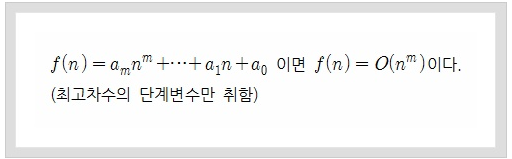
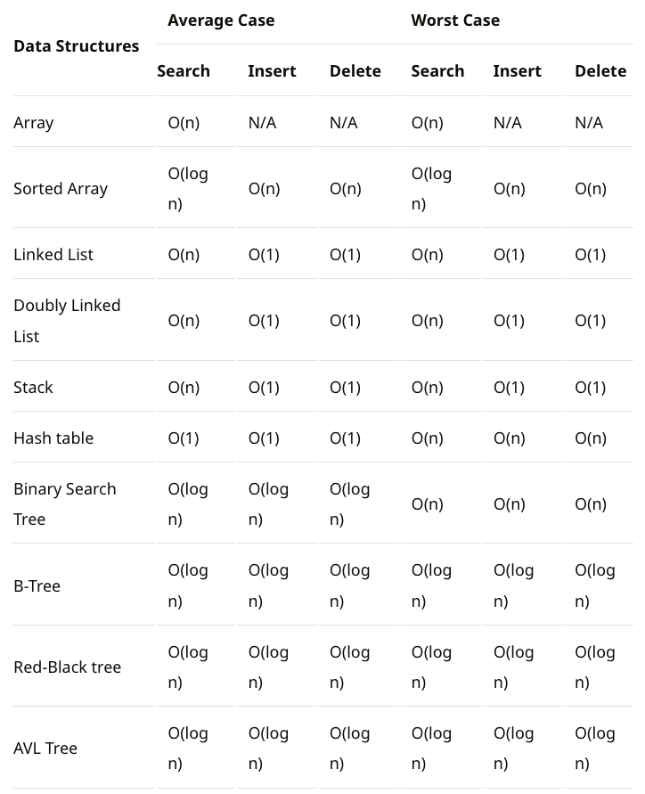

# 알고리즘의 시간 복잡도와 Big-O Notation

알고리즘의 실행시간은 컴퓨터가 알고리즘 코드를 실행하는 속도에 의존한다.
즉, 컴퓨터의 처리속도, 사용된 언어종류, 컴파일러 속도에 달려있다.

알고리즘의 실행시간은 아래 두 부분으로 나누어진다.

1. 입력값의 크기에 따라 알고리즘의 실행시간 검증
1. 입력값의 크기에 따른 함수의 증가량인 성장률
   중요하지 않는 상수와 계수들을 제거하면 알고리즘의 실행시간에서 중요한
   성장률에 집중할 수 있는데 이를 <strong>점근적 표기법(Asymptotic notation)</strong>이라 한다.
   여기서, 점근적이라는 의미는 가장 큰 영향을 주는 항만 계산한다는 의미다.

점근적 표기법은 다음 세가지가 있는데 시간복잡도를 나타내는데 사용된다.

- 오메가 표기법 (Big-Ω Notation)
  - 하한점근, 최선의 경우 표기법
  
    
    
- 세타 표기법 (Big-θ Notation)
  - 상한/하한 점근(평균점근)
  
    
    
- 최악의 경우 : 빅오 표기법 (Big-O Notation)
  - 상한점근, 최악의 경우 표기법
  - 최악의 경우에도 이보다는 빠르다는 의미때문에 신뢰도가 높아 가장 일반적으로 사용되는 표기법
  
    

## 빅오 표기법(Big-O)

빅오 표기법은 불필요한 연산을 제거하여 알고리즘분석을 쉽게 할 목적으로 사용된다.

Big-O로 측정되는 복잡성에는 시간과 공간복잡도가 있는데

- 시간복잡도는 입력된 N의 크기에 따라 실행되는 조작의 수를 나타낸다.
- 공간복잡도는 알고리즘이 실행될때 사용하는 메모리의 양을 나타낸다.
  요즘에는 데이터를 저장할 수 있는 메모리의 발전으로 중요도가 낮아졌다.


## 시간 복잡도

시간복잡도는 알고리즘의 성능을 말하는 것으로 알고리즘을 수행하기 위해 프로세스가 수행해야하는 연산을 수치화 한 것이다.
명령어의 실행시간은 컴퓨터의 하드웨어 또는 프로그래밍 언어에 따라 편차가 크게 달라지기 때문에 명령어의 실행 횟수(연산 횟수)만을 고려한다.

시간복잡도에서 중요하게 보는것은 가장큰 영향을 미치는 n의 단위이다.

```
1             O(1)   --> 상수
2n + 20       O(n)   --> n이 가장 큰영향을 미친다.
3n^2          O(n^2) --> n^2이 가장 큰영향을 미친다.
```

```
O(1) – 상수 시간 : 문제를 해결하는데 오직 한 단계만 처리함.
O(log n) – 로그 시간 : 문제를 해결하는데 필요한 단계들이 연산마다 특정 요인에 의해 줄어듬.
O(n) – 직선적 시간 : 문제를 해결하기 위한 단계의 수와 입력값 n이 1:1 관계를 가짐.
O(n log n) : 문제를 해결하기 위한 단계의 수가 N*(log2N) 번만큼의 수행시간을 가진다. (선형로그형)
O(n^2) – 2차 시간 : 문제를 해결하기 위한 단계의 수는 입력값 n의 제곱.
O(C^n) – 지수 시간 : 문제를 해결하기 위한 단계의 수는 주어진 상수값 C 의 n 제곱.
```

실행시간이 빠른순으로 입력 N값에 따른 서로 다른 알고리즘의 시간복잡도


## 시간복잡도를 구하는 방법

- 하나의 루프를 사용하여 단일 요소 집합을 반복 하는 경우 : O (n)
- 컬렉션의 절반 이상 을 반복 하는 경우 : O (n / 2) -> O (n)
- 두 개의 다른 루프를 사용하여 두 개의 개별 콜렉션을 반복 할 경우 : O (n + m) -> O (n)
- 두 개의 중첩 루프를 사용하여 단일 컬렉션을 반복하는 경우 : O (n²)
- 두 개의 중첩 루프를 사용하여 두 개의 다른 콜렉션을 반복 할 경우 : O (n \* m) -> O (n²)
- 컬렉션 정렬을 사용하는 경우 : O(n\*log(n))

## 정렬 알고리즘 비교


## 자료구조 비교


