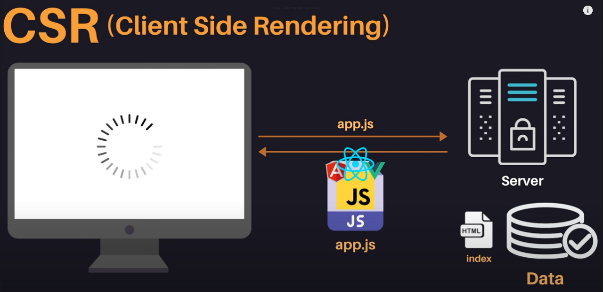
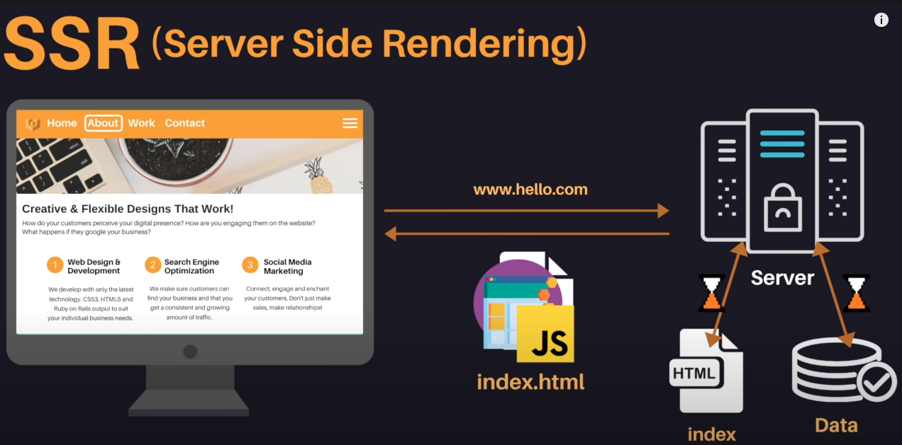
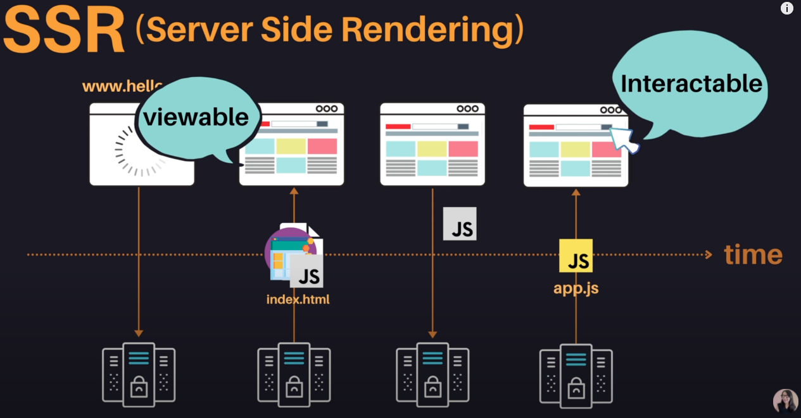
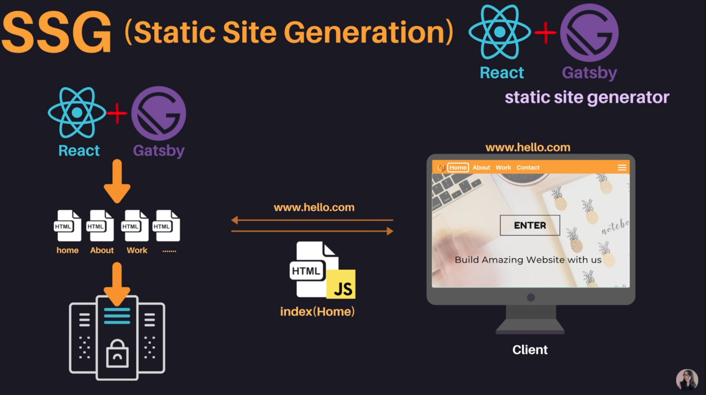
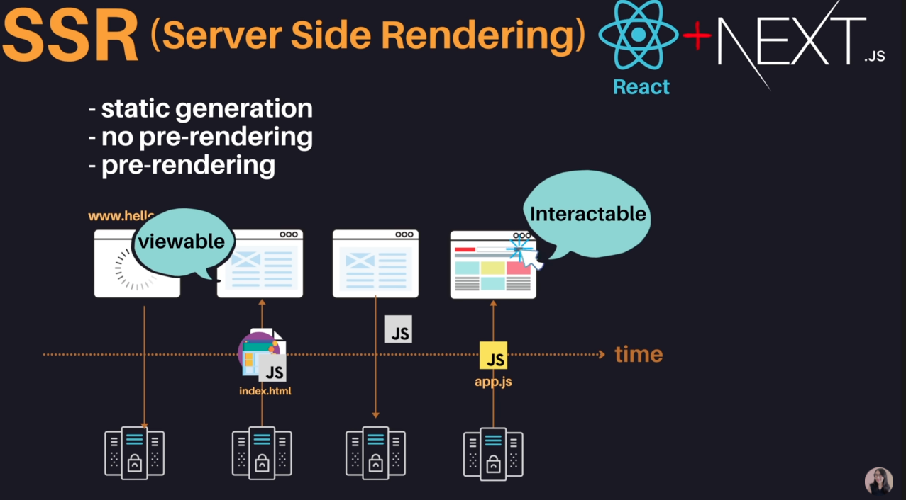

# Browser

### 1. 서버로부터 리소스를 받은 후 브라우저 동작 원리

1.  브라우저는 서버로부터 HTML, CSS, Javascript, 이미지 파일 등을 응답받는다.
2.  HTML, CSS 파일은 **렌더링 엔진**의 HTML 파서와 CSS 파서에 의해 파싱(Parsing)되어 DOM, CSSOM 트리로 변환되고 렌더 트리로 결합된다. 이 **렌더 트리**를 기반으로 브라우저는 웹페이지를 표시한다.
3.  자바스크립트는 **자바스크립트 엔진**이 처리하는데, HTML 파서는 script 태그를 만나면 자바스크립트 코드를 실행하기 위해 DOM 생성 프로세스를 중지하고 자바스크립트 엔진으로 제어 권한을 넘긴다. 제어 권한을 넘겨 받은 자바스크립트 엔진은 script 태그 내의 스크립트 코드 또는 script 태그의 src 어트리뷰트에 정의된 **자바스크립트 파일을 로드하고 파싱하여 실행**한다. 자바스크립트의 실행이 완료되면 다시 HTML 파서로 제어 권한을 넘겨서 브라우저가 중지했던 시점부터 DOM 생성을 재개한다.
    <br>
    **1. HTML 파싱과 DOM 생성**
    서버로부터 응답 받은 HTML 문서는 문자열로 이루어진 순수한 텍스트이다. 이를 브라우저에 시각적인 픽셀로 렌더링하려면 HTML 문서를 브라우저가 이해할 수 있는 자료구조(객체) 로 변환하여 메모리에 저장해야 한다. 아래 그림의 각 토큰을 객체로 변환하여 노드들을 생성한다.
    <strong>즉, DOM 은 HTML 문서를 파싱한 결과물이다. </strong>

     

    **2. CSS 파싱과 CSSOM 생성**
    link 태그의 href 어트리뷰트에 지정된 CSS 파일을 서버에 요청하여 로드한 CSS 파일이나 style 태그 내의 CSS 를 HTML 과 동일한 파싱 과정(바이트-> 문자 -> 토큰 -> 노드 -> CSSOM) 을 통해 CSS Object Model 을 생성한다.

    

    **3. 렌더 트리 생성**

    렌더 트리는 각 HTML 요소의 레이아웃(위치와 크기) 을 계산하는 데 사용되고 브라우저 화면에 픽셀을 렌더링하는 페인팅 처리에 입력된다.

    

    **4. 자바스크립트 파싱과 실행**

    자바스크립트 엔진은 자바스크립트 코드를 파싱하여 CPU 가 이해할 수 있는 low-level language 로 변환하고 실행한다. 이 엔진은 자바스크립트를 해석하여 추상적 구문 트리를 생성한다. 그리고 이를 기반으로 인터프리터가 실행할 수 있는 중간 코드인 바이트코드를 생성하여 실행한다.

    

    **5. 리플로우와 리페인트**

    리플로우는 레이아웃 계산을 다시하는 것으로 노드 추가/삭제, 요소의 크기/위치 변경, 윈도우 리사이징 등 레이아웃에 영향을 주는 변경이 발생한 경우 실행된다. 리페인트는 재결합된 렌더 트리를 기반으로 다시 페인트를 하는 것을 말한다.

    

For more detail: [프론트엔드 개발자라면 알고 있어야 할 브라우저의 동작 과정](https://yozm.wishket.com/magazine/detail/1338/)

---

### 2. SPA - CSR/SSR/SSG

<b>Single Page Application</b>
html 문서 전체가 아니라 json 과 같은 포맷으로 서버에서 필요한 데이터만 받아올 수 있다.
이 데이터를 javascript 를 이용해 동적으로 html 요소를 생성해 페이지를 업데이트하는 방식이다.
이 방식이 AJAX 라는 이름으로 공식적으로 인정되는데, 이 것이 Single Page Application 이다.

<div style="display:'flex'">


</div>
<br>
<br>

<h4>Table of Contents:</h4>

- Client Side Rendering(CSR)
- Server Side Rendering(SSR)
- TTV(Time To View) & TTI(Time To Interact)
- Static Site Generation(SSG)
- Conclusion

<br>
<br>

<h4>Client Side Rendering(CSR)</h4>

JS + Framework(React, Angular, View)
클라이언트에서 모든 것을 처리하는 방식

<div style="display:'flex'">


</div>

html 파일에 아래와 같이 body 안에서 script 로 링크된 app.js 자바스크립트를 서버로부터 다운로드 받는다.
로직들, 프레윔워크, 라이브러리의 소스코드가 포함되어 있어 사이즈가 커 다운로드 받는데 시간이 걸릴 수 있다.

```html
<body>
  <div id="root"></div>
  <script src="app.js"></script>
</body>
```

위와 같은 단점을 보완하기 위해 \*Static Sites 에서 영감을 받은 **Server Side Rendering** 이 탄생한다.

\*Static Sites
: 서버에 배포되어 있는 html 문서를 받아와서 보여주는 형식.
문제점은 페이지 내에서 다른 링크를 클릭시 페이지 전체가 업데이트 되어 사용성이 떨어짐.


<br>

<h4>Server Side Rendering(SSR)</h4>

서버에서 웹 사이트에 필요한 데이터를 모두 가져와서 html 파일 만들고 이 파일을 동적으로 조금 제어할 수 있는 소스코드와 함께 클라이언트에 보내주면, 클라언트에서는 이를 바로 사용자에게 보여준다.



<br>

**개선점**

1. Initial page load is faster
2. Great SEO: 모든 컨텐츠가 html 에 담겨져 있기 때문에 더 효율적인 Search Engine Optimization 이 가능하다.

**단점**

1. Blinking issue, Non-rich site interations

2. Server side overhead: 서버 과부하

3. Need to wait before interacting: 동적으로 데이터를 처리하는 자바스크립트(app.js)를 다운 받기 전에 여기저기 클릭할 경우 반응이 없는 경우가 발생할 수 있다.

<h4>TTV(Time To View) & TTI(Time To Interact)</h4>

1.CSR

TTV 와 TTI 가 동시에 가능해진다. 화면이 나타나는 시간이 느리다.


2.SSR

html 을 먼저 받아와서 사용자가 화면을 볼 수 있지만, javascript 파일을 받아올 때까지 클릭과 같은 interact 는 할 수 없다.
화면을 렌더링한 시점부터 인터랙션 기능이 가능할 때까지의 공백기간이 꽤 긴 편이다.



<h4>Static Site Generation(SSG)</h4>

리액트로 만든 앱을 정적으로 웹페이지를 미리 생성해 서버에 배포놓는다.
추가적으로 서버로부터 데이터를 받아오거나 동적으로 처리해야 하는 로직이 있을 경우 자바스크립트 파일을 함께 가지고 있을 수 있기 때문에 동적인 요소도 추가할 수 있다.



<h4>CSR + SSR</h4>



<h4>Opinion 😃</h4>


<h4>Conclusion</h4>

- 해당 서비스(사이트) 가 정적인지 동적인지
- 서버에서 동적으로 데이터를 받아오는지
- 얼마나 자주 받아오는지
- 얼마나 많은 사용자가 있는지

등에 따라 **TTV(Time To View) & TTI(Time To Interact)** 를 고려하여 더 유연하게 섞어가며 개발하는게 좋다.

#### Reference

[서버사이드 렌더링 (개발자라면 상식으로 알고 있어야 하는 개념 정리 ⭐️)](https://www.youtube.com/watch?v=iZ9csAfU5Os&t=335s)
