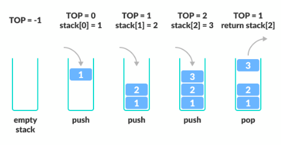
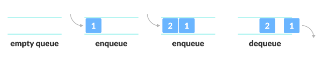
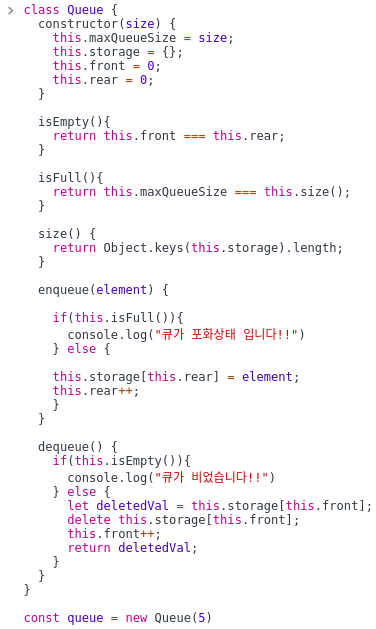
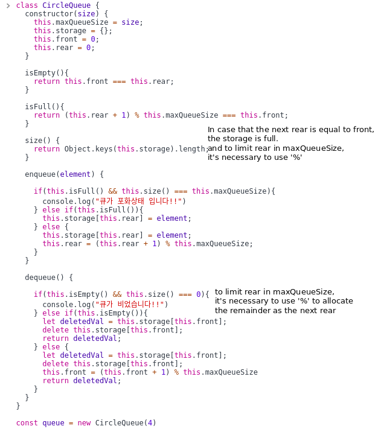

# Data Structure

### 1. Stack and Queue

#### Stack



- 데이터를 집어넣을 수 있는 선형(linear) 자료형
- 먼저 들어간 게 나중에 나오는 First In Last Out or Last In First Out 구조
- 스택에 할당된 공간이 꽉 차면 더 이상 Push 할 수 없다.

구현 코드

```js
class Stack {
  constructor() {
    //Storage 는 객체 타입이기 때문에,
    //새로운 데이터들은 {key: value} 형식으로 저장된다.
    this.storage = {};
    this.top = -1;
  }
  //Storage의 크기는 곧 길이를 의미한다.
  size() {
    return Object.keys(this.storage).length;
  }
  //새로운 element에는 가장 큰 숫자 키를 부여한다.
  push(element) {
    this.top++;
    this.storage[this.top] = element;
  }
  //가장 큰 숫자 키를 가진 element부터 삭제한다.
  //pop 메소드를 사용하면 삭제된 element를 return 한다.
  pop() {
    if (this.size() === 0) {
      this.top = -1;
      return undefined;
    }
    //reference:
    // if (this.size() <= 0) {
    //   return;
    // }
    const result = this.storage[this.top];
    delete this.storage[this.top];
    this.top--;

    return result;
  }
}
```

#### Queue



- 데이터를 집어넣을 수 있는 선형(linear) 자료형
- 먼저 들어간 게 먼저 나오는 First In First Out or Last In Last Out 구조
- 데이터가 나가는 위치는 가장 앞 / 들어오는 위치는 가장 뒤
- 원형 큐 / 우선순위 큐 등의 베리에이션 존재
- 한 번에 하나의 데이터만 처리가 가능
- 어떠한 작업 / 데이터를 순서대로 실행 / 사용하기 위해 대기시킬 때 사용

구현 코드

```js
class Queue {
  constructor() {
    this.storage = {};
    this.front = 0;
    this.rear = 0;
  }

  size() {
    return Object.keys(this.storage).length;
    //reference:  return this.rear - this.front;
  }
  //추가되는 element들은 증가되는 인덱스(rear++)를 갖는다.
  enqueue(element) {
    this.storage[this.rear] = element;
    this.rear++;
  }
  //가장 먼저 추가된 element가 삭제되고 front++ 를 통해
  //그 다음 element가 삭제될 타겟이 되도록 한다.
  dequeue() {
    if (this.size() === 0) {
      this.front = this.rear;
      return undefined;
    }
    //reference:
    // if (this.size() === 0) {
    //   return;
    // }
    const deletedVal = this.storage[this.front];
    delete this.storage[this.front];
    this.front++;
    return deletedVal;
  }
}
```

queue 의 사이즈를 지정하여 구현한 queue



원형 queue 구현


