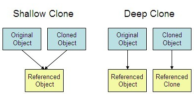
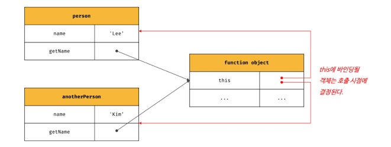
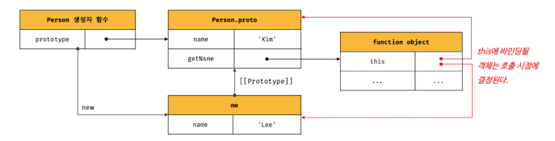
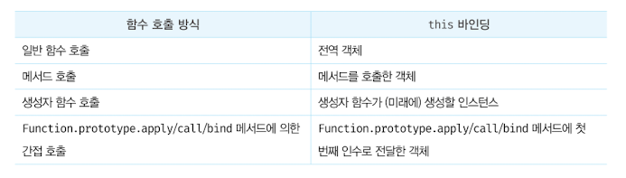
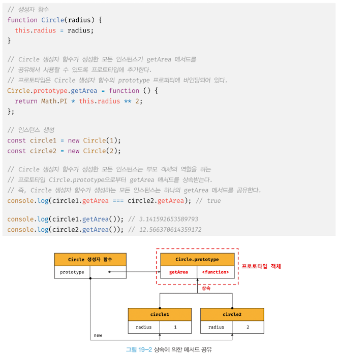

# Javascript Question

<h2>1. Shallow Copy 와 Deep Copy</h2>

자바스크립트에서 자료형은 아래와 같이 크게 기본형(Primitive Value) 과 참조형(Reference Type) 2가지로 나눌 수 있다.

기본형 (Primitive Value)

- Boolean
- Null
- Undefined
- Number
- String

참조형(Reference Type)

- Object(배열, 일반 객체, 함수)

이때 기본 자료형의 경우는 아래의 코드에서 볼 수 있듯이 copy 의 value 를 변경하더라도 string 의 value 엔 영향을 주지 않는다.

```js
let string = "hello";
let copy = string;
console.log(copy); // 'hello'
let copy = "hi";
console.log(string); // 'hi'
```

하지만, 참조형의 경우 ref 배열의 항목을 변경하면 array 의 항목도 변하는 것을 알 수 있다.
이는 참조형은 다른 변수에 대입할 때 값을 복사하는 게 아니라 참조(메모리의 주소)를 복사하기 때문에 발생하는 현상이다.

```js
let array = ["a", "b", "c"];
let ref = array;
ref[0] = "d";
console.log(array); // ['d', 'b', 'c']
```

위와 같은 특성으로 인해 참조형 copy 는 **shallow copy(얕은 복사)** 와 **deep copy(깊은 복사)** 가 있다.
shallow copy는 가장 상위 객체만 새로 생성되고 내부 객체들은 참조 관계인 경우를 의미하고 deep copy는 내부 객체까지 모두 새로 생성된 것을 의미한다.

### **Shallow Copy 코드**

같은 주소를 보고 있기 때문에 복사한 variable 의 항목을 변경하면 원본의 값도 변경된다.

```js
let employeeDetailsOriginal = {
  name: "JayKim",
  age: 30,
  profession: "software Enginner",
};
let employeeDetailsDuplicate = employDetailsOriginal;
//Shallow Copy

employDetailsDuplicate.name = "NameChanged";
//This statement will also change name from employeeDetailsOriginal,
//since we have a shallow copy, or a reference to let employeeDetailsOriginal.
//This means, you’re losing the original data as well.
```

- 장점 : 같은 객체를 공유하므로 메모리를 절약하고, 빠른 장점이 존재한다. 참조에 의한 호출(Call by Reference)에서 얕은 복사가 이루어 지는 이유 중 하나이다.

- 단점 : 두개 이상의 객체가 같은 대상을 가리키고 있기 때문에, 의도치 않게 여러 개의 객체가 동시에 수정될 수 있다.

### **Deep Copy 코드**

객체 내부 항목들에 value 가 직접 할당되는 깊은 복사이기 때문에 복사한 variable 의 항목이 변경되더라도 원본 값엔 영향을 주지 않는다.

```js
let employDetailsDuplicate = {
  name: employDetailsOriginal.name,
  age: employDetailsOriginal.age,
  Profession: employDetailsOriginal.Profession,
};
//Deep copy
```

- 장점 : 여러 객체가 동시에 수정되는 일이 발생하지 않아 안전하다.

- 단점 : 객체 생성 비용이 비싸며, 메모리를 많이 점유한다.



<h2> 2. 이벤트 루프와 태스크 큐(비동기 처리하는 프로세스)</h2>

브라우저의 동작을 보면 태스크가 동시에 처리되는 것처럼 느껴지는데, 이러첨 자바스크립트의 동시성(concurrency) 을 지원하는 것이 이벤트 루프(event loop)이다. 이벤트 루프는 브라우저에 내장되어 있는 기능이다.


- 힙: 객체가 저장되는 메모리 공간으로 콜 스택의 요소인 실행 컨텍스트는 힙에 저장된 객체를 참조한다. 저장할 객체는 원시 값과 달리 크기가 정해져 있지 않기 때문에 할당해야 할 메모리 공간의 크기를 런타임에 동적으로 할당해야 한다. 즉, 메모리 공간인 힙은 구조화 되어 있지 않다.
- 태스크 큐: 비동기 함수의 콜백 함수 또는 이벤트 핸들러가 일시적으로 보관되는 영역
- 이벤트 루프: 콜 스택과 태스크 큐를 반복해서 확인하고, 콜 스택이 비어 있고 태스크 큐에 대기 중인 함수가 있으면 이 이벤트 루프가 순차적으로 태스크 큐에서 콜 스택으로 함수를 이동 시킨다. 즉, 태스크 큐의 함수들은 비동기 처리 방식으로 동작하는 것이다.

비동기 처리에서 소스코드의 평가와 실행을 제외한 모든 처리는 자바스크립트 엔진을 구동하는 환경인 **브라우저 또는 Node.js** 가 담당한다.

- 자바스크립트 엔진: 비동기로 동작하는 setTimeout 의 콜백 함수의 평가와 실행 담당

- 브라우저 || Node.js: **호출 스케쥴링을 위한 타이머 설정과 콜백 함수 태스크 큐에 등록 담당**. 이를 위해 브라우저 환경이 태스크 큐와 이벤트 루프를 제공한다.

## [Here, You can test How Event loop works!!!](http://latentflip.com/loupe/?code=JC5vbignYnV0dG9uJywgJ2NsaWNrJywgZnVuY3Rpb24gb25DbGljaygpIHsKICAgIHNldFRpbWVvdXQoZnVuY3Rpb24gdGltZXIoKSB7CiAgICAgICAgY29uc29sZS5sb2coJ1lvdSBjbGlja2VkIHRoZSBidXR0b24hJyk7ICAgIAogICAgfSwgMjAwMCk7Cn0pOwoKY29uc29sZS5sb2coIkhpISIpOwoKc2V0VGltZW91dChmdW5jdGlvbiB0aW1lb3V0KCkgewogICAgY29uc29sZS5sb2coIkNsaWNrIHRoZSBidXR0b24hIik7Cn0sIDUwMDApOwoKY29uc29sZS5sb2coIldlbGNvbWUgdG8gbG91cGUuIik7!!!PGJ1dHRvbj5DbGljayBtZSE8L2J1dHRvbj4%3D)

### 비동기처리 프로세스 예제


1. 전역 코드 평가 → 전역 실행 컨텍스트 생성 → 콜 스택 푸시

2. setTimeout 함수 실행 컨텍스트 생성 → 콜 스택 푸시

3. 브라우저가 setTimeout 함수의 콜백 함수를 호출 스케쥴링(타이머 설정) 하고, 이 setTimeout 함수는 콜 스택에서 팝 된다.

4. 병행 처리

   1. 브라우저: 타이머 만료시 콜백함수 foo 를 태스크 큐에 푸시한다.
   2. 자바스크립트 엔진: bar 함수 실행 컨텍스트 생성 → 콜스택 푸시 → 현재 실행 중인 실행 컨텍스트 → bar 함수 종료 → 콜스택에서 팝

5. 전역 코드 실행 종료 → 전역 실행 컨텍스트 팝

6. 이벤트 루프에 의해 콜스택 비어 있음이 감지 → 태스크 큐의 콜백함수 foo 가 콜스택에 푸시 되어 실행된다. → foo 팝

**자바스크립트 엔진은 싱글 스레드로 동작하고, 브라우저는 멀티 스레드로 동작하기 때문에 비동기 처리가 가능하다. 즉, 브라우저와 자바 스크립트 엔진이 협력하여 비동기 함수를 실행하는 것이다.**

<h2> 3. this</h2>

- this는 자신이 속한 객체 또는 자신이 생성할 인스턴스를 가리키는 자기 참조 변수다.
- this를 통해 자신이 속한 객체 또는 자신이 생성할 인스턴스의 프로퍼티나 메서드를 참조할 수 있다.
- this는 함수가 호출되는 방식에 따라 this에 \*바인딩될 값, 즉 this 바인딩이 동적으로 결정된다.

\*this바인딩
: 바인딩이란 식별자와 값을 연결하는 과정을 의미한다. 예를 들어, 변수 선언은 변수 이름과 확보된 메모리 공간의 주소를 바인딩 하는 것이다.

함수를 호출하는 방식은 아래와 같다.

1. 일반 함수 호출
1. 메서드 호출
1. 생성자 함수 호출
1. Function.prototype.apply/call/bind 메서드에 의한 간접 호출

#### 1. 일반 함수 호출

기본적으로 this에는 전역 객체가 바인딩 된다.
일반 함수로 호출된 모든 함수(중첩 함수, 콜백 함수 포함) 내부의 this에는 전역 객체가 바인딩된다.

```js
var value = 1;

const obj = {
  value: 100,
  foo() {
    console.log("foo's this: ", this); //{value: 100, foo: f}
    // 콜백 함수 내부의 this에는 전역 객체가 바인딩된다.
    setTimeout(function () {
      console.log("callback's this: ", this); //window
      console.log("callback's this.value", this.value); // 1
    }, 100);
  },
};

obj.foo();
```

자바스크립트는 명시적으로 바인딩할 수 있는 Function.prototype.apply, call, bind 메서드를 제공한다.

```js
var value = 1;

const obj = {
  value: 100,
  foo() {
    // 콜백 함수에 명시적으로 this를 바인딩한다.
    setTimeout(
      function () {
        console.log("callback's this.value", this.value); // 1
      }.bind(this),
      100
    );
  },
};

obj.foo();
```

또는 화살표 함수를 사용하여 this 바인딩을 일치시킬 수도 있다.

```js
var value = 1;

const obj = {
  value: 100,
  foo() {
    // 화살표 함수 내부의 this는 상위 스코프의 this르 가리킨다.
    setTimeout(() => console.log(this.value), 100); // 100
  },
};

obj.foo();
```

#### 2. 메서드 호출

메서드 내부의 this는 프로퍼티로 메서드를 가리키고 있는 객체와는 관계가 없고 메서드를 호출한 객체에 바인딩된다.



```js
const person = {
  name: "Jay",
  getName() {
    return this.name;
  },
};

const getName = person.getName;

console.log(getName()); // ''
// 일반 함수로 호출된 getName 함수 내부의 this.name은 브라우저 환경에서 window.name과 같다.
// 브라우저 환경에서 window.name은 브라우저 창의 이름을 나타내는 빌트인 프로퍼티이며 기본값은 ''이다.
// Node.js 환경에서 this.name은 undefined이다.

function Person(name) {
  this.name = name;
}

Person.prototype.getName = function () {
  return this.name;
};

const me = new Person("Lee");

//getName 메서드를 호출한 객체는 me다.
console.log(me.getName()); // Lee

Person.prototype.name = "Kim";

//getName 메서드를 호출한 객체는 Person.prototype이다.
console.log(Person.prototype.getName()); // Kim
```



#### 3. 생성자 함수 호출

생성자 함수 내부의 this에는 생성자 함수가 생성할 인스턴스가 바인딩된다.

```js
//new 연산자와 함께 호출하지 않으면 생성자 함수로 동작하지 않는다. 즉, 일반적인 함수의 호출이다.
const circle3 = Circle(15);

// 일반 함수로 호출된 Circle에는 반환문이 없으므로 암묵적으로 undefined를 반환한다.
console.log(circle3); // undefined
```

#### 4. Function.prototype.apply/call/bind 메서드에 의한 간접 호출

apply와 call 메서드의 본질적인 기능은 함수를 호출하는 것이다.

```js
function getThisBinding() {
  console.log(arguments);
  return this;
}

// this로 사용할 객체
const thisArg = { a: 1 };

// getThisBinding 함수를 호출하면서 인수로 전달한 객체를 getThisBinding 함수의 this에 바인딩한다.
// apply 메서드는 호출할 함수의 인수를 배열로 묶어 전달한다.
console.log(getThisBinding.call(thisArg, [1, 2, 3]));
// Arguments(3) [1,2,3, callee: f, Symbol(Symbol.iterator): f]
// { a: 1 }

// call 메서드는 호출할 함수의 인수를 쉼표로 구분한 리스트 형식으로 전달한다.
console.log(getThisBinding.call(thisArg, 1, 2, 3));
// Arguments(3) [1,2,3, callee: f, Symbol(Symbol.iterator): f]
// { a: 1 }
```

Function.prototype.bind 메서드는 apply와 call 메서드와 달리 함수를 호출하지 않는다.
다만 첫 번째 인수로 전달한 값으로 this바인딩이 교체된 함수를 새롭게 생성해 반환한다.

```js
function getThisBinding() {
  return this;
}

// this로 사용할 객체
const thisArg = { a: 1 };

console.log(getThisBinding.bind(thisArg)); // getThisBinding
// bind 메서드는 함수를 호출하지는 않으므로 명시적으로 호출해야 한다.
console.log(getThisBinding.bind(thisArg)()); // { a: 1 }
```

bind 메서드는 메서드의 this와 메서드 내부의 중첩 함수 또는 콜백 함수의 this가 불일치하는 문제를 해결할 수 있다.

```js
const person = {
  name: "Lee",
  foo(callback) {
    // 1
    setTimeout(callback, 100);
  },
};

person.foo(function () {
  console.log(`Hi! my name os ${this.name}`); // 2. Hi! my name is .
  // 일반 함수로 호출된 콜백 함수 내부의 this.name은 브라우저 환경에서 window.name과 같다.
  // 브라우저 환경에서 window.name은 브라우저 창의 이름을 나타내는 빌트인 프로퍼티이며 기본값은 ''이다.
  // Node.js 환경에서 this.name은 undefined이다.
});
```

bind 메서드를 사용하여 this를 일치시킬 수 있다.

```js
const person = {
  name: "Lee",
  foo(callback) {
    // bind 메서드로 callback 함수 내부의 this 바인딩을 전달
    setTimeout(callback.bind(this), 100);
  },
};

person.foo(function () {
  console.log(`Hi! my name os ${this.name}`); // 2. Hi! my name is Lee.
});
```

### Summary



<h2>4. 버블링과 캡처링</h2>

#### 버블링

한 요소에 이벤트가 발생할 경우, 이 요소에 할당된 핸들러가 동작하고, 이어서 부모 요소의 핸들러가 동작한다.이처럼 가장 최상단의 조상 요소를 만날 때까지 이 과정이 반복되면서 요소 각각에 할당된 핸들러가 동작하는 현상을 **버블링**이라 한다.
이벤트가 가장 깊은 곳의 요소에서 시작되어 부모 요소를 거슬러 올라가며 발생하는 모습이 물속 거품과 유사하여 생긴 이름이다.

아래와 같은 코드가 있을때 가장 안쪽의 p 요소를 클릭하면,

```html
<style>
  body * {
    margin: 10px;
    border: 1px solid blue;
  }
</style>

<form onclick="alert('form')">
  FORM
  <div onclick="alert('div')">
    DIV
    <p onclick="alert('p')">P</p>
  </div>
</form>
```

1. `<p>` 에 할당된 onclick 핸들러 동작,
1. 바깥의 `<div>`에 할당된 핸들러 동작,
1. 그 바깥의 `<form>`에 할당된 핸들러가 동작,
1. document 객체를 만날 때까지, 각 요소에 할당된 onclick 핸들러가 동작한다.

여기에서 이벤트가 발생한 가장 안쪽의 요소를 타겟(target)이라 부르는데, `event.target` 으로 접근 가능하다.

#### 버블링 중단하는 방법

이벤트 버블링은 타깃 이벤트에서 시작해서 `html`요소를 거쳐 document 객체를 만날 때까지 각 노드에서 모두 발생하는데, 몇몇 이벤트는 window 객체까지 거슬러 올라가기도 한다.

이런 경우에, `event.stopPropagation()` 사용하여 버블링을 방지할 수 있다. 만약, 요소에 할당된 다른 핸들러의 동작도 막고 싶다면 `event.stopImmediatePropagation()`을 사용한다.

```html
<body onclick="alert(`버블링은 여기까지 도달하지 못합니다.`)">
  <button onclick="event.stopPropagation()">클릭해 주세요.</button>
</body>
```

#### 캡처링

표준 DOM 이벤트에서 정의한 이벤트 흐름엔 아래와 같이 3가지 단계가 있다.

- **캡처링 단계 – 이벤트가 하위 요소로 전파되는 단계**
- 타깃 단계 – 이벤트가 실제 타깃 요소에 전달되는 단계
- 버블링 단계 – 이벤트가 상위 요소로 전파되는 단계

onEvent 프로퍼티나 HTML 속성, addEventListener(event, handler)를 이용해 할당된 핸들러는 캡처링에 대해 전혀 알 수 없다. 즉, 이 핸들러들은 두 번째 혹은 세 번째 단계의 이벤트 흐름(타깃 단계와 버블링 단계)에서만 동작하는데, 만약 캡처링 단계에서 이벤트를 잡아내려면 아래와 같이 addEventListener의 capture 옵션을 **true**로 설정하면 된다.

```html
elem.addEventListener(..., {capture: true})
```

요약하면, 각 핸들러는 아래와 같은 event 객체의 프로퍼티에 접근할 수 있다.

- `event.target` – 이벤트가 발생한 가장 안쪽의 요소
- `event.currentTarget (=this)` – 이벤트를 핸들링 하는 현재 요소 (핸들러가 실제 할당된 요소)
- `event.eventPhase` – 현재 이벤트 흐름 단계(캡처링=1, 타깃=2, 버블링=3)

<strong>핸들러에서 event.stopPropagation()을 사용해 이벤트 버블링을 멈출 수 있다. 다만, 이 방법은 추천하지 않는데, 왜냐하면 지금은 상위 요소에서 이벤트가 어떻게 쓰일지 확실치 않더라도, 추후에 버블링이 필요한 경우가 생기기 때문이다.</strong>

<h2>5. ES6 & 최신 JS 호환성 문제 해결법</h2>

#### Q. ES6 이상의 버전을 브라우저에서 인식하지 못한다면 어떻게 해결할 수 있나?

브라우저 별로 구동원리 또는 JS엔진 등의 차이로 브라우저 호환성 이슈가 발생하는데 이 차이를 최소화하여 런타임 환경에 맞게 최적화 하는 작업을 **크로스 브라우징** 이라 한다.
Javascript의 경우, 호환성에 따른 충돌이나 부작용을 줄이기 위해 **Babel** 이라는 \*트랜스파일러 사용하면 된다. Babel은 주로 ES5 이상 버전의 코드를 현재 또는 과거의 브라우저와 같은 환경에서 호환되는 버전으로 변환할 수 있다. 이를 통해 IE나 다른 브라우저에서 동일한 기능을 제공하고 side-effect를 최소한으로 줄일수 있다.

바벨의 빌드 단계(코드 변환 단계)

1. 파싱: 코드를 읽고, 추상 구문 트리(AST)로 변환하는 단계
1. 변환: 추상 구문 트리(AST)를 변경
1. 출력: 변경된 결과물을 출력

위 빌드 단계를 통해 Javascript의 호환성 이슈를 해결한다.



- 트랜스파일러
  : 한 언어로 작성된 소스 코드를 비슷한 수준의 추상화를 가진 언어로 변환하는 것

- 컴파일러
  : 한 언어도 작성된 코드를 다른 언어로 변환하는 것으로 예를 들어, C 코드로 개발된 코드를 Assembly 코드로 변환하는 것도 이에 해당한다.
