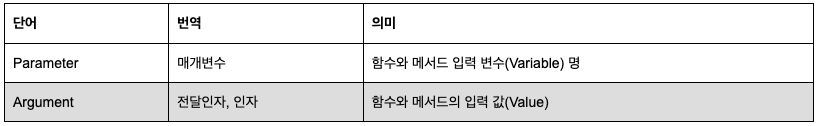

# Confusing Concepts

### Q1) HTML: The difference between attribute and property

**What is an attribute?**
Attributes carry additional information about an HTML element and come in `name=”value”` pairs. Example: `<div class=”my-class”></div>`. Here we have a div tag and it has a class attribute with a value of my-class.

**What is a property?**
Property is a representation of an attribute in the HTML DOM tree. So the attribute in the example above would have a property named `className` with a value of `my-class`.

```
Our DIV node
 |- nodeName = "DIV"
 |- className = "my-class"
 |- style
   |- ...
 |- ...
```

**What is the difference between attribute and property?**
Attributes are in your HTML text document/file, whereas properties are in HTML DOM tree. This means that <strong>attributes do not change and always carry initial (default) values</strong>. However, HTML properties can change, for example when user checks a checkbox, inputs text to textarea or uses JavaScript to change the property value.


**Only element’s property is changed, because it is in the DOM and dynamic. But element’s attribute is in HTML text and can not be changed!**

### Q2) parameter 와 argument 의 차이점

parameter는 함수 혹은 메서드 정의에서 나열되는 변수 명이다. 반면 argument는 함수 혹은 메서드를 호출할 때, 전달 혹은 입력되는 실제 값이다. parameter 실체는 변수이고 argument의 실체는 값입니다. 따라서 두 단어는 명확하게 구분해야 한다.



**parameter(매개변수)** 와 **argument(전달인자)**

```js
function pExample(str1, str2) //str1과 str2가 parameter
  return a +" "+ b

pExample("apple", "banana") // "apple" 과 "banana" 가 argument
```
